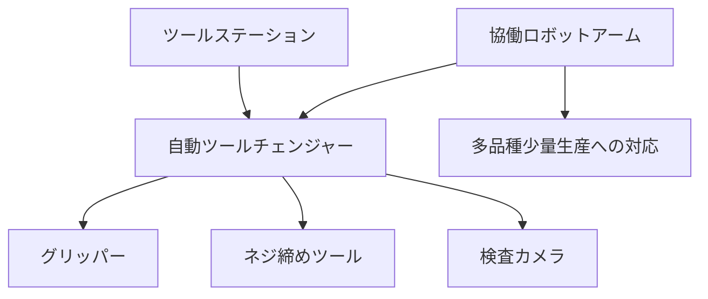

# T12-04-05 多様な作業対応エンドエフェクタ・ツールチェンジャー

## Summary（5つの要点）

1. **汎用性とマルチタスクの実現**: **単一**の**協働ロボット**（コボット）が**複数の工程**（例: 部品供給→ネジ締め→検査）を**連続的**に**担当**するために、**作業**に**特化**した**先端工具（エンドエフェクタ）**を**迅速**に**交換**する技術 `(1)`。
2. **ツールチェンジャーの自動化**: **ロボットアーム**の**先端**と**作業台**に**設置**された**ツールステーション**との間で、**電気、空気圧、通信**の**接続**を**自動**で**確立**しながら**エンドエフェクタ**を**数秒以内**に**交換**する**機構**。
3. **多様なエンドエフェクタ**: 
    * **把持（グリッパー）**: **協働ロボット**の**安全制御**（T12-04-01）に**対応**した**力制御**が可能な**ソフトグリッパー**や**吸着パッド**。
    * **加工**: **自動ネジ締め機、研磨パッド、接着剤塗布ノズル**。
    * **検査**: **高解像度カメラ、レーザーセンサー、非接触寸法測定器**。
4. **オープンインターフェース**: **協働ロボット**の**普及**に伴い、**多様なメーカー**が**標準化**された**インターフェース**（**ISO 9409-1**など）に**準拠**した**エンドエフェクタ**を**容易**に**開発・提供**できる**エコシステム**が**重要** `(2)`。
5. **プラグ&プレイ**: **エンドエフェクタ**を**交換**した**後**、**ロボット**が**自動的**に**ツール**の**種類、重量、重心**を**認識**し、**制御パラメータ**を**即座に調整**する**自動設定機能**。

#### 概念図

---

### 技術評価表（定量的な視点）
| 評価項目 | 評価 | 根拠 |
| :--- | :--- | :--- |
| 導入コスト | ⭐⭐⭐☆☆ | ツールチェンジャー機構、多種のエンドエフェクタのコスト |
| 技術成熟度 | ⭐⭐⭐⭐☆ | 技術は確立。**小型軽量化**と**高耐久性**、**センサー統合**が進化中 `(1)` |
| 日本の競争力 | ⭐⭐⭐⭐☆ | **高精度グリッパー、精密加工ツール**で**強み**。**インターフェースの標準化**が課題 `(2)` |
| 市場性 | ⭐⭐⭐⭐⭐ | **多品種少量生産**、**変種変量生産**の**現場**で**必須**。
| 品質保証の重要性 | ⭐⭐⭐⭐⭐ | **ツール交換時の接続不良**が**ライン停止**に直結。**耐久性、再現性**が重要 |

---

## 日本の立ち位置・強み弱みのSummary

### 強み：日本企業や研究機関が持つ独自の技術、優位性などを箇条書きで記述。

* **精密グリッパー技術**: **CKD、SMC**など**空気圧、電動グリッパー**の**世界的なメーカー**が**高度な把持制御**技術を提供。
* **特殊加工ツールのノウハウ**: **研磨、バリ取り、ネジ締め**など、**日本の高い製造品質**を**支える**ための**特殊な加工ツール**の**開発ノウハウ**。
* **高信頼性のコネクタ技術**: **自動ツールチェンジャー**に必要な**電気、流体**の**高耐久性、高信頼性**な**コネクタ**の**サプライヤー**。

### 弱み：日本が抱える規制、標準化の遅れ、海外依存などを箇条書きで記述。

* **オープンインターフェースの普及**: **海外メーカー**が**主導**する**インターフェース（OnRobot、Schunk）**への**対応**が**遅れ**、**独自規格**が**乱立**している側面。
* **ソフトグリッパーの開発**: **不定形、壊れやすい物体**を**把持**するための**ソフトロボティクス**を**応用**した**エンドエフェクタ**の**開発**が**欧米**に**比べ**て**遅れ**。
* **AIによるツール選択**: **作業内容**を**AI**が**認識**し、**最適**な**ツール**を**自動**で**提案・交換**する**高度な自律制御**の**実装**が途上。

---

## 技術ロードマップ（短期/中期/長期）

### 短期目標（～2027年）

* **ツールチェンジャー**の**交換時間**を**1秒未満**に**短縮**し、**ダウンタイム**を**最小化**。
* **国際標準**に**準拠**した**オープンインターフェース**の**普及率**を**80%**に向上。
* **カメラ**を**内蔵**し、**把持対象物**を**自動認識**して**把持力**を**最適**に**調整**する**スマートグリッパー**を**標準化**。

### 中期目標（2028年～2031年）

* **ロボット**が**作業指示書**や**CADデータ**を**解析**し、**必要**な**ツール**を**ツールステーション**から**自律的**に**選択**・**装着**する**AI制御**を実現。
* **超音波、X線**などの**非破壊検査**を**実行**できる**高機能な検査ツール**を**協働ロボット**に**搭載**。
* **3Dプリント技術**（T15-06-01）を**活用**し、**現場**で**即座**に**カスタム仕様**の**グリッパー指先**を**製造**。

### 長期目標（2032年～2035年）

* **エンドエフェクタ**が**人間の手**と**区別**の**つかない**レベルで**繊細**な**触覚**（T8-03-05）を**持ち**、**あらゆる作業**を**自律的**に**実行**。
* **ツール**が**自己診断**を**行い**、**交換**や**メンテナンス**を**ロボット**が**自律的**に**計画・実行**する**自己修復システム**を確立。

### 📚 参照リンク

1. [SCHUNK：エンドエフェクタとツールチェンジャーソリューション](https://www.schunk.com/jp/ja/製品/ロボットアクセサリ/エンド-エフェクタ/)
2. [SMC：電動アクチュエータ・グリッパー](https://www.smcworld.com/product/ja/s.do?pID=J-EV-A)
3. [NEDO：ロボット技術の動向調査](https://www.nedo.go.jp/activities/ZZJP_100067.html)