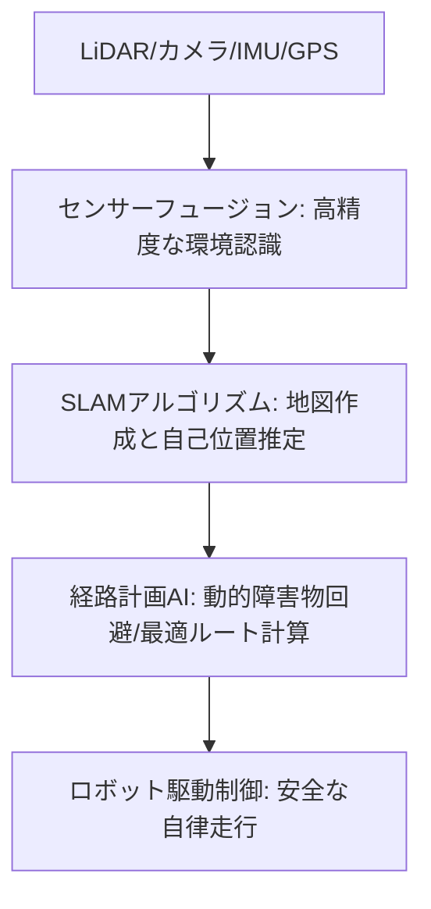

# T12-05-01 自律走行・経路計画AI（SLAM技術）

## Summary（5つの要点）

1. **自律走行の基盤（SLAM）**: **SLAM（Simultaneous Localization and Mapping：自己位置推定と地図作成の同時実行）**は、**未知**の**環境**で**地図**を**作成**しながら**自己**の**現在位置**を**正確**に**推定**する**技術**。**配達ロボット**が**GPS**が**利用できない**屋内や**複雑**な**歩道**を**走行**するために**必須** `(1)`。
2. **センサーフュージョン**: **LiDAR（レーザー）、深度カメラ、IMU（慣性計測装置）、GPS**など**複数**の**センサー**からの**情報**を**統合**（フュージョン）し、**単一**の**センサー**では**克服**できない**誤差**や**ノイズ**を**補完**し、**高精度**な**位置推定**と**環境認識**を**実現** `(1)`。
3. **動的障害物回避**: **歩行者、自転車、ペット**など**移動**する**障害物**の**将来**の**位置**を**AI**で**予測**し、**衝突**の**リスク**を**最小限**に**抑え**た**経路**を**リアルタイム**で**再計画**する**技術**。特に**公共空間**での**安全**な**走行**に**不可欠**。
4. **グローバルとローカルの経路計画**: **配達**の**全体目標**（グローバルルート）と、**足元**の**段差、障害物**を**回避**する**即時的**な**行動**（ローカルパス）を**階層的**に**統合**し、**効率**と**安全性**を**両立**。
5. **環境変化への適応**: **季節**や**天候**による**路面**の**変化**（雪、水たまり）や、**店舗**の**一時的**な**看板**設置などの**環境変化**を**自律的**に**検知**・**学習**し、**走行マップ**を**自動**で**更新**する**能力** `(2)`。

#### 概念図

 

---

### 技術評価表（定量的な視点）
| 評価項目 | 評価 | 根拠 |
| :--- | :--- | :--- |
| 導入コスト | ⭐⭐⭐☆☆ | LiDAR、高性能GPU、AIソフトウェアのコスト |
| 技術成熟度 | ⭐⭐⭐⭐☆ | 技術は成熟。**複雑**な**市街地**での**信頼性**と**法規制対応**が課題 `(2)` |
| 日本の競争力 | ⭐⭐⭐⭐☆ | **トヨタ、ホンダ**など**自動車メーカー**の**自律走行技術**を**応用**。**センサー部品**に**強み** `(1)` |
| 市場性 | ⭐⭐⭐⭐⭐ | **ラストワンマイル配送**の**人件費削減**に**直結**し、**需要**が**爆発的** |
| 品質保証の重要性 | ⭐⭐⭐⭐⭐ | **衝突事故**は**社会受容性**の**低下**に直結。**位置推定精度（cm級）**、**回避信頼性**が最重要 |

---

## 日本の立ち位置・強み弱みのSummary

### 強み：日本企業や研究機関が持つ独自の技術、優位性などを箇条書きで記述。

* **高精度センサー技術**: **ソニー、パイオニア、デンソー**などが提供する**小型、高性能、低価格**な**LiDAR**や**カメラセンサー**。
* **自動車自律走行技術の応用**: **自動車メーカー**が**培った**、**複雑**な**公道**での**高信頼性**な**自律走行アルゴリズム**を**ロボット**に**転用**。
* **都市地図データ**: **ゼンリン**などの**高精度**な**地図データ**を**自律走行**の**事前情報**として**活用**できる**基盤**。

### 弱み：日本が抱える規制、標準化の遅れ、海外依存などを箇条書きで記述。

* **歩道・公道走行の規制**: **改正道路交通法**が**施行**されたが、**詳細**な**運行ルール、保険、責任範囲**の**整備**が**途上**で、**大規模な実証**に**制約**。
* **SLAM/AIアルゴリズムの国際競争**: **Google、Amazon**など**海外IT大手**が**莫大な実走行データ**を**学習**した**高性能なAI**で**先行**。
* **オープンソースプラットフォーム**: **ROS（Robot Operating System）**など、**自律走行**の**基盤**となる**オープンソースソフトウェア**の**開発**への**貢献**と**利用**が**欧米**に**劣後**。

---

## 技術ロードマップ（短期/中期/長期）

### 短期目標（～2027年）

* **SLAM**の**位置推定誤差**を**cm級**に**安定化**し、**GPS**が**届かない**屋内**と**屋外**の**シームレス**な**移動**を実現。
* **AI**が**歩行者**の**動き**を**2秒先**まで**予測**し、**社会的**に**受容**される**「人間らしい」**な**障害物回避**を**実現**。
* **遠隔監視**（T12-05-04）を**前提**とした**特定区域**での**無人走行**の**法規制**を**整備**。

### 中期目標（2028年～2031年）

* **都市全体**の**3D地図**を**ロボット**間で**共有**し、**自己学習**により**地図**の**鮮度**を**自動維持**。
* **視覚認識**と**LiDAR**を**融合**させ、**天候**（雨、雪、濃霧）に**関わらず**、**99.99%**の**障害物検知率**を**達成**。
* **人間**の**ジェスチャー**や**声**を**認識**し、**道路**の**通行権**を**円滑**に**譲り合う**ような**高度**な**社会協調走行**を実現。

### 長期目標（2032年～2035年）

* **配達ロボット**が**完全に自律的**に**未知**の**場所**へ**地図**を**作成**しながら**配送**し、**遠隔監視**が**不要**となる**レベル5**の**完全自律走行**を実現。
* **都市インフラ**（T18-05-01）と**連携**し、**交通信号、工事情報**を**リアルタイム**で**取得**し、**都市全体**で**配送効率**を**最適化**。

### 📚 参照リンク

1. [JST：屋内と屋外をシームレスにつなぐ自律移動ロボット技術](https://www.jst.go.jp/ristex/port/project/h30/p-p16.html)
2. [経済産業省：無人自動運転移動サービスに関する技術開発](https://www.meti.go.jp/policy/mono_info_service/robotics/kaigorobo/index.html)
3. [Starship Technologies：自律走行技術に関する情報](https://www.starship.xyz/)