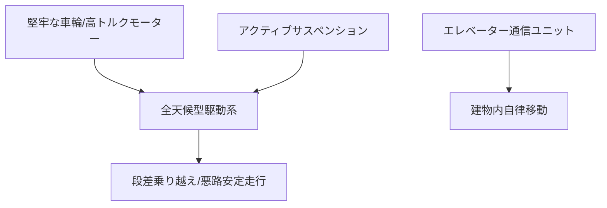

# T12-05-02 歩道・屋内走行対応モビリティプラットフォーム

## Summary（5つの要点）

1. **全天候・悪路走行能力**: **歩道**の**段差（2-5cm）**、**傾斜、砂利、濡れた路面**など、**都市**の**多様**な**環境変化**に**対応**し、**荷物**を**安定**して**運搬**するための**堅牢**な**車輪、サスペンション、車体設計** `(1)`。
2. **エレベーター・ドア連携**: **建物内**への**配送**を**実現**するために、**エレベーター**の**運行システム**と**無線**で**通信**し、**自動**で**乗降**する**機能**。また、**自動ドア**や**セキュリティドア**を**ロボット**から**開閉**するための**インターフェース**を**搭載** `(2)`。
3. **人間との協調設計**: **最大速度**を**歩行者**と**同等**の**時速6km以下**に**制限**し、**不必要**な**加速・減速**を**避ける**ことで、**人間**と**同じ空間**を**円滑**に**共有**できる**モビリティ設計**。
4. **エネルギー効率と航続距離**: **小型・軽量**な**車体**と**高効率**な**駆動モーター**、**大容量バッテリー**により、**充電なし**で**一日の配送**（約20-40km）を**完了**できる**航続距離**を**確保**。
5. **モジュール化**: **配送ボックス、センサー、駆動系**を**モジュール化**することで、**修理、メンテナンス**を**迅速**に行い、**ロボット**の**稼働率**を**最大化**する**設計** `(1)`。

#### 概念図

---

### 技術評価表（定量的な視点）
| 評価項目 | 評価 | 根拠 |
| :--- | :--- | :--- |
| 導入コスト | ⭐⭐⭐⭐☆ | 部品は安価だが、機体設計と統合システム開発にコスト |
| 技術成熟度 | ⭐⭐⭐⭐☆ | 郊外キャンパス、限定エリアで実用化。**エレベーター連携**の**汎用化**が課題 `(2)` |
| 日本の競争力 | ⭐⭐⭐⭐☆ | **パナソニック、ZMP**などが**国内**の**特有**の**環境**（狭い歩道、複雑な建物）に**適応**した**機体**を開発 `(2)` |
| 市場性 | ⭐⭐⭐⭐⭐ | **ラストワンマイル**の**人件費高騰**により、**代替需要**が高い |
| 品質保証の重要性 | ⭐⭐⭐⭐⭐ | **悪路**での**転倒**や**荷物の破損**は**信頼性**に直結。**耐久性**と**走行安定性**が重要 |

---

## 日本の立ち位置・強み弱みのSummary

### 強み：日本企業や研究機関が持つ独自の技術、優位性などを箇条書きで記述。

* **狭隘路・歩道走行技術**: **日本の狭い歩道、複雑な交差点**を**安全**に**走行**するための**機体設計**と**制御技術**。
* **エレベーター連携の先行**: **パナソニック**などが**既存**の**ビル**の**エレベーター**と**通信**し、**ロボット**が**自動**で**乗降**する**システム**を**先行**して**開発**。
* **自動車部品の応用**: **サスペンション、駆動モーター**など、**自動車産業**で**培われた**、**高信頼性**な**モビリティ部品**の**サプライチェーン**。

### 弱み：日本が抱える規制、標準化の遅れ、海外依存などを箇条書きで記述。

* **最高速度規制**: **歩道**での**走行速度**が**時速6km以下**に**制限**されており、**広範囲**な**配送効率**に**限界**がある。
* **プラットフォームの多様性不足**: **Starship**など**海外メーカー**に**比べ**て、**様々な形状**や**用途**（大型、複数階層対応）に**対応**できる**モビリティプラットフォーム**の**多様性**が**不足**。
* **エレベーター連携の標準化**: **エレベーターメーカー**ごとの**通信仕様**が**異なり**、**ロボット**側での**汎用的なインターフェース**の**標準化**が**遅れ**。

---

## 技術ロードマップ（短期/中期/長期）

### 短期目標（～2027年）

* **機体**の**防水・防塵性能**を**IP67以上**に**標準化**し、**悪天候下**での**安定**した**運行**を実現。
* **アクティブサスペンション**を**搭載**し、**10cm程度**の**段差**を**荷物**の**揺れ**を**最小限**に**抑え**て**乗り越える**能力を獲得。
* **エレベーター**の**メーカー**を**問わず**、**標準化**された**通信プロトコル**による**自動連携**を**義務化**。

### 中期目標（2028年～2031年）

* **モビリティプラットフォーム**を**AI**が**自動診断**し、**故障**を**予知**して**自己修復**や**自己交換**を**行う**機能（**T18-05-05**）を**搭載**。
* **時速10km程度**での**走行**が**可能**な**準歩道、自転車専用レーン**での**走行**を**可能**とする**法規制**の**整備**。
* **空気圧**や**サスペンション**を**自動調整**し、**荷物**の**重心**や**重量**に**最適**な**走行**を**実現**。

### 長期目標（2032年～2035年）

* **ロボット**が**水中**や**砂地**など**極端**な**悪路**も**走行**できる**変形**・**多脚**モビリティ**を**標準化**。
* **モビリティ**が**電力**を**太陽光**や**無線給電**で**自律的**に**補給**し、**充電ステーション**が**不要**になる。

### 📚 参照リンク

1. [Kiwibot：モビリティとインテリジェンス](https://www.kiwibot.com/technology)
2. [パナソニック：自律走行ロボットHOSPI-RIMO](https://www.panasonic.com/jp/business/solution/robot/hospirimo.html)
3. [ZMP：デリバリーロボットDeliRo](https://www.zmp.co.jp/products/dlr)