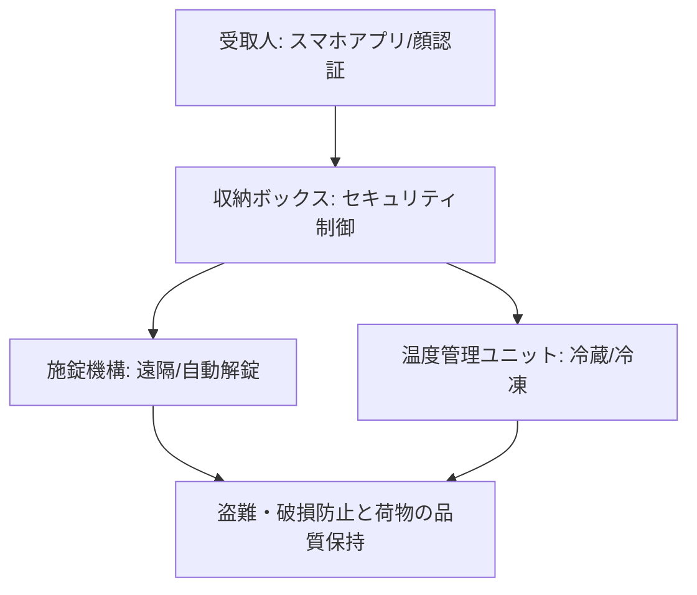

# T12-05-03 荷物収納ボックス・セキュリティシステム

## Summary（5つの要点）

1. **受取人認証と解錠**: **配達ロボット**の**最大**の**課題**である**「荷物の受け渡し」**を**安全**に**行う**ための**システム**。**受取人**は**スマートフォンアプリ、PINコード、顔認証**などで**本人確認**を行い、**指定**の**収納ボックス**のみを**自動**で**解錠** `(1)`。
2. **物理的セキュリティ**: **収納ボックス**は**堅牢**な**素材**で**作られ**、**盗難**や**いたずら**を**防止**するための**二重施錠機構**や**破壊検知センサー**を**搭載**。**異常**を**検知**した**場合**は**警報**を**発報**し、**遠隔監視センター**（T12-05-04）に**通知** `(1)`。
3. **温度管理機能**: **生鮮食品**や**冷凍品**など、**温度**に**敏感**な**荷物**を**運搬**するために、**ボックス内部**を**冷蔵・冷凍**に**保つ**ための**ペルチェ素子**や**断熱材**を**内蔵**。**AI**が**配送時間**と**外気温**から**最適**な**温度**を**自動**で**設定** `(2)`。
4. **GPS追跡と監視カメラ**: **ロボット**の**位置**を**リアルタイム**で**GPS追跡**し、**ボックス**に**内蔵**された**防犯カメラ**が**周囲**を**常時録画**。**荷物の紛失、盗難**の**際**の**証拠**として**活用**。
5. **多区画収納と最適化**: **複数の顧客**への**配達**を**一度**に**行う**ために、**ボックス**を**独立**した**複数**の**区画**に**分割**。**AI**が**荷物**の**サイズ、重量、温度条件**に**合わせ**て**最適な区画**を**自動**で**割り当てる**。

#### 概念図

---

### 技術評価表（定量的な視点）
| 評価項目 | 評価 | 根拠 |
| :--- | :--- | :--- |
| 導入コスト | ⭐⭐⭐☆☆ | 堅牢なボックス、冷却システム、電子錠のコスト |
| 技術成熟度 | ⭐⭐⭐⭐☆ | 技術は成熟。**小型軽量化**と**温度管理効率**の**向上**が進行中 `(2)` |
| 日本の競争力 | ⭐⭐⭐⭐☆ | **高精度**な**電子錠、防犯センサー**の**技術**に**強み**。**宅配ボックス**の**ノウハウ**を応用 `(2)` |
| 市場性 | ⭐⭐⭐⭐⭐ | **生鮮食品**や**医薬品**の**配送**を**可能**にし、**市場**を**拡大** |
| 品質保証の重要性 | ⭐⭐⭐⭐⭐ | **荷物の紛失、盗難**は**顧客信頼**を**失墜**させる。**セキュリティ**と**温度管理精度**が最重要 |

---

## 日本の立ち位置・強み弱みのSummary

### 強み：日本企業や研究機関が持つ独自の技術、優位性などを箇条書きで記述。

* **宅配ボックス技術の応用**: **不在時**の**安全**な**荷物受け渡し**に**関する**、**宅配ボックス**（例: パナソニック、OKI）で**培われた**、**認証**と**セキュリティ**の**ノウハウ**。
* **高精度な温度制御**: **食品、医薬品**の**輸送**に**関する**、**小型**で**高効率**な**冷却・断熱技術**。
* **小型防犯技術**: **小型**で**高解像度**の**カメラ**や**高性能なセンサー**を**内蔵**し、**いたずら**や**盗難**に**対応**。

### 弱み：日本が抱える規制、標準化の遅れ、海外依存などを箇条書きで記述。

* **受取人認証の標準化**: **多様**な**配送サービス**や**プラットフォーム**間での**統一的**な**受取人認証プロトコル**が**未確立**。
* **ボックスの軽量化**: **温度管理**や**セキュリティ**を**強化**する**ため**に、**ボックス**が**大型・重量化**する**傾向**があり、**ロボット**の**航続距離**を**制限**。
* **対テロ・物理的脅威への対応**: **海外**で**見られる**ような**ロボット**への**大規模**な**物理的攻撃**に**対する**、**ボックス**の**設計、法規制**の**議論**が**途上**。

---

## 技術ロードマップ（短期/中期/長期）

### 短期目標（～2027年）

* **ボックス**の**温度制御**を**AI**が**自動調整**し、**電力消費**を**現行比30%削減**。
* **受取人**が**ロボット**に**音声、ジェスチャー**で**解錠**を**指示**できる**ハンズフリー認証**を**実現**。
* **ボックス**が**荷物**の**種類**（生鮮、医薬品など）を**自動認識**し、**不正**な**開封、取り出し**を**検知**。

### 中期目標（2028年～2031年）

* **ロボット**が**荷物**を**配達先**の**スマートホーム**や**スマートロック**と**直接連携**し、**玄関先**に**自動で**「**投函**」**する**。
* **ボックス**の**素材**を**軽量**で**耐衝撃性**の**高**い**新素材**（**T15-02-01**）に**置き換え**。
* **ボックス**が**自己発電機能**（**振動発電**など）を**搭載**し、**電力**を**自律的**に**賄う**。

### 長期目標（2032年～2035年）

* **荷物**そのものに**小型**の**センサー**と**認証チップ**が**埋め込まれ**、**ボックス**が**不要**となる**超セキュリティシステム**。
* **ロボット**が**ボックス**を**分解・再構築**し、**荷物**の**サイズ**に**最適**な**容量**を**自律的**に**形成**。

### 📚 参照リンク

1. [Nuro：自動運転による安全な配達ソリューション](https://nuro.ai/technology/)
2. [Amazon Scout：セキュリティとプライバシーへの取り組み](https://www.aboutamazon.com/news/transportation/amazon-scout-now-operating-in-more-locations)
3. [パナソニック：宅配ボックス関連技術](https://www.panasonic.com/jp/business/solution/logistic/delivery_box.html)