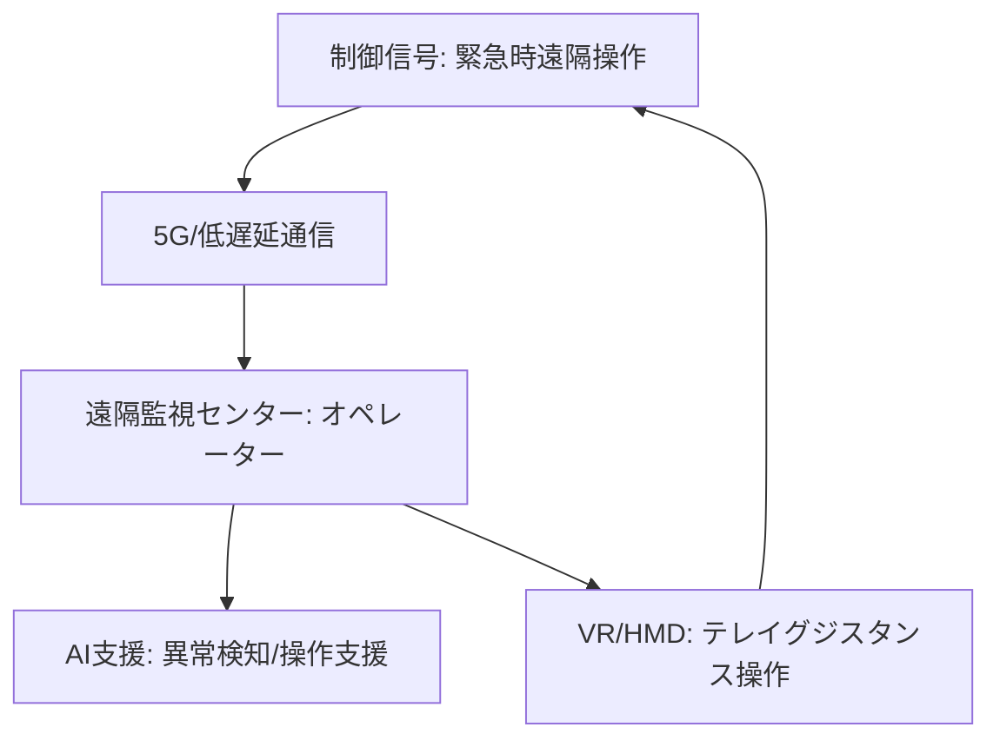

# T12-05-04 遠隔監視・緊急時遠隔操作システム

## Summary（5つの要点）

1. **自律走行の補完**: **AI**による**自律走行**（T12-05-01）が**困難**な**状況**（**予期せぬ工事、いたずら、複雑な人間関係**）に**遭遇**した**際**、**人間**の**オペレーター**が**介入**し、**ロボット**の**運行**を**維持**する**フェイルセーフ**機構 `(1)`。
2. **多重監視とオペレーター効率**: **1人**の**オペレーター**が**複数台（数十〜百台）**の**ロボット**を**同時**に**監視**。**ロボット**が**自律走行**を**継続**できる**間**は**基本的に介入せず**、**問題発生時**に**通知**を受けて**初めて**、**遠隔**で**カメラ映像**や**センサーデータ**を**確認**し、**操作**を**引き継ぐ** `(1)`。
3. **低遅延・高信頼性通信**: **遠隔操作**には**ロボット**と**オペレーター**間で**リアルタイム**な**映像、制御信号**の**やり取り**が**必須**。**5G/6G通信技術**（T18-04-01）により、**遅延**を**数十ms以下**に**抑え**、**高信頼性**を**確保**。
4. **テレイグジスタンス**: **オペレーター**が**ロボット**の**視点**や**聴覚**を**VR/ARデバイス**で**体験**し、**あたかもその場にいる**ような**感覚**で**ロボット**を**操作**する**技術**。**繊細**な**状況判断**や**人間**との**コミュニケーション**を**実現** `(2)`。
5. **AIによる支援**: **AI**が**遠隔操作**に**必要**な**情報**（**問題の原因、最適な回避策**）を**オペレーター**に**提示**し、**操作**を**支援**。**遠隔操作**の**ログ**を**学習**し、**次**の**自律走行アルゴリズム**の**改善**に**利用**。

#### 概念図

 

---

### 技術評価表（定量的な視点）
| 評価項目 | 評価 | 根拠 |
| :--- | :--- | :--- |
| 導入コスト | ⭐⭐⭐☆☆ | 監視センター、5G通信インフラ、高性能な遠隔操作機のコスト |
| 技術成熟度 | ⭐⭐⭐⭐☆ | 技術は成熟。**オペレーター**1人当たりの**管理台数**の**最大化**が課題 `(1)` |
| 日本の競争力 | ⭐⭐⭐⭐⭐ | **5Gインフラ**の**整備**、**テレイグジスタンス**の**基礎研究**で**世界**を**リード** `(2)` |
| 市場性 | ⭐⭐⭐⭐⭐ | **無人化**と**人件費削減**を**両立**させる**必須技術**。
| 品質保証の重要性 | ⭐⭐⭐⭐⭐ | **通信断**は**ロボットの停止**に直結。**遠隔操作**時の**遅延、操作精度**が最重要 |

---

## 日本の立ち位置・強み弱みのSummary

### 強み：日本企業や研究機関が持つ独自の技術、優位性などを箇条書きで記述。

* **テレイグジスタンス研究**: **慶應義塾大学**の**舘研究室**などに代表される**テレイグジスタンス（遠隔存在感）**の**基礎研究**の**蓄積**。
* **5G/6Gインフラ**: **NTTドコモ、KDDI、ソフトバンク**による**高信頼性、低遅延**な**移動体通信インフラ**の**整備**。
* **高品質な部品**: **低遅延**な**映像伝送**に**必要**な**エンコーダ/デコーダ**や**カメラ技術**。

### 弱み：日本が抱える規制、標準化の遅れ、海外依存などを箇条書きで記述。

* **遠隔操作の法規制**: **公道**での**遠隔操作**における**運転免許**の**有無、事故時**の**責任**の**所在**など、**法整備**が**国際標準**に**後れ**。
* **オペレーターの標準化**: **遠隔操作**に**必要**な**スキルセット**の**標準化**や**ライセンス制度**が**未確立**。
* **AIによる自律回復の遅れ**: **遠隔操作**に**頼りすぎる**ことで、**ロボット**が**自律的**に**問題を**「**学習**・**解決**」**する**ための**データ蓄積**や**AI開発**が**遅れる**懸念。

---

## 技術ロードマップ（短期/中期/長期）

### 短期目標（～2027年）

* **遠隔監視**を**前提**とした**「レベル2」**の**無人配送**を**特定地域**で**法制化**。
* **オペレーター1人**で**50台以上**の**ロボット**を**同時**に**監視**できる**AI支援システム**を**導入**。
* **遠隔操作時**の**通信遅延**を**50ms以下**に**安定**させる**技術**の**標準化**。

### 中期目標（2028年～2031年）

* **AI**が**遠隔操作**の**ログ**を**学習**し、**過去**に**遠隔介入**が**必要**だった**状況**を**ロボット**が**自律的**に**回避**（**自律走行**の**レベル向上**）。
* **テレイグジスタンス**を**活用**し、**オペレーター**が**遠隔**で**人間**に**道**を**尋ねる、お礼**を**言う**などの**高度**な**コミュニケーション**を**実現**。
* **6G**の**広域展開**により、**都市**の**どこ**でも**高信頼性、低遅延**な**遠隔操作**を**実現**。

### 長期目標（2032年～2035年）

* **ロボット**が**ほとんど**の**状況**で**自律的**に**判断**し、**遠隔操作**が**不要**となる**「レベル4」**の**無人配送**を**標準化**。
* **遠隔オペレーター**は**技術**の**維持、改善**に**専念**し、**配送**の**現場**には**人間**が**物理的**に**存在**しない**配送ネットワーク**を**構築**。

### 📚 参照リンク

1. [Nuro：遠隔操作技術（Teleoperation）の詳細](https://www.nuromi.com/teleoperation)
2. [総務省：5G/Beyond 5Gを活用したロボットの遠隔制御技術](https://www.soumu.go.jp/)
3. [Amazon Scout：遠隔監視のコンセプト](https://www.aboutamazon.com/news/transportation/amazon-scout-now-operating-in-more-locations)