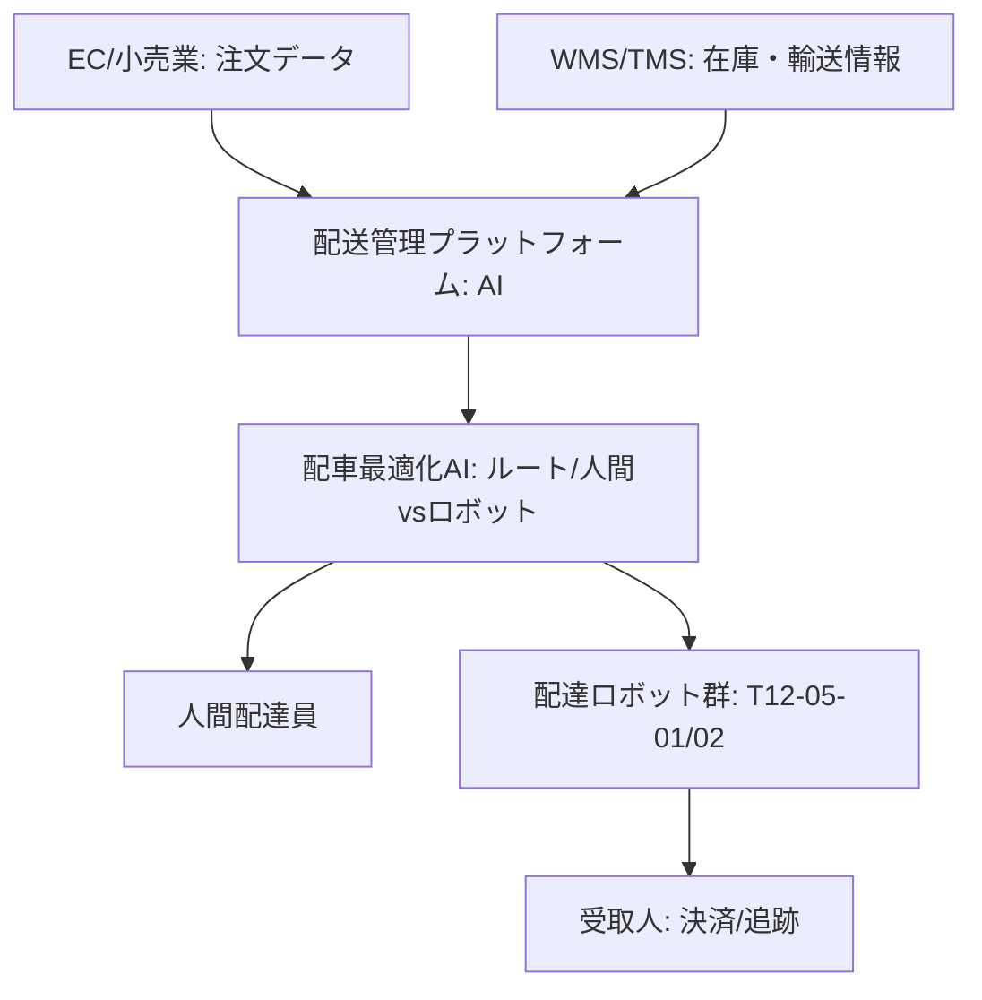

# T12-05-05 ビジネスモデル・配送管理プラットフォーム

## Summary（5つの要点）

1. **統合配送管理（TMS/WMS連携）**: **配達ロボット**の**配車、ルート、スケジュール**を**自動**で**最適化**する**クラウドベース**の**プラットフォーム**。**倉庫管理システム（WMS）**や**輸送管理システム（TMS）**と**連携**し、**注文**から**配送**までを**一元管理** `(1)`。
2. **人間・ロボットのハイブリッド運用**: **配送エリア**の**特性**（**高層ビル、郊外、歩道状況**）や**天候、時間帯**に**応じて**、**人間**の**配達員**と**ロボット**を**自動**で**組み合わせ**、**全体**の**配送効率**と**コスト**を**最適化**する**AIアルゴリズム** `(2)`。
3. **ルート最適化AI**: **リアルタイム**の**交通情報、天候、ロボット**の**バッテリー残量**、**荷物**の**温度条件**などを**考慮**し、**複数**の**ロボット**と**配送先**を**結ぶ**、**最も効率的**な**走行ルート**を**動的**に**計算**。
4. **APIによるエコシステム構築**: **スーパー、コンビニ、レストラン、EC事業者**が**簡単**に**プラットフォーム**に**接続**できる**標準API**を**提供**。**多様**な**サービス**の**ラストワンマイル**を**ロボット**が**共有**することで、**稼働率**を**向上**させ、**コスト**を**低減** `(1)`。
5. **料金決済・追跡システム**: **注文**から**ロボット**による**配達**、**自動決済**、**受取人**への**荷物追跡情報**の**提供**までを**一貫**して**管理**する**機能**。**透明性**と**利便性**を**確保**。

#### 概念図

 

---

### 技術評価表（定量的な視点）
| 評価項目 | 評価 | 根拠 |
| :--- | :--- | :--- |
| 導入コスト | ⭐⭐⭐☆☆ | クラウドインフラ、AI開発、API連携の開発コスト |
| 技術成熟度 | ⭐⭐⭐⭐☆ | 個別技術は成熟。**ハイブリッド運用**の**AI最適化**が進化中 `(2)` |
| 日本の競争力 | ⭐⭐⭐☆☆ | **ラストワンマイル**の**個別最適化**に**強み**。**グローバルプラットフォーム**では**海外勢**が**先行** `(2)` |
| 市場性 | ⭐⭐⭐⭐⭐ | **物流クライシス**、**人件費高騰**の**解決策**として**喫緊の需要**。
| 品質保証の重要性 | ⭐⭐⭐⭐⭐ | **配送遅延、誤配送**は**サービス信頼**に直結。**AI**の**最適化精度**が重要 |

---

## 日本の立ち位置・強み弱みのSummary

### 強み：日本企業や研究機関が持つ独自の技術、優位性などを箇条書きで記述。

* **きめ細やかな配送ノウハウ**: **ヤマト運輸、佐川急便**などが**培った**、**ラストワンマイル**の**複雑**な**需要**に**対応**する**配送計画**の**ノウハウ**。
* **既存WMS/TMSとの連携**: **国内**の**物流システム**に**特化**した**API連携技術**と**SIer**の**存在**。
* **小売業との緊密な連携**: **コンビニ、スーパー**などの**店舗**と**一体**となった**実証実験**が**進み**、**ビジネスモデル**の**検証**が**容易**。

### 弱み：日本が抱える規制、標準化の遅れ、海外依存などを箇条書きで記述。

* **グローバル標準の遅れ**: **Amazon、Uber Eats**など**グローバルプラットフォーム**が**主導**する**配送エコシステム**への**対応**が**遅れ**。
* **データ連携の壁**: **異なる**プラットフォーム間での**配送データ**の**共有**や**標準化**が**進まず**、**地域全体**での**最適化**が**困難**。
* **法規制の複雑さ**: **ロボット**の**運用**に**関する**、**自治体、警察**など**多様**な**機関**の**許可**が**必要**であり、**プラットフォーム**での**一括管理**が**複雑**。

---

## 技術ロードマップ（短期/中期/長期）

### 短期目標（～2027年）

* **AI**による**人間**と**ロボット**の**ハイブリッド配車最適化**の**精度**を**95%以上**に**向上**させ、**配送コスト**を**現行比30%削減**。
* **標準API**を**策定**し、**プラットフォーム**への**EC事業者**の**参入**を**加速**。
* **ロボット**の**リアルタイム**な**状態**（**故障、バッテリー**）を**可視化**する**ダッシュボード機能**を**標準化**。

### 中期目標（2028年～2031年）

* **地域**の**電力、交通、気象データ**（**T18-01-01**）と**連携**し、**社会全体**の**リソース**を**考慮**した**マクロ**な**配送最適化**を実現。
* **プラットフォーム**が**ロボット**の**自律走行アルゴリズム**を**遠隔**で**自動更新**し、**性能**を**継続的**に**改善**。
* **多種**の**ロボット**（**ドローン、大型、屋内用**）を**一元管理**できる**マルチモーダル配送**を**実現**。

### 長期目標（2032年～2035年）

* **都市**の**物流**が**完全に**「**サービス**」**化**され、**人間**の**介入**が**最小限**の**自律型都市物流ネットワーク**を**実現**。
* **プラットフォーム**が**注文**を**受ける前**に**需要**を**予測**し、**ロボット**を**事前に**「**配置**」**する**という**超効率的**な**物流**を**実現**。

### 📚 参照リンク

1. [Amazon Scout：自律型配送ロボットによるラストワンマイル革新](https://www.zdnet.com/article/amazon-scout-autonomous-delivery-robot-aims-to-take-on-the-last-mile/)
2. [ソフトバンクグループ：ロボットを活用したラストワンマイル配送の実証実験](https://group.softbank/)
3. [国土交通省：物流MaaS（Mobility as a Service）の推進](https://www.mlit.go.jp/)