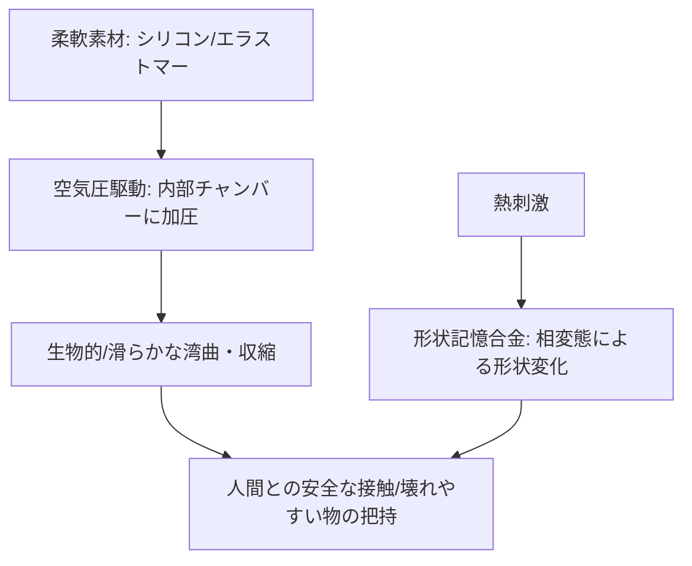

# T12-06-01 柔軟素材アクチュエータ（空気圧・形状記憶合金）

## Summary（5つの要点）

1. **本質的な安全性と柔軟性**: **シリコンゴム、エラストマー**などの**柔軟素材**で**構築**され、**人間**や**壊れやすい物体**と**接触**しても**衝撃**を**吸収**し、**破損**を**防ぐ**。**従来の剛体ロボット**の**課題**である**安全性**と**汎用性**を**解決** `(1)`。
2. **空気圧駆動（Pneumatic Actuators）**: **柔軟素材**の**内部**に**空気**を**加圧**・**減圧**することで、**筋肉**のように**収縮、湾曲、伸長**などの**滑らか**で**生物的**な**動き**を**実現**。**駆動源**は**外部**の**ポンプ**や**バルブ**で**制御**される（**PneuNet**、**McKibben型人工筋肉**） `(1)`。
3. **形状記憶合金（SMA）駆動**: **Ni-Ti合金**などの**形状記憶合金**を**ヒーター**で**加熱**し、**形状**を**変化**させることで**ロボット**を**駆動**。**軽量、小型**で**静か**な**動作**が**可能**だが、**応答速度**が**空気圧**より**遅い**という**特性**を持つ。
4. **応用分野の拡大**: **ソフトグリッパー**として**卵、果物、不定形**な**食品**の**把持**に**利用**されるほか、**狭い場所**で**動作**する**ソフトアーム**、**着る**タイプの**リハビリウェア**（**T12-06-05**）などに**応用** `(2)`。
5. **製造技術の進展**: **3Dプリンティング技術**（**T15-06-01**）の**進化**により、**柔軟素材**を**複雑**な**構造**で**一体成形**することが**可能**になり、**アクチュエータ**の**設計自由度**と**生産性**が**向上**。

#### 概念図

---

### 技術評価表（定量的な視点）
| 評価項目 | 評価 | 根拠 |
| :--- | :--- | :--- || 導入コスト | ⭐⭐⭐⭐☆ | 剛体ロボットに比べると**低コスト**だが、**バルブ・ポンプ**は**必要** |
| 技術成熟度 | ⭐⭐⭐⭐☆ | **基礎研究**から**実用化**へ**移行中**。**空気圧**の**精密制御**が**課題** `(2)` || 日本の競争力 | ⭐⭐⭐⭐☆ | **SMA（形状記憶合金）**、**高分子材料**の**研究**に**強み**。**応用分野**で**世界**を**リード** `(2)` || 市場性 | ⭐⭐⭐⭐⭐ | **食品、医療、介護**など**人間**と**接する**分野で**爆発的**な**需要** |
| 品質保証の重要性 | ⭐⭐⭐⭐⭐ | **柔軟素材**の**耐久性、クリープ**、**アクチュエータ**の**再現性**が重要 |

---

## 日本の立ち位置・強み弱みのSummary

### 強み：日本企業や研究機関が持つ独自の技術、優位性などを箇条書きで記述。

* **高分子材料技術**: **東レ、帝人**など、**高品質**で**耐久性**の**高**い**エラストマー、形状記憶ポリマー**などの**素材開発**に**強み**。
* **SMAアクチュエータの応用**: **SMA**を**リハビリ支援、医療用カテーテル**など**精密**な**分野**で**応用**する**ノウハウ**。
* **空気圧制御技術**: **SMC、CKD**など、**産業用**の**高精度**な**バルブ、ポンプ**を**提供**する**サプライヤー**の**存在**。

### 弱み：日本が抱える規制、標準化の遅れ、海外依存などを箇条書きで記述。

* **空気圧システムの一体化**: **アクチュエータ、バルブ、ポンプ**を**ロボット本体**に**小型、軽量**で**一体化**する**システムインテグレーション**が**海外勢**に**後れ**をとる。
* **バイオミメティクスデザインの遅れ**: **タコ、イモムシ**など**生物**の**動き**を**忠実**に**再現**する**ための**、**材料**と**構造**の**複雑**な**最適化設計**が**欧米**（Harvard、ETH Zurich）に**後れ**。
* **長時間の耐久性**: **柔軟素材**は**剛体**に**比**べ**疲労**や**クリープ（時間経過による変形）**を**起こしやすく**、**産業用途**での**長期間**の**信頼性確保**が**課題**。

---

## 技術ロードマップ（短期/中期/長期）

### 短期目標（～2027年）

* **空気圧駆動システム**の**一体化**（**バルブ、ポンプ**の**小型化**）により、**アーム先端部**への**搭載**を**標準化**。
* **食品、医療分野**での**ソフトグリッパー**の**市場シェア**を**80%**に**拡大**。
* **形状記憶合金**の**加熱・冷却**の**応答速度**を**空気圧駆動**と**同等**の**100ms以内**に**短縮**。

### 中期目標（2028年～2031年）

* **アクチュエータ**と**センサー**（**T12-06-02**）を**一体成形**し、**人間**の**皮膚**のように**機能**する**スマートソフトマッスル**を**実現**。
* **ロボット**が**外部**の**空気圧源**を**必要**とせず、**内蔵**した**化学反応**などで**駆動**する**完全自律型**ソフトアクチュエータを開発。
* **電気刺激**で**駆動**し、**空気圧**に**匹敵**する**力**を**発生**できる**高分子アクチュエータ（EAP）**を**実用化**。

### 長期目標（2032年～2035年）

* **細胞**や**分子**レベルでの**駆動**を**可能**とする**超小型**の**バイオアクチュエータ**を**実用化**し、**極小**の**手術**や**物質輸送**に**応用**。
* **ロボット**が**環境**の**温度、湿度、化学物質**に**応じて**、**素材**の**剛性**や**形状**を**自動**で**変化**させる**スマートマテリアルロボット**を**実現**。

### 📚 参照リンク

1. [Soft Robotics Toolkit: Actuators and Mechanisms](https://softroboticstoolkit.com/actuators)
2. [NEDO：ソフトロボティクスの動向調査](https://www.nedo.go.jp/content/100880370.pdf)
3. [Harvard Biorobotics Laboratory: Soft Robotics Research](https://biorobotics.harvard.edu/)