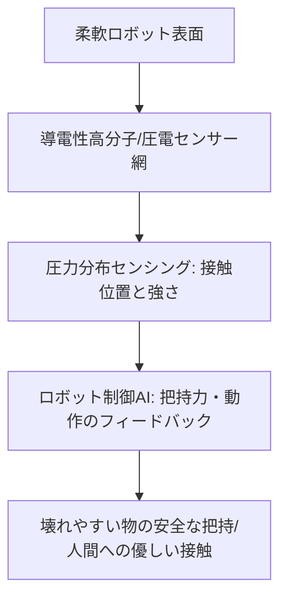

# T12-06-02 触覚センサー・圧力分布センシング

## Summary（5つの要点）

1. **高感度な接触情報の取得**: **柔軟素材**の**表面**や**内部**に**埋め込まれ**た**センサー**が、**物体**との**接触**による**圧力**の**強さ、位置、分布、形状**を**人間**の**皮膚**と**同等以上**の**感度**で**検知**する `(1)`。
2. **センサー技術の多様性**: 
    * **圧電/静電容量式**: **圧力**による**電気抵抗**や**静電容量**の**変化**を**利用**。
    * **光学式**: **接触**による**光**の**反射**や**伝達**の**変化**を**利用**し、**ノイズ**に**強**い**高感度**な**計測**を**実現**。
    * **導電性高分子**: **柔軟**で**伸縮性**の**ある**フィルムに**センサー**を**形成**し、**「電子スキン」**として**広範囲**に**適用** `(2)`。
3. **掴む力加減の精密制御**: **グリッパー**（**T12-06-01**）が**対象物**の**硬さ**や**重さ**を**触覚**で**判断**し、**破損**させない**最小限**の**力**で**把持**する**フィードバック制御**を**可能**にする。
4. **医療・介護への応用**: **医療ロボット**の**触診**（**腫瘍**の**硬さ**の**識別**）、**介護ロボット**が**高齢者**を**優しく**、**安全**に**抱き上げる**際の**皮膚**への**圧力分布**の**監視**に**不可欠** `(2)`。
5. **製造技術の進展**: **プリンテッドエレクトロニクス**や**ナノマテリアル**を**活用**し、**柔軟**で**耐久性**の**高い**センサーを**低コスト**で**大量生産**する**技術**が**進展**。

#### 概念図

---

### 技術評価表（定量的な視点）
| 評価項目 | 評価 | 根拠 |
| :--- | :--- | :--- || 導入コスト | ⭐⭐⭐☆☆ | センサーの微細加工、フレキシブル基板のコスト |
| 技術成熟度 | ⭐⭐⭐⭐☆ | **高感度化**は進展。**広範囲**での**耐久性、信頼性**の**確保**が**課題** `(1)` || 日本の競争力 | ⭐⭐⭐⭐⭐ | **高分子化学**、**微細加工**、**プリンテッドエレクトロニクス**で**世界最高レベル**の**研究** `(2)` || 市場性 | ⭐⭐⭐⭐⭐ | **自動化、医療、介護**の**高度化**に**不可欠**な**「感覚」**を**提供** || 品質保証の重要性 | ⭐⭐⭐⭐⭐ | **計測**の**ドリフト、ノイズ**が**誤動作**に直結。**長期**の**使用**に**耐える****耐久性**が重要 |

---

## 日本の立ち位置・強み弱みのSummary

### 強み：日本企業や研究機関が持つ独自の技術、優位性などを箇条書きで記述。

* **導電性高分子・電子スキン**: **東京大学**の**染谷研究室**などが**開発**する**伸縮自在**な**超薄型センサー**（**電子皮膚**）は**世界最高水準**。
* **微細加工・MEMS技術**: **高感度**な**圧力センサー**を**シリコン**や**柔軟基板**に**集積化**する**微細加工技術**。
* **触覚フィードバック制御**: **力覚センサー**（**T12-04-01**）と**触覚センサー**を**統合**し、**繊細**な**マスタースレーブ操作**を**実現**する**制御ノウハウ**。

### 弱み：日本が抱える規制、標準化の遅れ、海外依存などを箇条書きで記述。

* **データ処理の遅延**: **高密度**に**配置**された**多数**の**センサー**から**取得**される**膨大**な**データ**を**リアルタイム**で**処理**するための**高性能**な**エッジAIチップ**（**T18-04-05**）が**不足**。
* **標準化の遅れ**: **触覚センサー**の**計測指標、インターフェース**の**標準化**が**遅れ**ており、**異なるメーカー**の**ロボット**への**搭載**が**複雑**。
* **量産コスト**: **柔軟素材**への**センサー**の**精密**な**埋め込み**・**配線技術**が**複雑**で、**量産時**の**コスト削減**が**課題**。

---

## 技術ロードマップ（短期/中期/長期）

### 短期目標（～2027年）

* **ロボットアーム**の**先端部**に**触覚センサー**を**標準搭載**し、**不定形**な**物体**の**把持**を**実用化**。
* **センサー**の**耐久性**を**産業用ロボット**と**同等**の**数百万サイクル**に**向上**。
* **圧力、温度**を**同時**に**検知**できる**マルチモーダル**な**触覚センサー**を**開発**。

### 中期目標（2028年～2031年）

* **人間**の**皮膚**を**超える****感度**と**解像度**（**1mm以下**）の**電子スキン**を**ロボット全体**に**展開**。
* **AI**が**触覚情報**から**物体**の**材質、内部構造、新鮮さ**を**推定**し、**作業**に**フィードバック**。
* **手術ロボット**が**触覚センサー**を**利用**し、**外科医**に**組織**の**硬さ**を**リアルタイム**で**伝える**（**T12-06-05**）。

### 長期目標（2032年～2035年）

* **ロボット**が**人間**の**手のひら**と**遜色**ない**器用さ**で**繊細**な**作業**を**行う**ために、**触覚**と**深層学習**が**統合**された**制御系**を**実現**。
* **人間**が**直接**、**ロボット**の**触覚**を**遠隔**で**体験**できる**テレイグジスタンス**の**触覚インターフェース**を**標準化**。

### 📚 参照リンク

1. [Soft Robotics: Review on Tactile Sensing and its Applications](https://journals.sagepub.com/doi/full/10.1177/1729881419830500)
2. [東京大学 染谷研究室：電子皮膚（e-skin）技術](https://www.jst.go.jp/pr/announce/20161021/index.html)
3. [NEDO：触覚・五感センシング技術の動向調査](https://www.nedo.go.jp/content/100880370.pdf)