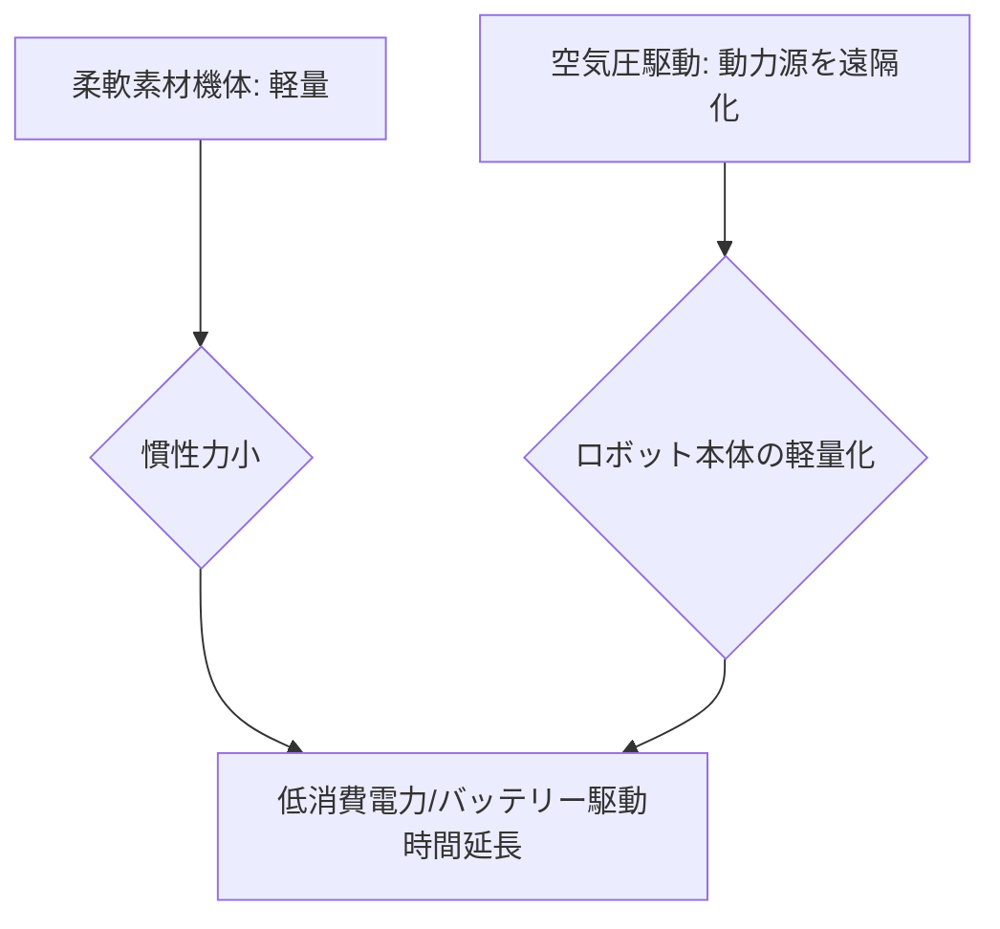

# T12-06-03 軽量・省エネルギー駆動システム

## Summary（5つの要点）

1. **軽量化による省エネ**: **柔軟素材（シリコン、エラストマー）**の**利用**により、**ロボット**の**機体**が**本質的**に**軽量化**され、**重いモーター、ギア、フレーム**が**不要**となる。**動作時**の**慣性力**が**小**さく、**消費エネルギー**が**劇的**に**削減**される `(1)`。
2. **空気圧駆動の優位性**: **空気圧システム**は**電力**を**使わず**、**コンプレッサー**を**遠隔**に**配置**できるため、**ロボット本体**の**軽量化**に**貢献**。また、**空気**が**漏れても感電リスク**がなく、**本質的**に**安全** `(2)`。
3. **バッテリー駆動時間の延長**: **省エネルギー化**により、**同容量**の**バッテリー**でも**駆動時間**が**延長**され、**モバイル**での**長時間作業**（**災害救助、農業**）が**可能**となる。**駆動源**の**内蔵化**も**容易**。
4. **構造的な安全性**: **柔軟アクチュエータ**は**電力**の**損失**や**故障**で**動作**が**停止**しても、**急激**に**硬直**したり**衝突**したりする**リスク**が**低**い（**柔順性**）。**安全**のための**追加的**な**センサー**や**機構**が**不要**で**コスト削減**に**貢献**。
5. **新駆動原理の探索**: **形状記憶合金（SMA）**、**誘電エラストマーアクチュエータ（DEA）**、**化学反応**を**利用**した**駆動**など、**電力**や**外部ポンプ**に**依存**しない**新**しい**駆動原理**が**研究**されており、**さらなる**の**軽量・省エネ**を**目指**す `(1)`。

#### 概念図

---

### 技術評価表（定量的な視点）
| 評価項目 | 評価 | 根拠 |
| :--- | :--- | :--- || 導入コスト | ⭐⭐⭐⭐☆ | 部品点数が少なく、剛体ロボットより安価 |
| 技術成熟度 | ⭐⭐⭐☆☆ | **基礎研究**段階。**空気圧システム**の**統合**と**効率向上**が**課題** `(2)` || 日本の競争力 | ⭐⭐⭐⭐☆ | **高分子化学**と**SMA（形状記憶合金）**による**新駆動原理**で**強み** |
| 市場性 | ⭐⭐⭐⭐⭐ | **バッテリー駆動**の**モバイルロボット**の**全**てに**影響**を**与える** |
| 品質保証の重要性 | ⭐⭐⭐⭐⭐ | **駆動効率**と**バッテリー寿命**が**稼働率**に直結。**耐久性**が重要 |

---

## 日本の立ち位置・強み弱みのSummary

### 強み：日本企業や研究機関が持つ独自の技術、優位性などを箇条書きで記述。

* **超低消費電力部品**: **CMOSセンサー、マイコン**など、**エレクトロニクス**の**分野**で**培われた**、**超低消費電力**な**電子部品**の**技術**。
* **SMAアクチュエータの効率化**: **形状記憶合金**の**加熱**・**冷却**プロセス**の**効率**を**最大化**する**制御技術**。
* **高効率な小型バッテリー**: **リチウムイオンバッテリー**の**高エネルギー密度化**と**小型化**の**技術**。

### 弱み：日本が抱える規制、標準化の遅れ、海外依存などを箇条書きで記述。

* **ソフトロボット特有の制御**: **柔軟**で**非線形**な**挙動**を**精密**に**制御**するための**最適化アルゴリズム**の開発が**欧米**に**後れ**をとる。
* **内蔵型ポンプ・バルブの不足**: **空気圧駆動**に**必要**な**超小型、高効率**な**内蔵型マイクロポンプ、マイクロバルブ**の**開発**が**途上**。
* **エネルギーハーベスティングの統合**: **ロボット**が**自律的**に**環境**から**エネルギー**を**収集**（**振動発電**など）し、**駆動**に**利用**する**システム**の**統合**が**遅れ**。

---

## 技術ロードマップ（短期/中期/長期）

### 短期目標（～2027年）

* **空気圧駆動**の**エネルギー効率**を**現行比20%向上**させる**AI制御**を**導入**。
* **ロボット本体**の**重量**に**対**する**可搬重量**の**比率（ペイロード比）**を**10倍以上**に**向上**。
* **柔軟アクチュエータ**の**非線形特性**を**補償**するための**ロバスト制御**を**標準化**。

### 中期目標（2028年～2031年）

* **駆動**に**必要**な**電力**の**半分**を**環境**から**エネルギーハーベスティング**で**賄う**。
* **ロボット**が**形状**を**変化**させる**際**に**発生**する**熱**や**振動**を**利用**して**駆動**する**自己持続型**ソフトロボットを開発。
* **人工筋肉**の**高分子素材**に**太陽電池**や**静電発電**を**統合**し、**外装**を**全て**エネルギー源とする**デザイン**。

### 長期目標（2032年～2035年）

* **生体**と**同等**の**エネルギー効率**（**最大10倍以上**の**削減**）で**動作**する**ソフトロボット**を**実現**。
* **駆動システム**が**周囲**の**環境**（**温度、湿度**）から**動力**を**抽出**し、**半永久的**に**稼働**する**究極**の**省エネ**を**実現**。

### 📚 参照リンク

1. [ScienceDirect: Soft Robotics Review on Actuators and Energy Efficiency](https://www.sciencedirect.com/science/article/pii/S235249502030113X)
2. [SMC：空気圧制御機器の技術動向](https://www.smcworld.com/product/ja/s.do?pID=S-EV-A)
3. [NEDO：ソフトロボット技術の動向調査](https://www.nedo.go.jp/content/100880370.pdf)