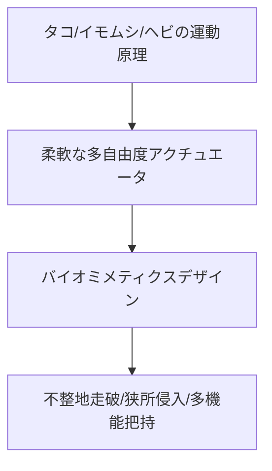

# T12-06-04 生物模倣デザイン（バイオミメティクス）

## Summary（5つの要点）

1. **生物の運動原理の応用**: **タコ**の**腕**や**イモムシ**の**蠕動運動**、**ヘビ**の**移動**など、**生物**が**環境**に**適応**して**行**う**柔軟**で**多自由度**な**動き**の**原理**を**ロボット**の**設計**に**応用**する `(1)`。
2. **不整地・狭所への適応**: **剛体**では**進入**が**困難**な**配管内**、**瓦礫**の**隙間、水中**など**不均一**な**環境**で、**体**を**変形**させながら**効率的**に**移動**・**作業**する**能力**を**実現**（**ヘビ型ロボット**、**昆虫型ロボット**）。
3. **高い適応性を持つ把持**: **タコ**の**吸盤**や**ゾウ**の**鼻**など**生物**の**器用**な**把持原理**を**応用**し、**不定形**な**物体**を**優しく、確実**に**掴む**（**ソフトグリッパー**、**T12-06-01**）。
4. **効率的なエネルギー利用**: **生物**の**筋肉**や**骨格**の**構造**を**模倣**することで、**最小限**の**エネルギー**で**複雑**な**動作**を**可能**とする**省エネ設計**（**T12-06-03**）。
5. **センシング・制御の統合**: **生物**の**神経系**と**皮膚**の**連携**を**模倣**し、**体全体**に**分散**された**センサー**（**T12-06-02**）と**アクチュエータ**が**協調**して**複雑**な**環境**に**適応**した**動き**を**自律的**に**生成** `(2)`。

#### 概念図

---

### 技術評価表（定量的な視点）
| 評価項目 | 評価 | 根拠 |
| :--- | :--- | :--- || 導入コスト | ⭐⭐⭐☆☆ | 複雑な構造の設計・製造コスト |
| 技術成熟度 | ⭐⭐⭐☆☆ | **研究段階**が**中心**。**実用環境**での**耐久性**と**速度**が**課題** `(1)` || 日本の競争力 | ⭐⭐⭐⭐⭐ | **東京工業大学、東北大学**など**生物模倣ロボット**の**基礎研究**で**世界**を**牽引** `(2)` || 市場性 | ⭐⭐⭐⭐☆ | **災害救助、インフラ点検、海洋探査**など**特殊環境**での**ニッチ**な**市場** |
| 品質保証の重要性 | ⭐⭐⭐⭐⭐ | **悪環境下**での**動作信頼性**、**センサー**と**アクチュエータ**の**連携**の**再現性**が重要 |

---

## 日本の立ち位置・強み弱みのSummary

### 強み：日本企業や研究機関が持つ独自の技術、優位性などを箇条書きで記述。

* **生物学・ロボティクスの融合**: **生物**の**運動メカニズム**を**深く理解**し、**ロボット**に**応用**する**学際的**な**研究**が**盛ん**。
* **特殊環境下での実績**: **ヘビ型ロボット**など、**原子力発電所**の**点検**や**災害現場**での**がれき**を**乗り越える**ための**特殊ロボット**の**開発実績**。
* **材料科学の優位性**: **柔軟**でありながら**高強度**を**保つ**ための**新素材（T15-02-01）**や**複合材料**の**開発**。

### 弱み：日本が抱える規制、標準化の遅れ、海外依存などを箇条書きで記述。

* **大規模なフィールドテスト不足**: **災害救助、インフラ点検**など**実社会**での**大規模**な**実証実験**の**機会**が**欧米**に**劣後**。
* **制御の非線形性**: **生物模倣**の**複雑**で**非線形**な**挙動**を**高速**で**精密**に**制御**する**アルゴリズム**の**開発**が**高度**で**困難**。
* **商業化の遅れ**: **研究成果**が**製品化**され、**ニッチ**な**市場**で**広く**利用**される**まで**の**プロセス**が**遅い**。

---

## 技術ロードマップ（短期/中期/長期）

### 短期目標（～2027年）

* **生物模倣ロボット**の**不整地走破率**を**90%以上**に**向上**させ、**災害現場**での**実用化**を**拡大**。
* **タコ**の**腕**のような**多自由度**の**ソフトアーム**を**開発**し、**極端**に**狭い場所**での**作業**を**実現**。
* **AI**が**環境**の**画像**から**生物**の**最適な**「**歩き方**」**を**瞬時**に**模倣**し、**動作**を**自動生成**。

### 中期目標（2028年～2031年）

* **ロボット**が**生物**と**同等**の**感覚器**を**持ち**、**温度、光、化学物質**を**検知**して**自律的**に**行動**。
* **ロボット**の**体**を**構成**する**素材**が**自己修復機能**（**T15-02-03**）を**持ち**、**損傷**を**自動**で**修復**。
* **生物**の**群れ**の**行動**を**模倣**し、**多数**の**ソフトロボット**が**協調**して**複雑**な**タスク**を**実行**。

### 長期目標（2032年～2035年）

* **ロボット**が**進化**の**原理**を**自律的**に**学習**し、**与えられ**た**環境**に**最適**な**「身体」**を**自ら****設計**・**生成**（**自己進化**）。
* **人間**の**臓器、筋肉、血管**を**模倣**した**医療用**の**バイオロボット**を**実現**し、**究極**の**低侵襲治療**を**実現**。

### 📚 参照リンク

1. [Nature: Soft robots that are self-sufficient and self-healing](https://www.nature.com/articles/nature16972)
2. [東京工業大学：広瀬研究室/ヘビ型ロボット](https://www.hirose.pi-robot.co.jp/)
3. [NEDO：ソフトロボット技術の動向調査](https://www.nedo.go.jp/content/100880370.pdf)