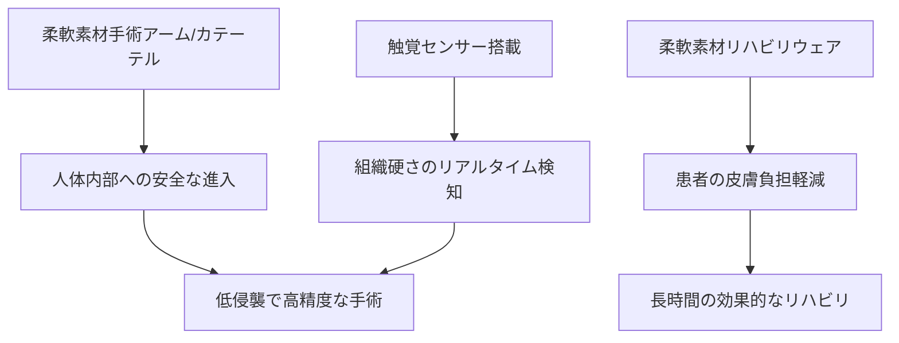

# T12-06-05 医療応用（低侵襲手術ロボット・リハビリロボット）

## Summary（5つの要点）

1. **低侵襲手術の安全性向上**: **柔軟素材**で**構成**された**手術ロボット**（**内視鏡、カテーテル**）が、**人体**の**湾曲**した**臓器、血管**を**損傷**させる**リスク**を**最小限**に**抑え**て**進入**し、**手術**を**行う** `(1)`。
2. **ソフト内視鏡**: **従来の硬**い**内視鏡**と**異**なり、**消化管**の**複雑**な**経路**を**蠕動運動**（**T12-06-04**）や**自律的**な**屈曲**で**安全**に**進**み、**診断**や**治療**を**行**う（**早期癌**の**切除**など）。
3. **優しいリハビリ支援**: **リハビリロボット、介護支援ロボット**として**装着**される**ウェアラブルデバイス**に**柔軟素材**を**利用**。**皮膚**や**関節**への**圧迫**や**摩擦**を**低減**し、**長時間の使用**による**患者**の**負担**を**最小化** `(2)`。
4. **触覚フィードバックによる精密操作**: **手術ロボット**の**先端**に**触覚センサー**（**T12-06-02**）を**搭載**し、**外科医**に**組織**の**硬さ**や**張力**を**リアルタイム**で**伝える**。これにより、**繊細**で**高度**な**手術**を**実現**。
5. **国際的な承認獲得**: **ソフトロボティクス**を**医療機器**として**実用化**するためには、**FDA**や**CEマーク**など**国際的**な**医療機器承認**が**必須**であり、**臨床試験**と**安全性評価**が**進展中**。

#### 概念図

---

### 技術評価表（定量的な視点）
| 評価項目 | 評価 | 根拠 |
| :--- | :--- | :--- || 導入コスト | ⭐⭐⭐☆☆ | 医療機器としての**認証コスト**が**高**い |
| 技術成熟度 | ⭐⭐⭐☆☆ | **研究**から**臨床試験**段階。**信頼性、滅菌**が**課題** `(1)` || 日本の競争力 | ⭐⭐⭐⭐⭐ | **内視鏡技術**（**オリンパス、富士フイルム**）と**リハビリロボット**の**研究**に**強み** `(2)` || 市場性 | ⭐⭐⭐⭐⭐ | **高齢化**と**医療費削減**の**ニーズ**により**巨大**な**市場** |
| 品質保証の重要性 | ⭐⭐⭐⭐⭐ | **人命**に**関わる**ため、**素材**の**生体適合性、滅菌性、故障率**の**ゼロ化**が最重要 |

---

## 日本の立ち位置・強み弱みのSummary

### 強み：日本企業や研究機関が持つ独自の技術、優位性などを箇条書きで記述。

* **世界最高峰の内視鏡技術**: **オリンパス、富士フイルム**など、**内視鏡**の**光学、微細加工、駆動**の**分野**で**世界**を**リード**。
* **リハビリ・介護ロボットの先行**: **装着型リハビリロボット（HALなど）**や**介護支援機器**の**開発**が**進み**、**臨床データ**が**豊富**。
* **生体適合性材料技術**: **手術**や**体内**に**使用**する**高分子素材**の**生体適合性、安全性**に**関する****高い技術**。

### 弱み：日本が抱える規制、標準化の遅れ、海外依存などを箇条書きで記述。

* **医療機器承認の複雑さ**: **革新的な**ソフトロボティクス**医療機器**の**薬事承認**プロセスが**欧米**に**比**べ**時間**が**かかり**、**実用化**が**遅延**。
* **手術ロボットプラットフォーム**: **ダヴィンチ**など**海外製**の**剛体手術ロボット**が**市場**を**支配**しており、**ソフトロボット**の**参入**に**時間**を**要**する。
* **医療現場との連携**: **医師**や**リハビリ専門家**と**ロボット開発者**の**連携**を**強化**し、**現場**の**ニーズ**を**迅速**に**反映**する**体制**が**課題**。

---

## 技術ロードマップ（短期/中期/長期）

### 短期目標（～2027年）

* **柔軟素材**の**リハビリウェア**の**装着感**と**駆動補助力**の**最適化**を**実現**し、**国内市場**での**シェア**を**拡大**。
* **カテーテル**や**内視鏡**に**ソフトアクチュエータ**を**搭載**し、**遠隔**からの**湾曲操作**を**可能**とする**低侵襲診断**を**実用化**。
* **手術ロボット**の**触覚フィードバック**の**精度**を**99%以上**に**向上**させ、**臨床試験**を**加速**。

### 中期目標（2028年～2031年）

* **生体**の**蠕動運動**を**模倣**し、**消化管**を**自律的**に**移動**・**診断**・**治療**する**カプセル型ソフトロボット**を**開発**。
* **血管内**に**進入**し、**血栓**や**疾患**を**柔軟素材**で**安全**に**除去**・**治療**する**ナノ・マイクロソフトロボット**の**基礎研究**を**確立**。
* **AI**が**患者**の**状態**や**リハビリ**の**進捗**を**解析**し、**ロボット**の**補助力**を**自動**で**調整**する**個別化リハビリシステム**。

### 長期目標（2032年～2035年）

* **手術**の**全**プロセス**を**自律的**に**行**い、**人間**の**外科医**は**監視**のみを**行**う**完全自律型ソフト手術ロボット**を**実現**。
* **体内**に**埋め込まれ**、**長期間**に**わたり**、**薬物**の**放出**や**生体信号**の**監視**を**行**う**生分解性**ソフトロボットを**実現**。

### 📚 参照リンク

1. [ScienceDirect: Soft Robotics in Minimally Invasive Surgery](https://www.sciencedirect.com/science/article/pii/S036083521830578X)
2. [NEDO：リハビリ・生活支援ロボット技術の研究開発](https://www.nedo.go.jp/activities/ZZJP_100067.html)
3. [オリンパス：医療機器・内視鏡技術の紹介](https://www.olympus-izu.com/)