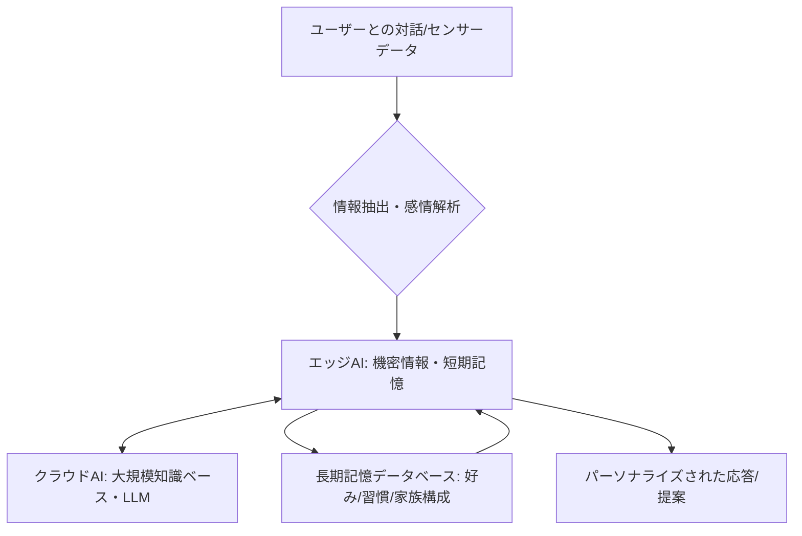

# T12-07-01 長期記憶・パーソナライゼーションAI

## Summary（5つの要点）

1. **継続的な関係性の構築**: **ユーザー**の**対話履歴**、**趣味**、**生活習慣、家族構成**などを**長期記憶**として**保存**し、**「昨日話した続き」**を**理解**することで、**人間**との**継続的**な**関係性**を**構築**する `(1)`。
2. **ハイブリッドAI構成**: **プライバシー**に**関わる****機密情報**（**家族、健康**など）の**記憶**・**推論**を**デバイス内**の**エッジAI**で**実行**し、**大規模**な**知識**・**モデル**の**更新**を**クラウドAI**で**行う**（**フェデレーテッドラーニング**）。
3. **プロンプトエンジニアリングの高度化**: **長期記憶**から**関連情報**を**検索**・**抽出**し、**大規模言語モデル（LLM）**への**入力（プロンプト）**に**組み込む**ことで、**個別最適化**された**応答**を**生成**する（**RAG: Retrieval-Augmented Generation**）。
4. **記憶のライフサイクル管理**: **記憶**の**優先順位**（**頻度、感情、重要度**）に**応じ**て**長期、短期**を**区別**し、**不要**な**記憶**は**自動**で**忘却**・**抽象化**する**仕組み**が**必要**となる。
5. **感情・意図の理解**: **長期記憶**に**基**づき、**ユーザー**の**発言**に**隠さ**れた**感情**や**真**の**意図**を**より****深**く**推論**し、**共感**を**示**す**応答**を**可能**とする `(2)`。

#### 概念図

---

### 技術評価表（定量的な視点）
| 評価項目 | 評価 | 根拠 |
| :--- | :--- | :--- || 導入コスト | ⭐⭐⭐☆☆ | **高性能**な**エッジAIチップ**の**コスト**が**必要** `(1)` |
| 技術成熟度 | ⭐⭐⭐⭐☆ | **RAG技術**は**実用化**段階だが、**記憶**の**「忘却」**や**倫理的**な**制御**は**課題** || 日本の競争力 | ⭐⭐⭐⭐☆ | **自然言語処理**、**エッジAIハードウェア**（**半導体**）の**分野**に**強み** |
| 市場性 | ⭐⭐⭐⭐⭐ | **対話型AI**の**満足度**と**リピート率**に**直結**する**核心**技術 |
| 品質保証の重要性 | ⭐⭐⭐⭐⭐ | **記憶**の**正確性、一貫性**、**プライバシー保護**の**保証**が**必須** |

---

## 日本の立ち位置・強み弱みのSummary

### 強み：日本企業や研究機関が持つ独自の技術、優位性などを箇条書きで記述。

* **エッジAIチップ技術**: **低消費電力**で**高度**な**AI推論**を**実現**する**組み込み型**の**AIチップ**（**T18-04-05**）の**開発**。
* **日本語LLMの研究**: **日本語**の**文脈**や**文化**を**深**く**理解**し、**自然**な**対話**を**可能**とする**独自**の**LLM開発**。
* **プライバシー保護技術**: **秘匿計算、差分プライバシー**など、**データ**を**保護**しながら**学習**を**行**う**技術**の**研究**。

### 弱み：日本が抱える規制、標準化の遅れ、海外依存などを箇条書きで記述。

* **クラウドLLMへの依存**: **大規模**な**基盤モデル**の**開発**・**運用**で**米国**の**巨大IT企業**に**依存**。
* **倫理的ガイドラインの遅れ**: **AI**が**ユーザー**の**機密情報**を**長期記憶**として**扱**う**際**の**利用停止、削除、忘却**に**関する**法的な**枠組み**や**技術**の**標準化**が**遅延**。
* **多言語対応の不足**: **海外**の**家族**や**友人**と**の****連携**を**考慮**した**多言語**での**記憶**・**対話**の**シームレス**な**実現**が**課題**。

---

## 技術ロードマップ（短期/中期/長期）

### 短期目標（～2027年）

* **クラウド**と**エッジ**で**記憶**を**分離**し、**プライバシー**を**保護**する**ハイブリッドAI構成**を**標準化**。
* **過去7日間**の**対話内容**を**基**に、**一貫性**の**ある****応答**を**生成**する**機能**を**実装**。
* **ユーザー**の**好物**、**嫌いなもの**、**名前**など**基本**プロファイル**情報**を**99%**の**精度**で**記憶**・**利用**。

### 中期目標（2028年～2031年）

* **記憶**の**中**から**感情**の**変化**を**検出**し、**ロボット**が**自律的**に**会話**の**トーン**や**テーマ**を**調整**。
* **長期記憶**を**利用**し、**ユーザー**が**気付か**ない**潜在的**な**ニーズ**を**予測**して**提案**（**T12-07-02**と**連携**）。
* **法規**に**適合**し、**ユーザー**からの**指示**で**個別**の**記憶**を**消去**できる**「**デジタル忘却**」**機能**を**実装**。

### 長期目標（2032年～2035年）

* **人間**と**区別**がつかない**レベル**の**個性、人格**を**持**つ**AI**を**実現**し、**ユーザー**の**人生**に**関わる****重要**な**意思決定**を**共**に**行**う**パートナー**となる。
* **AI**が**自ら**の**「**記憶**」**を**再構築**・**抽象化**し、**人間**の**経験**に**近**い**形**で**学習**を**行**う**自己改善**システム**を**確立**。

### 📚 参照リンク

1. [Nature Machine Intelligence: Long-term memory in AI for continuous human-robot interaction](https://www.nature.com/articles/s42256-022-00516-x)
2. [ACM Transactions on Human-Robot Interaction: Emotional Intelligence for Social Robots](https://dl.acm.org/doi/full/10.1145/3371676)
3. [総務省: AIネットワーク社会推進会議におけるプライバシー保護の動向](https://www.soumu.go.jp/main_sosiki/singi/ai/)
