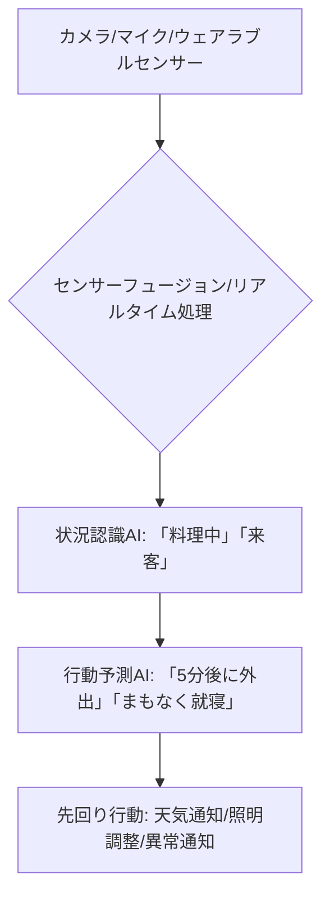

# T12-07-02 状況認識・行動予測エンジン

## Summary（5つの要点）

1. **マルチモーダルデータ融合**: **カメラ（画像）、マイク（音声、環境音）、加速度、温度**などの**複数**の**センサー**から**得**られる**情報**を**統合（センサーフュージョン）**し、**家庭内**の**状況**を**リアルタイム**で**正確**に**認識**する `(1)`。
2. **状況認識の定義**: 「**ユーザー**が**料理中**」「**来客**がある」「**転倒**した」「**集中**して**読書中**」など、**抽象的**な**状況**を**定義**し、**AI**が**各**センサー**データ**から**状況**を**分類**・**特定**する。
3. **時系列予測モデル**: **過去**の**行動パターン**の**長期記憶（T12-07-01**）に**基**づき、**ユーザー**が**次**に**何**を**行**うかを**数秒**から**数十分****先**まで**予測**する（**例**：**「ユーザーがコートに手をかけた」**→**「間もなく外出する」**）。
4. **先回りサポートの実現**: **行動予測**の**結果**に**基**づき、**適切**な**タイミング**で**介入**（**例**：**「外出前に天気予報を通知」「就寝前に照明を自動で調整」**）。**特に**、**薬**の**飲み忘れ**や**転倒**など**危険**な**行動**の**未然****防止**に**貢献** `(2)`。
5. **プライバシーと信頼性**: **常時****モニタリング**は**プライバシー**の**懸念**を**伴**うため、**エッジ**での**画像**・**音声**の**匿名化**・**非特定化**、**ユーザー**による**モニタリング**の**オンオフ制御**が**必須**。

#### 概念図

---

### 技術評価表（定量的な視点）
| 評価項目 | 評価 | 根拠 |
| :--- | :--- | :--- || 導入コスト | ⭐⭐⭐☆☆ | **センサー**と**エッジAIチップ**の**統合**コスト |
| 技術成熟度 | ⭐⭐⭐⭐☆ | **主要**な**行動認識**は**実用化**。**複雑**な**意図予測**は**研究**段階 `(1)` || 日本の競争力 | ⭐⭐⭐⭐⭐ | **高精度**な**センサー**、**画像認識AI**（**ファナック**など**産業用**の**強み**） |
| 市場性 | ⭐⭐⭐⭐⭐ | **高齢者見守り**、**防犯**、**スマートホーム**の**核**となる**機能** |
| 品質保証の重要性 | ⭐⭐⭐⭐⭐ | **誤認識、誤予測**が**危険**な**誤動作**に**直結**するため**重要** |

---

## 日本の立ち位置・強み弱みのSummary

### 強み：日本企業や研究機関が持つ独自の技術、優位性などを箇条書きで記述。

* **高精度センサー技術**: **カメラ**、**マイク**、**加速度計、環境センサー**の**製造技術**と**品質**は**世界最高水準**。
* **エッジAI画像解析**: **プライバシー**に**配慮**し、**デバイス内**で**人**の**動き**や**物体**を**認識**する**軽量**な**AIモデル**の**開発**。
* **高齢者見守りノウハウ**: **介護施設**や**在宅介護**での**実証実験**が**豊富**であり、**異常行動**の**パターン**に関する**データ**と**知見**。

### 弱み：日本が抱える規制、標準化の遅れ、海外依存などを箇条書きで記述。

* **プライバシー規制の制約**: **カメラ**や**マイク**による**常時****モニタリング**に**対**する**ユーザー**の**心理的****抵抗**と、**関連法規制**の**厳格**さが**実証実験**の**足かせ**。
* **センサーフュージョンの複雑性**: **異種**の**センサー**（**画像、音響、触覚**）から**得**られる**情報**を**統合**し、**意味**のある**状況**を**抽出**する**アルゴリズム**の**高度**な**開発**が**必要**。
* **行動予測の倫理問題**: **AI**が**行動**を**予測**し**介入**する**際**に、**自由意思**の**尊重**や**過剰**な**介入**を**避**ける**ための****倫理的**な**設計**が**未整備**。

---

## 技術ロードマップ（短期/中期/長期）

### 短期目標（～2027年）

* **主要**な**生活動作**（**起床、就寝、食事、外出、転倒**）の**認識精度**を**98%以上**に**向上**。
* **AI**が**ユーザー**の**転倒**を**検知**した**際**に、**家族**や**緊急機関**に**自動**で**通報**する**システム**を**実用化**。
* **常時****モニタリング****中**の**データ**の**全て**を**エッジ側**で**匿名化**し、**プライバシー**を**確保**する**仕組み**を**標準搭載**。

### 中期目標（2028年～2031年）

* **ユーザー**の**「**疲労**」「**ストレス**」「**集中力**」など**心理的**な**状況**を**推定**し、**介入**する**タイミング**を**最適化**。
* **予測**の**信頼度**を**AI**が**自ら****評価**し、**信頼度**が**高**い**場合**のみ**先回り****サポート**を**行**う**自律制御**を**導入**。
* **複数**の**家族****メンバー**の**行動**や**意図**を**同時**に**認識**・**予測**し、**家族****間**の**コミュニケーション**を**支援**。

### 長期目標（2032年～2035年）

* **AI**が**人間**の**心理**と**同等**の**複雑**さで**状況**を**理解**し、**誤検出**ゼロで**危機**を**回避**する**安全****確保****システム**を**確立**。
* **予測**と**介入**の**プロセス**を**人間**が**理解**できる**形**で**説明**する**「**説明可能**な**AI（XAI）**」**を**標準搭載**し、**倫理的**な**信頼性**を**確保**。

### 📚 参照リンク

1. [IEEE Transactions on Mobile Computing: Context-Awareness and Activity Recognition in Smart Environments](https://ieeexplore.ieee.org/document/8916321)
2. [ACM CHI: Proactive and Predictive Human-Robot Interaction](https://dl.acm.org/doi/full/10.1145/3313831.3376518)
3. [NEDO: AIを活用した認知機能の低下予防技術の研究開発](https://www.nedo.go.jp/activities/ZZJP_100140.html)
