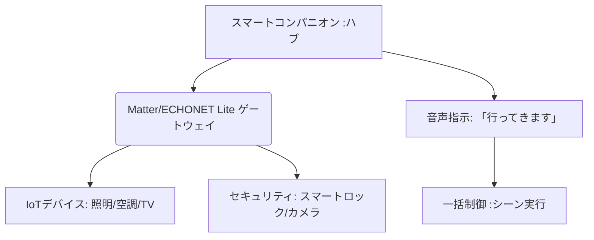

# T12-07-03 スマートホーム統合制御（IoT連携）

## Summary（5つの要点）

1. **プラットフォーム統合の標準化**: **Amazon Alexa、Google Home、Apple HomeKit**などの**異なる****エコシステム**を**横断**して**家電**を**制御**するため、**共通**の**通信**・**アプリケーション****層**を**提供**する**「Matter」**などの**標準規格**の**採用**が**加速** `(1)`。
2. **音声による一括制御**: **スマートコンパニオン**が**ハブ**となり、**ユーザー**の**自然**な**音声指示**（**例**：「**おはよう**」**で****照明**と**エアコン**を**起動**）を**解釈**し、**複数**の**IoTデバイス**を**同時**に**制御**する**「**シーン制御**」**を**実行**。
3. **高齢者・障害者支援**: **身体**の**自由**が**利**かない**人**でも、**音声**だけで**照明、鍵、カーテン**など**生活**に**不可欠**な**設備**を**操作**できる**環境**を**提供**し、**生活**の**自立**を**支援**。
4. **セキュリティの集中管理**: **多数**の**家庭内IoTデバイス**が**持**つ**セキュリティ****脆弱性**を**一元管理**し、**不正アクセス**や**マルウェア**の**侵入**を**防止**する**ゲートウェイ****機能**を**担**う。
5. **環境の最適化**: **ユーザー**の**状況認識（T12-07-02）**や**長期記憶（T12-07-01）**と**連携**し、**照明**の**色**や**空調**の**温度**を**感情**や**健康状態**に**合**わせて**自動**で**最適**に**調整**する**（**自律制御**）。

#### 概念図

---

### 技術評価表（定量的な視点）
| 評価項目 | 評価 | 根拠 |
| :--- | :--- | :--- || 導入コスト | ⭐⭐⭐⭐☆ | **Matter**の**普及**で**デバイス****単価**が**下落**傾向 |
| 技術成熟度 | ⭐⭐⭐⭐☆ | **主要**な**規格**が**出揃い**、**相互接続性**が**向上** `(1)` || 日本の競争力 | ⭐⭐⭐⭐⭐ | **家電メーカー**が**多**く、**ECHONET Lite**など**独自**の**標準**も**普及** |
| 市場性 | ⭐⭐⭐⭐⭐ | **住宅**の**スマート化**は**不可逆**な**トレンド**で**市場**は**拡大** |
| 品質保証の重要性 | ⭐⭐⭐⭐⭐ | **セキュリティ**と**誤動作****防止**（**火災、施錠**など**生命**に**関わる**）が**最重要** |

---

## 日本の立ち位置・強み弱みのSummary

### 強み：日本企業や研究機関が持つ独自の技術、優位性などを箇条書きで記述。

* **ECHONET Liteの普及**: **国内**の**主要****家電**メーカー**が**採用**する**スマートハウス****向け****通信規格**であり、**既存**の**家電**との**連携**に**強み**。
* **高度な家電製造技術**: **エアコン、冷蔵庫**など**高機能**な**家電製品**の**製造技術**が**高**く、**IoT対応**も**進展**。
* **住宅・建築業界との連携**: **ハウスメーカー**や**建設業界**との**連携**が**進み**、**新築****住宅**への**組み込み**が**加速**。

### 弱み：日本が抱える規制、標準化の遅れ、海外依存などを箇条書きで記述。

* **プラットフォームの海外依存**: **Amazon、Google、Apple**などの**海外****プラットフォーマー**が**制御**の**中心**となり、**主導権**を**握ら**れて**いる**。
* **古い家電との互換性**: **日本**の**家庭**に**多**い**非****IoT****対応**の**古い家電**との**接続**が**困難**（**スマートリモコン**で**一部****対応**）。
* **セキュリティガイドラインの遅れ**: **家庭****内****ネットワーク**の**セキュリティ**に**関する****統一的**な**ガイドライン**の**策定**が**遅れ**、**消費者**の**不安**を**解消**できて**いない**。

---

## 技術ロードマップ（短期/中期/長期）

### 短期目標（～2027年）

* **Matter**などの**統一****規格**に**対応**した**家電**の**市場****シェア**を**50%以上**に**拡大**。
* **スマートコンパニオン**が**家庭****内**の**全て**の**家電**を**音声**で**制御**できる**互換性**を**確保**。
* **高齢者、障害者****向け**の**専用****UI**（**音声、大画面表示**）を**標準**で**搭載**。

### 中期目標（2028年～2031年）

* **AI**が**ユーザー**の**生活****パターン**を**学習**し、**照明**、**空調、セキュリティ**を**人間**の**介入****なし**に**自動**で**最適**に**制御**する**「**自律****最適化****ホーム**」**を**実現**。
* **ロボット**が**自ら****充電**や**メンテナンス**を**行**い、**家庭****内**の**インフラ****維持**を**担う**（**T12-07-04**と**連携**）。
* **家庭内****ネットワーク**の**不正アクセス**を**AI**が**検知**・**防御**する**ゼロトラスト****セキュリティ****システム**を**構築**。

### 長期目標（2032年～2035年）

* **家****全体**が**単一**の**生命体**のように**機能**し、**住人**の**健康**や**幸福度**を**最大化**する**「**バイオ****フィードバック****ホーム**」**を**実現**。
* **家庭****内**の**エネルギー****消費**を**地域****グリッド**と**連携**させ、**自動**で**売買**を**行**う**VPP**（**仮想****発電所**）**の****核**となる。

### 📚 参照リンク

1. [Connectivity Standards Alliance: Matter Specification](https://csa-iot.org/all-solutions/matter/)
2. [経済産業省: スマートホームの実現に向けた制度整備の方向性](https://www.meti.go.jp/policy/it_policy/iot/index.html)
3. [一般社団法人 エコーネットコンソーシアム: ECHONET Lite規格](https://www.echonet.jp/)
