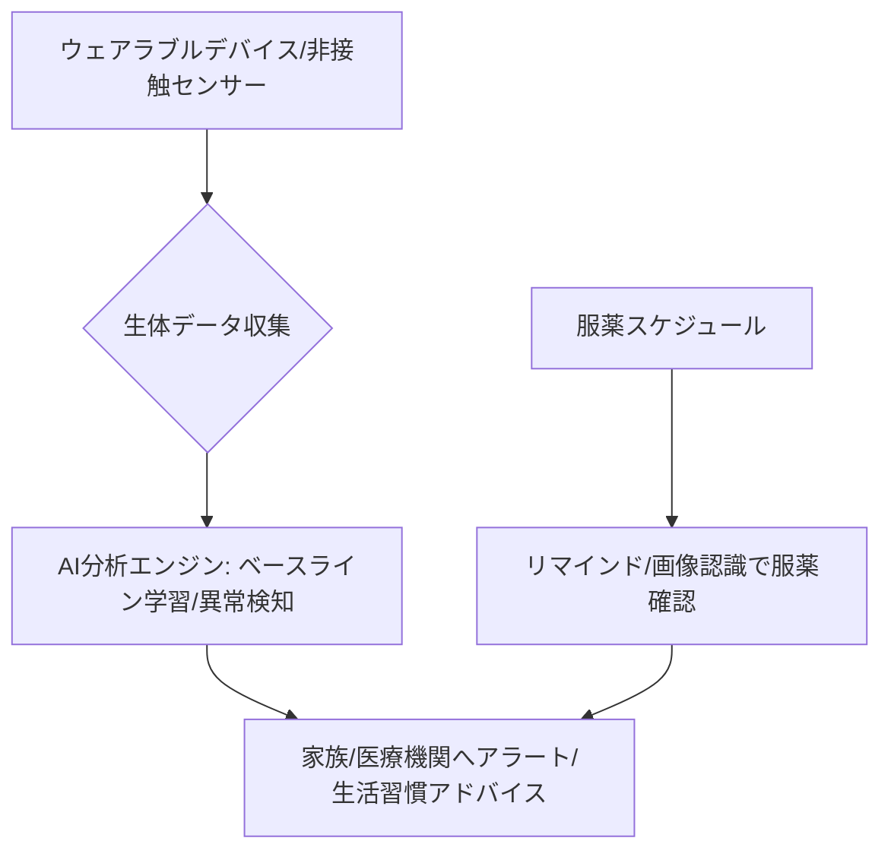

# T12-07-04 健康モニタリング・服薬管理機能

## Summary（5つの要点）

1. **常時バイタルデータ取得**: **ウェアラブルデバイス（スマートウォッチ、リング、パッチ）**や**家庭内センサー（体重計、血圧計、非接触センサー）**から、**心拍数、睡眠パターン、活動量、血圧、血糖値**などの**生体情報**を**継続的**に**収集**する `(1)`。
2. **異常値の早期検出と通知**: **AI**が**個人**の**ベースライン**を**学習**し、**通常**と**異**なる**異常値（例：不整脈、極端な睡眠不足、急激な体重減少）**を**検出**した**場合**、**家族**や**提携****医療機関**に**自動**で**アラート**を**送信**。
3. **高度な服薬管理**: **設定**された**服薬****時刻**に**正確**に**リマインド**を**行**う。**さらに**、**カメラ**や**画像認識AI**（**T12-07-02**と**連携**）を**利用**して**ユーザー**の**服薬****動作**を**確認**し、**確実**な**服薬**を**サポート**。
4. **慢性疾患・フレイル予防**: **生活習慣病**の**指標**を**モニタリング**し、**食事**や**運動**に**関**する**パーソナライズ****された****アドバイス**を**提供**（**T12-07-01**と**連携**）。**高齢者**の**フレイル**（**虚弱**）**リスク**を**歩行速度**や**活動量**から**評価**。
5. **医療機関とのデータ連携**: **収集**した**健康****データ**を**セキュア**な**形**で**医療機関**や**薬局**と**共有**し、**遠隔****診療**や**処方****管理**の**効率化**に**貢献**。**PHR**（**Personal Health Record**）**の****基盤**となる `(2)`。

#### 概念図

---

### 技術評価表（定量的な視点）
| 評価項目 | 評価 | 根拠 |
| :--- | :--- | :--- || 導入コスト | ⭐⭐⭐☆☆ | **高精度**な**医療****認証****済み****センサー**の**コスト** |
| 技術成熟度 | ⭐⭐⭐☆☆ | **データ****連携**の**法規制**、**医療機器****認証**の**取得**が**課題** `(1)` || 日本の競争力 | ⭐⭐⭐⭐⭐ | **医療機器**、**健康****計測****技術**、**長寿****研究**の**知見**に**強み** |
| 市場性 | ⭐⭐⭐⭐⭐ | **高齢化****社会**での**見守り**、**予防****医療**に**不可欠** |
| 品質保証の重要性 | ⭐⭐⭐⭐⭐ | **データ**の**正確性**と**緊急****通知**の**信頼性**が**人命**に**直結** |

---

## 日本の立ち位置・強み弱みのSummary

### 強み：日本企業や研究機関が持つ独自の技術、優位性などを箇条書きで記述。

* **医療機器メーカーの技術力**: **オムロン、パナソニック**など、**血圧計、体温計**など**高精度**な**医療****計測****機器**の**開発****実績**。
* **非接触バイタル計測**: **ミリ波レーダー**や**カメラ**を**利用**し、**非接触**で**心拍、呼吸、睡眠**を**計測**する**技術**の**研究**が**進展**。
* **PHR/地域医療連携の推進**: **マイナンバー****カード****連携**による**健康****医療****情報****基盤**の**整備**（**T16-04-03**）が**進行中**。

### 弱み：日本が抱える規制、標準化の遅れ、海外依存などを箇条書きで記述。

* **医療機器認証の遅延**: **ウェアラブル****デバイス**など**新規****技術**の**医療機器****承認**に**時間**が**かかり**、**実用化**が**遅れ**がち。
* **データのサイロ化**: **医療****データ**が**病院****ごと**に**分断**され、**スマート****コンパニオン**が**取得**した**データ**と**の****シームレス**な**連携**が**困難**。
* **服薬確認AIの信頼性**: **カメラ**で**服薬****動作**を**確認**する**際**の**誤****検出**（**飲ん**だ**ふり**など）を**防**ぐ**ため**の****精度****保証**が**課題**。

---

## 技術ロードマップ（短期/中期/長期）

### 短期目標（～2027年）

* **主要**な**ウェアラブル****デバイス**と**血圧計**からの**データ****連携**を**標準化**し、**服薬****リマインド****機能**を**標準搭載**。
* **AI**による**転倒****リスク****評価****機能**を**実装**し、**フレイル****予防****プログラム**を**提供**。
* **体温**、**心拍**などの**異常値****検出****時**の**家族****通知****機能**の**信頼性**を**99.9%**に**向上**。

### 中期目標（2028年～2031年）

* **非接触**で**心電図**や**血糖値**など**高度**な**バイタル****情報**を**計測****可能**な**センサー**を**スマート****コンパニオン**に**内蔵**。
* **PHR****基盤**と**連携**し、**医師**が**スマート****コンパニオン****経由**で**遠隔****診療**を**行**える**システム**を**構築**。
* **個々人**の**遺伝子****情報**や**腸内****環境（T17-01-02）**に**基**づいた**食事、運動、服薬**の**個別****アドバイス**を**提供**。

### 長期目標（2032年～2035年）

* **ロボット**が**自律的**に**健康****状態**を**維持**・**改善**し、**病気**の**発症**を**未然**に**防**ぐ**「**自己****最適化****予防****医療****システム**」**を**実現**。
* **体内**に**埋め込ま**れた**ナノ****センサー**からの**情報**も**統合**し、**分子****レベル**での**健康****管理**を**実現**。

### 📚 参照リンク

1. [The Lancet Digital Health: Wearable technologies for health monitoring](https://www.thelancet.com/journals/landig/article/PIIS2589-7500(23)00003-8/fulltext)
2. [厚生労働省: 次世代医療基盤法とPHRの推進](https://www.mhlw.go.jp/stf/seisakunitsuite/bunya/0000185011.html)
3. [NEDO: AIを活用した認知機能の低下予防技術の研究開発](https://www.nedo.go.jp/activities/ZZJP_100140.html)
