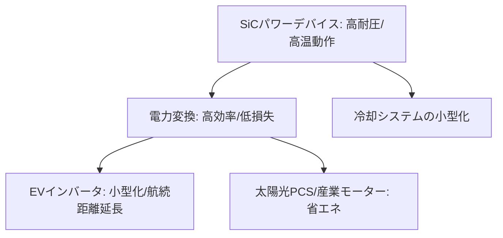

# T13-01-01 SiC(炭化ケイ素)パワーデバイス

## Summary（5つの要点）

1. **ワイドバンドギャップ半導体**: シリコン（Si）に対し、**バンドギャップが約3倍**、**絶縁破壊電圧が約10倍**と優れ、**高温（200℃以上）**でも安定動作が可能。
2. **電力損失の大幅削減**: Si製デバイス（IGBTなど）と比較し、**電力変換時の損失を最大70%以上削減**可能。これにより、エネルギー効率が飛躍的に向上する。
3. **システムの小型・軽量化**: 高効率化により**発熱が減少**するため、**冷却システム（ヒートシンク、水冷機構）**を大幅に**小型・軽量化**できる。
4. **主要応用分野**: **EV（電気自動車）用インバータ**の小型・高効率化に不可欠であり、航続距離の延長に直結。**太陽光発電用PCS（パワーコンディショナ）**、**産業用モーター**、**鉄道車両**にも採用が急拡大。
5. **日本の競争力**: **ローム**が世界トップクラスのシェアを持ち、**三菱電機、富士電機、デンソー**なども含め、日本企業がSiCデバイス市場をリードしている `(1, 2)`。

#### 概念図

---

### 技術評価表（定量的な視点）
| 評価項目 | 評価 | 根拠 |
| :--- | :--- | :--- |
| 導入コスト | ⭐⭐⭐☆☆ | Siデバイスより高価だが、システム全体の小型化・効率化でコスト回収可能 |
| 技術成熟度 | ⭐⭐⭐⭐☆ | 8インチウェハへの移行が進み、量産技術は確立。EV搭載で急速に普及 |
| 日本の競争力 | ⭐⭐⭐⭐⭐ | ローム、三菱電機、富士電機が世界シェア上位を占め、圧倒的に強い `(1, 2)` |
| 市場性 | ⭐⭐⭐⭐⭐ | EV、再生可能エネルギー市場の成長に直結し、需要は爆発的に増加 |
| 品質保証の重要性 | ⭐⭐⭐⭐⭐ | EVやインフラ用途では**10年以上の高信頼性**が必須。**高温動作時の信頼性試験**が重要 |

---

## 日本の立ち位置・強み弱みのSummary

### 強み：日本企業や研究機関が持つ独自の技術、優位性などを箇条書きで記述。

* **高品質ウェハ・デバイスの一貫生産**: **ローム**がSiCウェハ（SiCrystal社）からデバイス製造まで一貫生産体制を構築し、**トレンチ構造**などの独自技術で世界をリードしている `(2)`。
* **産業・車載分野での実績**: **三菱電機、富士電機**が**鉄道、産業機器**で培った**高耐圧モジュール技術**を持ち、**車載品質**への対応力も高い `(1)`。
* **材料・製造装置**: SiCウェハの高品質化技術、エピタキシャル成長装置、高温イオン注入装置など、**サプライチェーン**全体で日本企業が強みを持つ。

### 弱み：日本が抱える規制、標準化の遅れ、海外依存などを箇条書きで記述。

* **ウェハの大口径化の遅れ**: **8インチ（200mm）ウェハ**への移行が量産の鍵となるが、**海外勢（Wolfspeed、STMicroelectronics）**との**投資競争**が激化している。
* **中国メーカーの猛追**: 中国政府の強力な支援を受けた新興メーカーが、**大規模な設備投資**と**低コスト攻勢**で急速にシェアを伸ばしつつある。
* **システムレベルの最適化**: デバイス単体だけでなく、**ゲートドライバ**（T13-01-04）や**実装技術**（T13-01-05）を含めた**システム全体での最適化提案力**が、海外競合（Infineon, STMicro）との差別化に必要。

---

## 技術ロードマップ（短期/中期/長期）

### 短期目標（～2027年）

* **8インチウェハ**によるSiCデバイスの**本格量産体制**を確立し、**コストをSi-IGBTに近づける**。
* **EVインバータ**市場での**シェア50%以上**を日本企業連合で確保。
* **第4世代**トレンチ型MOSFETを導入し、**電力損失をさらに10%削減**。

### 中期目標（2028年～2031年）

* SiCデバイスの**信頼性評価技術**を確立し、**車載、航空宇宙**分野での**標準規格化**を主導。
* **10kVを超える**超高耐圧SiCデバイスを実用化し、**電力系統（スマートグリッド）**への適用を開始。
* SiCデバイスの**高速スイッチング性能**を活かした**メガヘルツ（MHz）級**の電力変換システムを実用化。

### 長期目標（2032年～2035年）

* SiCパワーデバイスが**電力変換の主流**となり、**Siデバイス市場の大部分を置き換える**。
* **Ga2O3**（T13-01-03）などの次世代材料への移行を見据えつつ、SiCの**理論限界性能**（低損失、高温動作）を追求。

### 📚 参照リンク

1. [パワー半導体の世界シェアランキング！日本企業の強みや将来性も解説 - ワールドインテック](https://www.witc.co.jp/blog/npbx8fnmiurg/)
2. [SiCパワー半導体の特徴と注目の関連銘柄10社 - 半導体業界動向](https://handotai-gyokai.com/sic-power-devices/)
3. [SiCパワーデバイス技術 - ローム株式会社](https://www.rohm.co.jp/sic)