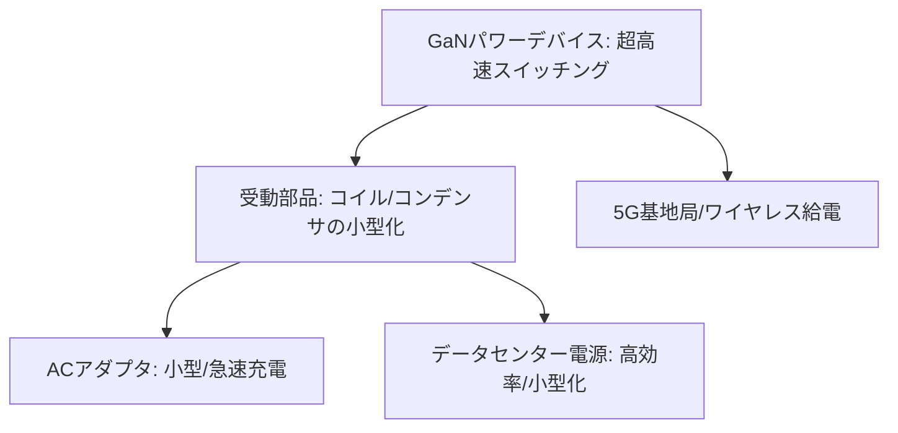

# T13-01-02 GaN(窒化ガリウム)パワーデバイス

## Summary（5つの要点）

1. **超高速スイッチング**: SiCよりもさらに**高速なスイッチング（MHz帯）**が可能。これにより、コイルやコンデンサなどの**受動部品を劇的に小型化**できる。
2. **応用分野（小型・高効率）**: **スマートフォンやPCの急速充電器（ACアダプタ）**の小型化で急速に普及。今後は**データセンターのサーバー電源**、**5G基地局電源**、**EV向け車載充電器（OBC）**への採用が本命。
3. **ノーマリーオフ動作**: SiCと異なり、GaN-HEMTは本来「ノーマリーオン」（ゲート電圧0Vで電流が流れる）特性を持つ。安全な電源として利用するため、**「ノーマリーオフ」（0VでOFF）**を実現する技術（カスケード接続、p-GaNゲート）が重要。
4. **日本の競争力**: **パナソニック**が独自の「X-GaN」（ノーマリーオフ）を開発。**サンケン電気**、**ローム**（T13-01-01）なども量産を推進。米国EPC、Navitas、GaN Systems（Infineonが買収）などのスタートアップも有力。
5. **SiCとの棲み分け**: **高耐圧・大電流**領域（例: EVのメインインバータ）は**SiC**、**中耐圧・超高速スイッチング**領域（例: 電源、充電器）は**GaN**という棲み分けが進んでいる。

#### 概念図

---

### 技術評価表（定量的な視点）
| 評価項目 | 評価 | 根拠 |
| :--- | :--- | :--- |
| 導入コスト | ⭐⭐⭐⭐☆ | ACアダプタでの普及により量産化が進み、コストが急速に低下 |
| 技術成熟度 | ⭐⭐⭐⭐☆ | 民生用電源で成熟。車載・産業用での信頼性確立が次のフェーズ |
| 日本の競争力 | ⭐⭐⭐⭐☆ | パナソニック、サンケン電気が強み。ゲートドライバ内蔵技術が鍵 |
| 市場性 | ⭐⭐⭐⭐⭐ | データセンター、5G基地局、EV充電器など、高効率電源市場で急成長 |
| 品質保証の重要性 | ⭐⭐⭐⭐☆ | **高温・高周波動作**時の**信頼性**と、**ゲート駆動の安定性**（T13-01-04）が重要 |

---

## 日本の立ち位置・強み弱みのSummary

### 強み：日本企業や研究機関が持つ独自の技術、優位性などを箇条書きで記述。

* **ノーマリーオフ技術**: **パナソニック**が開発した**「X-GaN」**は、**信頼性の高いノーマリーオフ動作**を実現する独自技術であり、産業応用で優位性を持つ。
* **高品質な基板技術**: GaNデバイスの基盤となる**シリコン（Si）基板**や**サファイア基板**上への**高品質なエピタキシャル成長技術**を持つ。
* **電源モジュール技術**: **TDK、村田製作所**など、GaNの高速性を活かした**小型電源モジュール（POLコンバータなど）**の設計・実装技術に優れる。

### 弱み：日本が抱える規制、標準化の遅れ、海外依存などを箇条書きで記述。

* **海外スタートアップの先行**: **Navitas、EPC、GaN Systems**（Infineonが買収）といった海外の**ファブレス・スタートアップ**が、**ゲートドライバICとのワンパッケージ化**や**積極的なマーケティング**で市場を先行。
* **8インチGaN-on-Si**: 量産コスト低減の鍵となる**8インチ（200mm）ウェハ**での**GaN-on-Si**（シリコン基板上のGaN）技術の量産化で、海外ファウンドリに後れを取る可能性。
* **車載用への展開**: ACアダプタなどの民生用に比べ、**EVの車載充電器（OBC）**や**DC-DCコンバータ**といった**高信頼性・大電力**が求められる車載分野での実績がSiCに比べて遅れている。

---

## 技術ロードマップ（短期/中期/長期）

### 短期目標（～2027年）

* **ACアダプタ市場**での**GaN搭載率を50%以上**にし、**量産効果によるコストダウン**を加速。
* **8インチGaN-on-Siウェハ**による量産体制を確立。
* **データセンター電源**、**サーバー電源**市場での採用を本格化し、**エネルギー効率の標準（80 PLUS Titanium）**達成に貢献。

### 中期目標（2028年～2031年）

* **EV用車載充電器（OBC）**および**LiDAR用ドライバー**としてGaNデバイスを標準搭載。
* **ゲートドライバIC**（T13-01-04）を**ワンパッケージ化**した**「GaN-IC」**を主流化し、**設計の容易化**と**さらなる小型化**を実現。
* **MHz帯**で動作する**ワイヤレス給電システム**を実用化。

### 長期目標（2032年～2035年）

* **GaNパワーデバイス**が**数kW～数十kWクラス**の電源市場（中耐圧領域）で**Siデバイスを完全に置き換え**。
* **GaN-on-GaN**（GaN基板上のGaN）技術の低コスト化を実現し、**超高信頼性**が求められる分野（航空宇宙など）へ展開。

### 📚 参照リンク

1. [GaNパワーデバイス「X-GaN」 - パナソニック インダストリー](https://panasonic.co.jp/industry/case/gan_power_device/)
2. [GaNパワー半導体とは？ - ローム株式会社](https://www.rohm.co.jp/electronics-basics/power-devices/gan_what)
3. [GaN Power ICs - Navitas Semiconductor](https://navitassemi.com/)