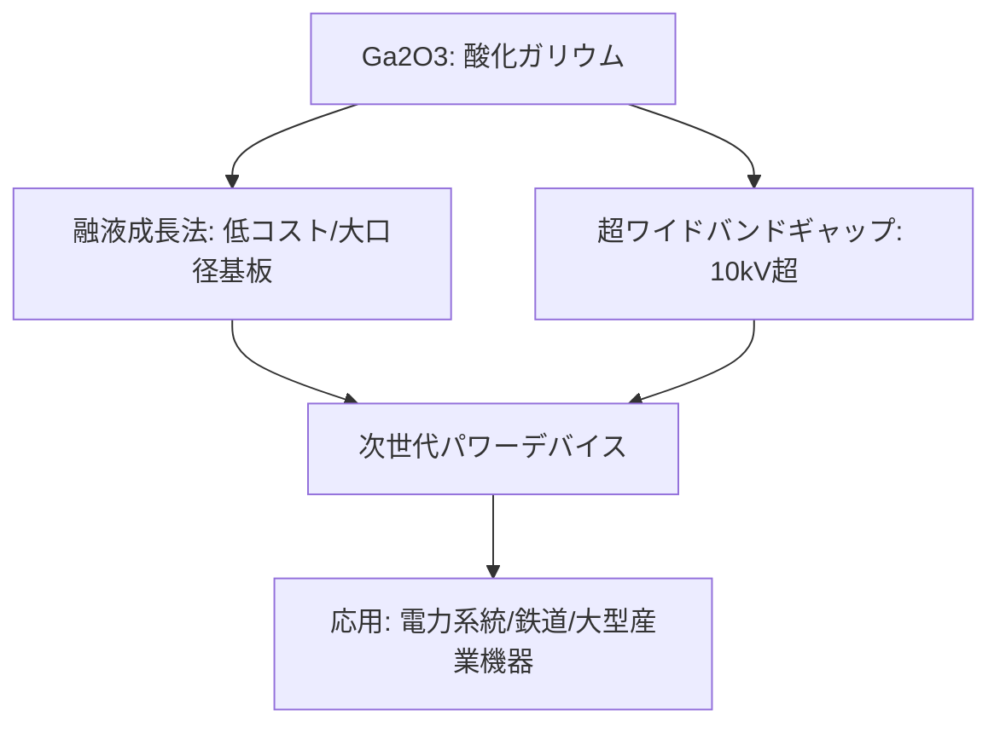

# T13-01-03 Ga2O3(酸化ガリウム)次世代パワー半導体

## Summary（5つの要点）

1. **日本発の新材料**: **SiC、GaNを超える**バンドギャップ（約4.8eV）を持つ**「次々世代」**のパワー半導体材料。**NICT、タムラ製作所、東京農工大学**などの**日本チーム**が世界に先駆けて研究開発をリードしてきた `(1, 4)`。
2. **超高耐圧・低損失**: 理論上、**SiC/GaNを超える**極めて高い**絶縁破壊電圧（10kV超）**と**低損失**を両立可能であり、**電力系統、鉄道、大型産業機器**など**超高電圧・大電力分野**での革新が期待される `(3, 5)`。
3. **低コスト製造の可能性**: SiCの製造法（昇華法）と異なり、**安価な「融液成長法」**で**大口径の単結晶基板**を製造可能。これにより、将来的に**SiCよりも低コスト**でデバイスを製造できる可能性がある `(3)`。
4. **主要プレイヤー**: **タムラ製作所**と**NICT**からスピンアウトした**「ノベルクリスタルテクノロジー」**と、京都大学発の**「FLOSFIA」**が、それぞれ異なる結晶構造（β型、α型）で開発を主導している `(1, 3, 7)`。
5. **実用化への課題**: **熱伝導率の低さ**（＝放熱性の悪さ）と、**p型半導体**の作製が困難である点が、実用化に向けた最大の技術的課題 `(7)`。

#### 概念図

---

### 技術評価表（定量的な視点）
| 評価項目 | 評価 | 根拠 |
| :--- | :--- | :--- |
| 導入コスト | ⭐⭐☆☆☆ | 研究開発段階であり、ウェハ・デバイス共に高コスト。量産化で低減期待 |
| 技術成熟度 | ⭐⭐☆☆☆ | 基礎研究・要素技術開発段階。2030年代の実用化を目指す `(7)` |
| 日本の競争力 | ⭐⭐⭐⭐⭐ | **日本が創出し、世界をリード**する分野。NICT、タムラ、大学発VBが中核 `(1, 3, 4)` |
| 市場性 | ⭐⭐⭐⭐☆ | SiC/GaNがカバーできない**超高耐圧市場**での将来的な需要が期待される |
| 品質保証の重要性 | ⭐⭐⭐⭐☆ | **放熱性の課題**を解決する**パッケージ技術**（T13-01-05）との連携が必須 |

---

## 日本の立ち位置・強み弱みのSummary

### 強み：日本企業や研究機関が持つ独自の技術、優位性などを箇条書きで記述。

* **世界トップの研究開発体制**: **NICT、タムラ製作所、東京農工大**のβ型研究チーム、**京都大学、FLOSFIA**のα型研究チームなど、**日本がGa2O3研究の中心地**である `(1, 3, 7)`。
* **基板製造技術の先行**: **ノベルクリスタルテクノロジー**が**4インチ（100mm）基板**の開発・販売を開始しており、基板製造で世界をリードしている `(3)`。
* **知的財産（特許）**: 基礎研究で先行しているため、**Ga2O3に関連する基本特許**の多くを日本企業・機関が押さえている。

### 弱み：日本が抱える規制、標準化の遅れ、海外依存などを箇条書きで記述。

* **熱伝導率の低さ（放熱性）**: Ga2O3は**SiCやGaNに比べて熱伝導率が著しく低い**。デバイスの**熱をいかに効率的に逃がすか**（T13-01-05）が実用化の最大の障壁 `(7)`。
* **p型半導体の不在**: **p型半導体**の作製が極めて困難であり、デバイス構造の設計自由度が制限される（例: ノーマリーオフのトランジスタ設計が難しい） `(6)`。
* **量産化への投資**: SiC/GaNが既に市場を形成する中、**2030年代の実用化**に向けた**息の長い研究開発投資**と、**大規模な量産投資**を継続できるかが課題。

---

## 技術ロードマップ（短期/中期/長期）

### 短期目標（～2027年）

* **6インチ（150mm）基板**の**高品質化・低コスト化**技術を確立。
* **低耐圧（600V～1.2kV）**領域において、**α型Ga2O3**（FLOSFIA）デバイスの**限定的な商用生産**を開始。
* **β型Ga2O3**（ノベルクリスタル）デバイスの**10kV耐圧**実証と、**放熱性**を改善した**パッケージ技術**（T13-01-05）の開発。

### 中期目標（2028年～2031年）

* **高耐圧（3.3kV～10kV）**領域において、**SiCデバイス**に対する**コスト優位性**と**性能優位性**を実証。
* **p型半導体技術**または**p型層を必要としない**高性能な**ノーマリーオフ**トランジスタ構造を確立 `(6)`。
* **鉄道、産業機器**分野での**実証実験**（フィールドテスト）を開始。

### 長期目標（2032年～2035年）

* **Ga2O3**が**超高耐圧パワーデバイス**（6kV超）の**主流材料**となり、**電力系統（送電システム）**の**電力変換器**に採用される。
* **SiC/GaNを凌駕する**コストパフォーマンスを実現し、**パワーエレクトロニクス市場**における日本の**競争優位性を確立**する。

### 📚 参照リンク

1. [会社情報 - 株式会社ノベルクリスタルテクノロジー](https://www.novelcrystal.co.jp/company/)
2. [酸化ガリウムトランジスタの世界最高性能を更新 - ノベルクリスタルテクノロジー](https://www.novelcrystal.co.jp/2025/5997/)
3. [「酸化ガリウム」からはじまる日本の半導体産業“大復活” - PC Watch](https://pc.watch.impress.co.jp/docs/column/semicon/1220487.html)
4. [株式会社ノベルクリスタルテクノロジー: HOME](https://www.novelcrystal.co.jp/)
5. [NICT技術移転ベンチャー - 株式会社 ノベルクリスタルテクノロジー](https://www.nict.go.jp/out-promotion/other/4otfsk000025qfsi-att/novel.pdf)
6. [世界初 酸化ガリウム反転型DI-MOSトランジスタを試作 - ノベルクリスタルテクノロジー](https://www.novelcrystal.co.jp/2022/3784/)
7. [酸化ガリウム（Ga2O3）はパワー半導体の有望株!?実用化に向けた最新開発動向を解説 - NEPCON JAPAN](https://www.nepconjapan.jp/hub/ja-jp/blog/blog03.html)