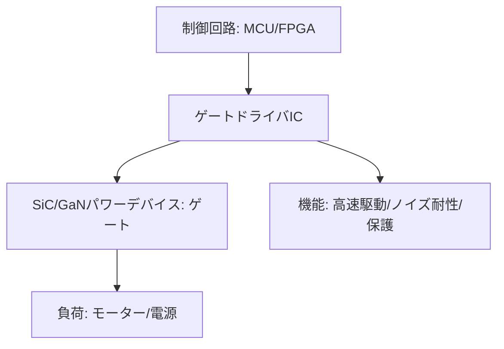

# T13-01-04 高速スイッチング・ゲートドライバIC

## Summary（5つの要点）

1. **デバイス性能の引き出し役**: **SiC**（T13-01-01）や**GaN**（T13-01-02）といったパワーデバイスの**ゲート**（制御端子）を**正確かつ高速にON/OFF**させるための専用IC `(1)`。
2. **高速スイッチングへの対応**: SiC/GaNの**MHz帯**にも達する**超高速スイッチング**に対応し、デバイスの**低損失性能**を最大限に引き出す。**駆動電圧の最適化**（例: SiCの負電圧バイアス）も行う。
3. **ノイズ耐性（CMTI）**: 高速スイッチング時に発生する**急峻な電圧変動（dv/dt）**による**ノイズ（コモンモードノイズ）**の影響を防ぎ、**誤動作（ON/OFFエラー）**を防止する**高いノイズ耐性（CMTI）**が必須。
4. **保護機能の内蔵**: **過電流、過熱、短絡、ゲート電圧低下**などの**異常状態**を**即座に検知**し、パワーデバイスを**安全に停止**させる**保護機能**を内蔵し、システム全体の信頼性を担保する。
5. **主要プレイヤー**: **Texas Instruments（TI）、Infineon Technologies**といった海外大手が強い分野だが、**ローム**もSiCデバイスとドライバを**セットで提供**することで競争力を高めている。

#### 概念図

---

### 技術評価表（定量的な視点）
| 評価項目 | 評価 | 根拠 |
| :--- | :--- | :--- |
| 導入コスト | ⭐⭐⭐⭐☆ | アナログICであり、デバイス本体に比べ安価だが、高性能品は高価 |
| 技術成熟度 | ⭐⭐⭐⭐☆ | SiC/GaN専用ドライバは成熟期に入り、保護機能の高度化が進む |
| 日本の競争力 | ⭐⭐⭐☆☆ | **ローム**がデバイスとセットで強み。アナログIC分野はTI、Infineonが優勢 `(1)` |
| 市場性 | ⭐⭐⭐⭐⭐ | SiC/GaNデバイスが普及するほど、**セットで必ず必要**になるため市場は拡大 |
| 品質保証の重要性 | ⭐⭐⭐⭐⭐ | **ドライバの誤動作**は**パワーデバイスの即時破壊**に直結する |

---

## 日本の立ち位置・強み弱みのSummary

### 強み：日本企業や研究機関が持つ独自の技術、優位性などを箇条書きで記述。

* **デバイスとの最適化**: **ローム、三菱電機**など、**パワーデバイス（SiC）**を自社開発しているメーカーは、**デバイス特性に最適化**された**ゲートドライバ**を**セットで開発・提供**できる強みを持つ `(1)`。
* **高信頼性アナログ技術**: 日本の半導体メーカーが持つ**高精度なアナログ回路設計技術**は、**ノイズ耐性**や**高精度な保護機能**の実装に不可欠。
* **モジュール化技術**: ドライバICとパワーデバイスを**1パッケージに統合**した**インテリジェントパワーモジュール（IPM）**の開発力がある。

### 弱み：日本が抱える規制、標準化の遅れ、海外依存などを箇条書きで記述。

* **海外アナログIC大手のシェア**: **Texas Instruments（TI）、Infineon、Analog Devices**といった**アナログICの巨人**が、**ゲートドライバIC市場**でも圧倒的なシェアと製品ラインナップを持つ。
* **GaN-ICへの追随**: **GaN**分野では、**Navitas**のように**デバイスとドライバを1チップに集積**した**「GaN-IC」**が主流になりつつあり、この分野での追随が課題（T13-01-02）。
* **標準化とセカンドソース**: 特定のドライバICへの依存を避けるため、**ピン互換性**や**機能の標準化**が求められるが、高機能ICでは各社の独自性が強く、**セカンドソース**の確保が難しい。

---

## 技術ロードマップ（短期/中期/長期）

### 短期目標（～2027年）

* **SiC/GaN**の**MHz帯スイッチング**に対応し、**ノイズ耐性（CMTI）**を**200V/ns以上**に高めたドライバICを量産化。
* **AI**を活用し、**過電流や温度上昇の「予兆」**を検知する**インテリジェント保護機能**を搭載。
* **双方向通信機能**をドライバICに持たせ、**デバイスの状態（温度、電流）**をリアルタイムで**上位コントローラ**に報告する機能を実装。

### 中期目標（2028年～2031年）

* **SiC/GaNデバイス**と**ゲートドライバ**を**1チップまたは1パッケージに完全統合**した**「スマートパワーデバイス」**を標準化。
* **デジタル制御**技術を導入し、**スイッチング速度（dv/dt）**や**デッドタイム**を**負荷状況に応じて動的に最適化**するドライバを実用化。
* **光絶縁**（フォトカプラ）に代わる、**高速・高信頼性**な**磁気絶縁**や**容量性絶縁**技術を標準搭載。

### 長期目標（2032年～2035年）

* **Ga2O3**（T13-01-03）などの**次世代デバイス**に対応した**超高耐圧（10kV超）**のゲートドライバICを開発。
* **ゲートドライバ自体**が**AI推論エンジン**を搭載し、**パワーデバイスの劣化状態**を診断し、**駆動プロファイルを自動調整**する**自己治癒型**システムを実現。

### 📚 参照リンク

1. [ゲートドライバとは - ローム株式会社](https://www.rohm.co.jp/electronics-basics/power-devices/gate-driver_what)
2. [SiC/GaNゲートドライバの選定 - Texas Instruments](https://www.ti.com/)
3. [EiceDRIVER™: GaN/SiCゲートドライバIC - Infineon Technologies](https://www.infineon.com/)