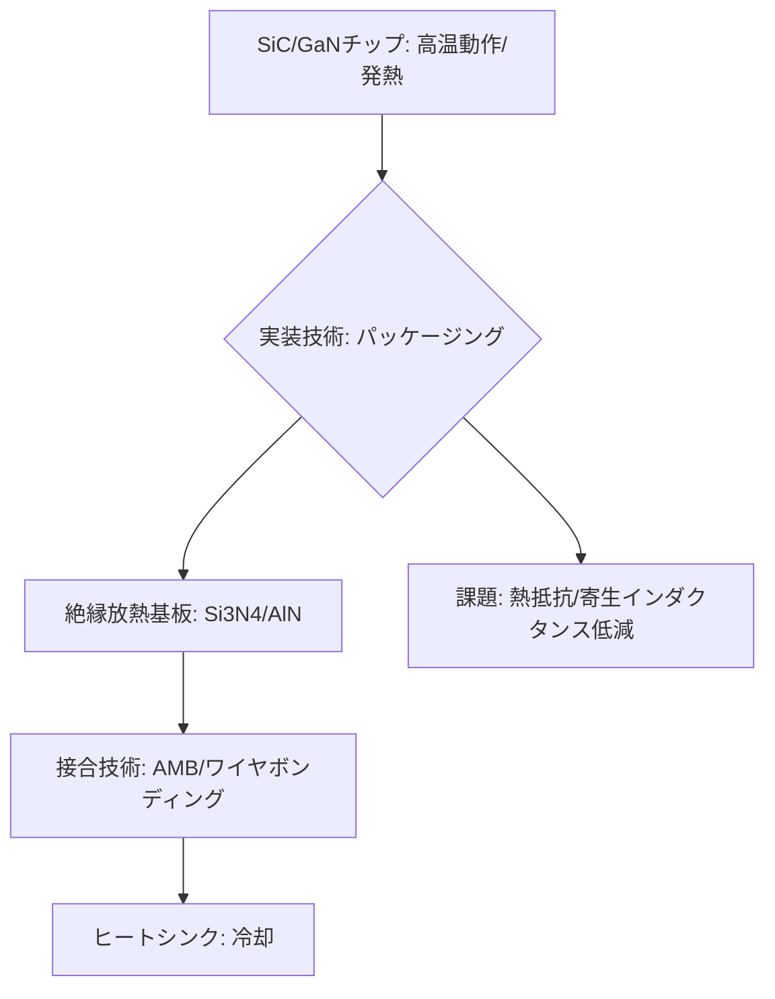

# T13-01-05 熱設計・実装技術(放熱基板・パッケージング)

## Summary（5つの要点）

1. **SiC/GaNの性能を引き出す鍵**: SiC（T13-01-01）やGaN（T13-01-02）は**高温動作**が可能だが、その**熱を効率的に外部へ逃がす**「熱設計・実装技術」がデバイスの**性能と信頼性**を決定する最大の鍵となる。
2. **高熱伝導・絶縁基板**: デバイスの熱をヒートシンクに伝えるため、**高い熱伝導率**と**高い電気絶縁性**を両立する**セラミック基板**（**窒化アルミニウム: AlN**、**窒化ケイ素: Si3N4**）が不可欠 `(1, 2, 3)`。
3. **高信頼性接合技術**: Si3N4などのセラミック基板と**銅（Cu）回路**を強固に接合する**AMB（Active Metal Brazing）技術**が、**高耐熱・高信頼性**が求められるパワーモジュールに採用されている `(1)`。
4. **パッケージング技術**: 高温動作による**熱膨張差**を吸収し、**寄生インダクタンス**（高速スイッチングを阻害する成分）を最小限に抑える**パッケージ設計**（例: 両面冷却、ヒートシンク一体型）が重要。
5. **日本の競争力**: **京セラ、デンカ、住友電工、日本ガイシ**など、日本の**素材メーカー**が**高機能セラミック基板（AlN、Si3N4）**や**放熱材料**で世界トップクラスのシェアと技術力を持つ `(1, 3)`。

#### 概念図

---

### 技術評価表（定量的な視点）
| 評価項目 | 評価 | 根拠 |
| :--- | :--- | :--- |
| 導入コスト | ⭐⭐⭐☆☆ | AlN、Si3N4基板はアルミナ基板より高価だが、性能向上に必須 |
| 技術成熟度 | ⭐⭐⭐⭐☆ | AlN、Si3N4基板、AMB技術はパワーモジュール用途で成熟・量産化済み |
| 日本の競争力 | ⭐⭐⭐⭐⭐ | **京セラ、デンカ**などがセラミック基板・放熱材料で世界シェアトップクラス `(1, 3)` |
| 市場性 | ⭐⭐⭐⭐⭐ | SiC/GaNデバイスの性能を保証する**「縁の下の力持ち」**であり、需要は連動して拡大 |
| 品質保証の重要性 | ⭐⭐⭐⭐⭐ | **熱抵抗の低減**と**温度サイクル耐性（信頼性）**がデバイスの寿命を決定する |

---

## 日本の立ち位置・強み弱みのSummary

### 強み：日本企業や研究機関が持つ独自の技術、優位性などを箇条書きで記述。

* **高機能セラミック基板**: **京セラ**（AlN、Si3N4）、**デンカ**（AlN）、**日本ガイシ**（Si3N4）などが、**高熱伝導・高強度**な**セラミック絶縁基板**で世界市場を席巻している `(1, 3)`。
* **AMB（活性金属ろう付け）技術**: **高信頼性**が求められる**AMB基板**（セラミックと銅の接合）において、日本の素材メーカーが優れた技術を持つ `(1)`。
* **放熱材料**: **高熱伝導グリス、放熱シート、液体金属**など、チップとヒートシンク間の**熱抵抗**を低減する周辺材料（TIM）の開発力も高い。

### 弱み：日本が抱える規制、標準化の遅れ、海外依存などを箇条書きで記述。

* **Ga2O3への対応**: **Ga2O3**（T13-01-03）のような**熱伝導率が極めて低い**新材料に対応する**革新的な放熱技術**（例: デバイスと冷却材の直接接触）の開発が今後の課題。
* **シミュレーション技術**: **熱、応力、電磁界**を**同時に解析**する**マルチフィジックス・シミュレーション**技術の活用において、海外の専門ソフトウェア（ANSYSなど）への依存度が高い。
* **実装プロセス全体の最適化**: 基板材料だけでなく、**焼結接合（シンタリング）**、**ワイヤボンディング**、**封止樹脂**まで含めた**パッケージ全体の最適化**と**コストダウン**の競争が激化している。

---

## 技術ロードマップ（短期/中期/長期）

### 短期目標（～2027年）

* **SiC/GaNデバイス**の**200℃超**の高温動作に対応する**高信頼性パッケージ**（耐熱サイクル性向上）の量産化。
* **両面冷却パッケージ**を実用化し、**熱抵抗を30%低減**。
* **寄生インダクタンス**を**5nH以下**に抑える**低インダクタンスパッケージ**を導入し、**SiC/GaNの高速スイッチング性能**を最大限に引き出す。

### 中期目標（2028年～2031年）

* **ヒートシンク一体型**の**3D実装パッケージ**を開発し、**パワーモジュールの体積を50%削減**。
* **Ga2O3**（T13-01-03）の**局所的な発熱**に対応するため、**ダイヤモンド**などの**超高熱伝導材料**を基板に組み込む**複合基板技術**を確立。
* **AI**を活用した**熱設計シミュレーション**を導入し、**設計期間を大幅に短縮**。

### 長期目標（2032年～2035年）

* **パワーデバイス**と**ゲートドライバ**（T13-01-04）、**冷却流路**までを**3D積層**した**「完全統合型インテリジェント・パワーモジュール」**を実現。
* **自己修復機能**を持つ材料（例: 亀裂を自己修復する封止樹脂）を開発し、**メンテナンスフリー**のパワーモジュールを実現。

### 📚 参照リンク

1. [産業用パワーモジュール向け絶縁放熱回路基板（AMB） - 京セラ](https://www.kyocera.co.jp/prdct/semicon/search_application/detail/amb.html)
2. [セラミックス基板〜パワー半導体モジュールに不可欠な材料 - SEMI-NET](https://semi-engineers.com/materials-ceramics-substrate/)
3. [窒化アルミニウム（AlN） | パッケージ/サブマウント - 京セラ](https://www.kyocera.co.jp/prdct/semicon/search_material/detail/ain.html)
4. [パワーモジュール向け放熱基板 - デンカ株式会社](https://www.denka.co.jp/)