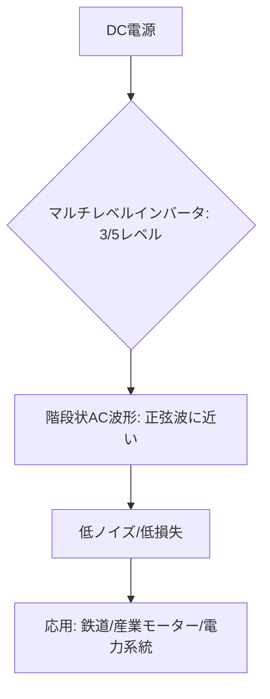

# T13-02-01 マルチレベルインバータ技術

## Summary（5つの要点）

1. **基本原理**: 複数の直流電源を組み合わせ、**3レベル、5レベル**など**階段状のAC出力波形**を生成するインバータ回路方式。
2. **低損失・低ノイズ**: 従来の2レベルインバータに比べ、出力波形が**より滑らかな正弦波に近づく**ため、**スイッチング損失**と**高調波ノイズ**を大幅に低減できる。
3. **SiCとの親和性**: **SiCパワーデバイス**（T13-01-01）と組み合わせることで、**三菱電機**は鉄道車両用インバータで**電力損失を約55%低減**し、装置の**体積・重量を約65%削減**する実績を持つ `(1, 3)`。
4. **高電圧・大電力分野**: 個々のデバイスにかかる電圧を低減できるため、**鉄道車両の駆動システム**、**風力発電**の系統連系、**1MWを超える大規模産業用モーター**など、**高電圧・大電力**分野で主流の技術。
5. **システム小型化**: ノイズが少ないため、**EMC対策フィルタ**（T13-02-05）や、モーターの**絶縁強化**を簡素化でき、システム全体の**小型化・低コスト化**に貢献する。

#### 概念図

---

### 技術評価表（定量的な視点）
| 評価項目 | 評価 | 根拠 |
| :--- | :--- | :--- |
| 導入コスト | ⭐⭐⭐☆☆ | 高電圧デバイスや複雑な制御回路が必要だが、フィルタコストを削減可能 |
| 技術成熟度 | ⭐⭐⭐⭐⭐ | 鉄道、大規模産業分野で長年の運用実績があり、成熟した技術 |
| 日本の競争力 | ⭐⭐⭐⭐⭐ | **三菱電機、日立製作所、富士電機**が鉄道・産業用で世界をリード `(1)` |
| 市場性 | ⭐⭐⭐⭐☆ | 高電圧・大電力市場に特化。SiC化による高効率ニーズで需要は堅調 |
| 品質保証の重要性 | ⭐⭐⭐⭐⭐ | **社会インフラ**（鉄道、電力）で使われるため、**10年以上の高信頼性**が必須 |

---

## 日本の立ち位置・強み弱みのSummary

### 強み：日本企業や研究機関が持つ独自の技術、優位性などを箇条書きで記述。

* **鉄道・産業での圧倒的実績**: **三菱電機、日立、富士電機**が、**新幹線**をはじめとする**鉄道車両用インバータ**や、**大規模プラント用ドライブ**において、**SiCマルチレベル技術**で世界最高水準の実績を持つ `(1, 3)`。
* **高耐圧SiCモジュール技術**: **高耐圧なSiCパワーモジュール**（T13-01-01）の**開発力と品質**が、マルチレベルインバータの性能を支えている `(2)`。
* **制御技術**: 複雑なマルチレベル回路の**多数のスイッチ**を**精密に同期制御**する**デジタル制御技術**（T13-02-03）のノウハウが豊富。

### 弱み：日本が抱える規制、標準化の遅れ、海外依存などを箇条書きで記述。

* **コスト競争**: 高耐圧SiCデバイスのコストが依然として高く、**中国メーカー**などの**低コストなSi-IGBT**を用いたインバータとの**価格競争**に直面する。
* **超小型化への課題**: 回路構成が複雑になるため、**EVインバータ**などの**極端な小型化**が求められる用途では、シンプルな**2レベルSiCインバータ**に軍配が上がることが多い。
* **制御アルゴリズムの標準化**: 各社が独自の制御方式を採用しており、**システム間の互換性**や**制御アルゴリズムの標準化**が課題。

---

## 技術ロードマップ（短期/中期/長期）

### 短期目標（～2027年）

* **SiCデバイスの全面採用**により、既存のSi-IGBTベースのマルチレベルインバータに比べ、**損失を50%以上削減**し、**体積を30%以上小型化**。
* **デジタル制御**（T13-02-03）の高度化により、**特定のノイズ周波数**を**能動的にキャンセル**する機能を実装。
* **鉄道、風力発電**分野での**標準インバータ**としての地位を確立。

### 中期目標（2028年～2031年）

* **10kVを超える**超高耐圧SiCデバイスと組み合わせ、**変圧器（トランス）不要**の**電力系統（スマートグリッド）直結型**インバータを実用化。
* **AI**を活用し、**負荷変動**や**系統の状態**を予測し、**インバータの動作モードを自律的に最適化**する技術を導入。
* **Ga2O3**（T13-01-03）デバイスの適用を見据えた**次世代マルチレベル回路**の研究開発を開始。

### 長期目標（2032年～2035年）

* マルチレベルインバータ技術が**MW（メガワット）級**の**電力変換の標準方式**となり、**社会インフラ**（送電、産業、交通）の**脱炭素化**を支える中核技術となる。
* **インバータ自体**が**電力網の安定化機能**（仮想同期発電機機能）を自律的に担うシステムを実現。

### 📚 参照リンク

1. [三菱電機 ニュースリリース フルSiCパワーモジュール適用鉄道車両用インバーター装置を製品化](http://www.mitsubishielectric.co.jp/news/2013/1225.html)
2. [三菱電機 パワーデバイス：HV-SiC パワーモジュール HV-SIC-MODULE](https://www.mitsubishielectric.co.jp/semiconductors/powerdevices/products/power-module/hv-sic-module/)
3. [次世代の電力社会を担う「SiCパワー半導体」が、鉄道車両用インバーターで実用化 - NEDO](https://webmagazine.nedo.go.jp/practical-realization/articles/201706sic/)