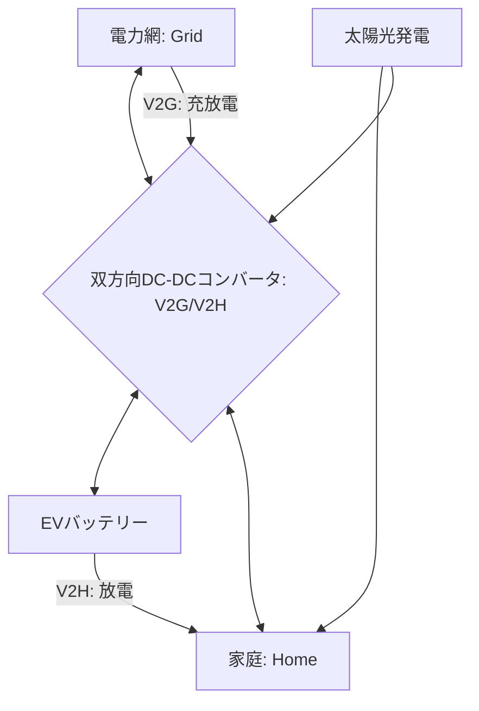

# T13-02-02 双方向DC-DCコンバータ(V2G/V2H対応)

## Summary（5つの要点）

1. **双方向の電力潮流**: **EV（電気自動車）**のバッテリーと、**家庭（V2H）**や**電力網（V2G）**との間で、**電力を双方向（充電・放電）**に融通するための電力変換器 `(1)`。
2. **EVの蓄電池化**: EVを**「移動する蓄電池」**として活用し、**太陽光発電の余剰電力**をEVに貯め、夜間や電力ピーク時に家庭へ**放電**。**災害時の非常用電源**としても機能する。
3. **高効率・小型化**: **SiC**（T13-01-01）や**GaN**（T13-01-02）パワーデバイスを採用することで、**95%を超える高い変換効率**と**小型・軽量化**を実現。
4. **日本の競争力**: **ニチコン**が**V2Hシステム**で世界トップシェアを誇り、**オムロン、パナソニック、デルタ電子**なども製品化。EVメーカー（日産、三菱）との連携も強い `(1)`。
5. **スマートグリッドへの貢献**: V2Gにより、多数のEVバッテリーを**仮想発電所（VPP）**として機能させ、**電力網の需給バランス調整**（デマンドレスポンス）に貢献する**HEMS**（T14-04-04）の中核技術。

#### 概念図

---

### 技術評価表（定量的な視点）
| 評価項目 | 評価 | 根拠 |
| :--- | :--- | :--- |
| 導入コスト | ⭐⭐☆☆☆ | V2H充放電設備（100万円前後）は高価。EV本体も必要 |
| 技術成熟度 | ⭐⭐⭐⭐☆ | V2Hは商用化済みで普及拡大中。V2Gは電力系統側の制度整備が途上 |
| 日本の競争力 | ⭐⭐⭐⭐⭐ | **ニチコン**がV2H市場で圧倒的なシェアと技術力。**CHAdeMO**規格とも連携 `(1)` |
| 市場性 | ⭐⭐⭐⭐⭐ | **EV普及、再エネ導入拡大、防災意識**の高まりで、市場は急成長 |
| 品質保証の重要性 | ⭐⭐⭐⭐⭐ | 電力系統との**連系保護機能**（異常時に安全に切断）、**充放電の安全性**が最重要 |

---

## 日本の立ち位置・強み弱みのSummary

### 強み：日本企業や研究機関が持つ独自の技術、優位性などを箇条書きで記述。

* **V2H市場の先行**: **ニチコン**が世界に先駆けてV2Hシステムを商用化し、**累計販売台数で世界トップ**を誇る `(1)`。
* **CHAdeMO規格との連携**: **日本発の急速充電規格「CHAdeMO」**が**V2H/V2G**のプロトコルを早期からサポートしており、EVとの**親和性が高い**。
* **高信頼性なパワエレ技術**: **オムロン、パナソニック**など、PCS（パワーコンディショナ）で培った**高信頼性な電力変換技術**が、双方向コンバータの品質を支えている。

### 弱み：日本が抱える規制、標準化の遅れ、海外依存などを箇条書きで記述。

* **V2Gの制度・市場整備の遅れ**: **V2G**をビジネスとして成立させるための**電力市場の制度設計**や**国際標準化（ISO 15118）**への対応が、欧米に比べて遅れている。
* **NACS規格への対応**: テスラが推進する**NACS（North American Charging Standard）**がデファクトスタンダード化しつつあり、**CHAdeMO**との**互換性、将来性**が課題。
* **SiC/GaNのコスト**: 高効率化に不可欠な**SiC/GaNデバイス**のコストが、システム全体の価格を高止まりさせる要因の一つ。

---

## 技術ロードマップ（短期/中期/長期）

### 短期目標（～2027年）

* **V2Hシステム**の**価格を現状の半分**に低減し、**新築ZEH（ゼロ・エネルギー・ハウス）**への**標準搭載**を推進。
* **GaNデバイス**（T13-01-02）の採用により、**コンバータの小型化・軽量化**をさらに進める。
* **HEMS**（T14-04-04）との連携を強化し、**AI**による**充放電スケジュールの完全自動化**を実現。

### 中期目標（2028年～2031年）

* **V2G**の**デマンドレスポンス**実証を完了し、**EVのバッテリー**を活用した**電力需給調整（VPP）**ビジネスを**電力会社**と連携して本格化。
* **国際標準規格（ISO 15118）**に対応した**双方向充電器**をグローバルに展開。
* **ワイヤレス給電**（T13-02-04）と**双方向コンバータ**を統合し、**ケーブルレス**でのV2H/V2Gを実現。

### 長期目標（2032年～2035年）

* **数百万台**のEVが**自律的に電力網と連携**し、**社会全体のエネルギーバッファ**として機能する**スマートグリッド**（T18-02-04）インフラが完成。
* **EVバッテリーの劣化**を**AIが予測**（T14-04-02）し、**充放電を最適制御**することで**バッテリー寿命を最大化**する技術を確立。

### 📚 参照リンク

1. [V2Hシステム - ニチコン株式会社](https://www.nichicon.co.jp/products/v2h/)
2. [V2X（Vehicle to X）ソリューション - オムロン ソーシアルソリューションズ](https://social.omron.com/jp/ja/v2x/)
3. [EV向けパワーエレクトロニクス - デルタ電子](https://www.delta-electronics.com/ja-JP/products/EV-Charging/V2X)