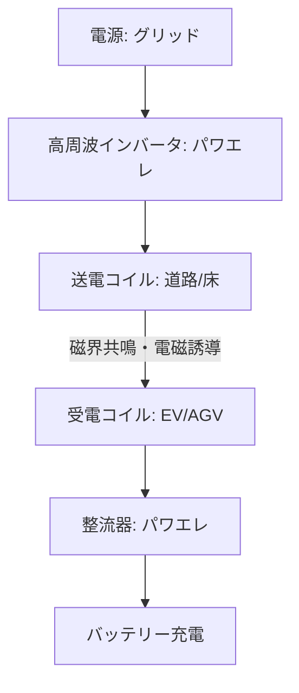

# T13-02-04 ワイヤレス給電システム統合技術

## Summary（5つの要点）

1. **基本原理**: **磁界共鳴方式**や**電磁誘導方式**を用い、**送電コイル**と**受電コイル**間で**電力を非接触**で伝送する技術。**高周波インバータ**（送電側）と**整流器**（受電側）という**パワーエレクトロニクス技術**が中核。
2. **EV走行中給電（DWPT）**: **道路に送電コイル**を埋め込み、**EVが「走りながら」充電**できる技術。バッテリー容量の削減（小型化）、充電作業の解消、航続距離の延長が期待される `(1, 2)`。
3. **産業応用**: **工場内のAGV（無人搬送車）**や**産業ロボット**への**非接触・自動給電**で既に実用化が進んでおり、**24時間稼働**と**配線レス**による**レイアウトの柔軟性**向上に貢献している `(3)`。
4. **日本の競争力**: **ダイヘン**が**AGV**や**EVバス**向け**走行中給電（DWPT）**で世界をリード `(1, 3)`。**IHI**は**WiTricity**（米国）と提携し、EV向け技術を開発 `(4)`。
5. **社会実装**: **2025年大阪・関西万博**において、**ダイヘン**が**走行中ワイヤレス給電EVバス**の運行を予定しており、大規模な社会実装の試金石となる `(1, 3)`。

#### 概念図

---

### 技術評価表（定量的な視点）
| 評価項目 | 評価 | 根拠 |
| :--- | :--- | :--- |
| 導入コスト | ⭐⭐☆☆☆ | 送電コイルの**インフラ敷設コスト**、受電装置コストが高額 |
| 技術成熟度 | ⭐⭐⭐⭐☆ | AGV/工場では成熟。EV走行中給電（DWPT）は実証段階 `(3)` |
| 日本の競争力 | ⭐⭐⭐⭐☆ | **ダイヘン、IHI**が産業・車載で強み。WiTricityが基本特許 `(1, 4)` |
| 市場性 | ⭐⭐⭐⭐⭐ | EV、AGV、ドローンの**利便性を劇的に向上**させ、バッテリー容量の制約を打破する |
| 品質保証の重要性 | ⭐⭐⭐⭐☆ | 高効率伝送、**位置ズレ耐性**、**電波法/EMC規格**（T13-02-05）の遵守が必須 |

---

## 日本の立ち位置・強み弱みのSummary

### 強み：日本企業や研究機関が持つ独自の技術、優位性などを箇条書きで記述。

* **産業用WPTでの実績**: **ダイヘン**が**産業用AGV**や**FA機器**向けのワイヤレス給電システムで**高いシェア**を持ち、**走行中給電**のノウハウを蓄積している `(3)`。
* **EVバスでの先行実証**: **2025年大阪・関西万博**での**走行中給電EVバス**の運行は、世界に先駆けた**大規模な社会実装**事例となる `(1)`。
* **高周波パワエレ技術**: **GaNデバイス**（T13-01-02）の活用など、ワイヤレス給電に不可欠な**高周波インバータ/コンバータ**の設計技術に優れる。

### 弱み：日本が抱える規制、標準化の遅れ、海外依存などを箇条書きで記述。

* **基本特許の海外依存**: **磁界共鳴方式**の**基本特許**の多くを**WiTricity（米国）**が保有しており、**IHI**のように**ライセンス契約**が不可欠な場合が多い `(4)`。
* **インフラコストと標準化**: **道路へのコイル埋設**は**莫大な初期コスト**がかかるため、**国際的な技術標準化**（SAE J2954など）と**国家的なインフラ戦略**がなければ普及が困難。
* **EMC（電磁両立性）の課題**: 数kW～数十kWの大電力を高周波で伝送するため、**周囲への電磁ノイズ漏洩（EMI）**対策（T13-02-05）と、**生体安全性（ICNIRPガイドライン）**の確保が大きな課題。

---

## 技術ロードマップ（短期/中期/長期）

### 短期目標（～2027年）

* **大阪・関西万博**での**走行中給電EVバス**の**安定運用**を成功させ、技術の**信頼性と社会受容性**を確立 `(1)`。
* **EVの停止中ワイヤレス充電**（駐車場）を**オプション機能**として標準化し、高級車から一般車への普及を開始。
* **産業用AGV**向けの**ワイヤレス給電**の**標準規格**を策定。

### 中期目標（2028年～2031年）

* **物流センター、空港、港湾**など、**特定エリア**での**商用トラック、バス**向けの**走行中給電（DWPT）インフラ**の導入を開始。
* **ドローン**（T19-10）や**水中ロボット**への**ワイヤレス給電ステーション**を実用化。
* **SiC/GaN**を全面採用し、**伝送効率95%以上**を達成するとともに、**送電・受電システムの小型化**を推進。

### 長期目標（2032年～2035年）

* **高速道路**の**主要レーン**に**走行中給電インフラ**が敷設され、**バッテリー容量を大幅に削減**したEV（小型バッテリーEV）が実現 `(1)`。
* **家庭内のあらゆる家電**への**空間ワイヤレス給電**（マイクロ波方式など）が実用化。

### 📚 参照リンク

1. [走行中ワイヤレス給電 - 株式会社ダイヘン](https://www.daihen.co.jp/products/wireless/dwpt/)
2. [EV充電システム - 株式会社ダイヘン](https://www.daihen.co.jp/products/wireless/)
3. [自動物流道路への 走行中ワイヤレス給電システム の適用について - 国土交通省](https://www.mlit.go.jp/road/ir/ir-council/buturyu_douro/pdf06/03.pdf)
4. [ワイヤレス化など進化するＥＶ充電器、国内外のビジネス事例は？ - 新電力ネット](https://pps-net.org/column/109661)