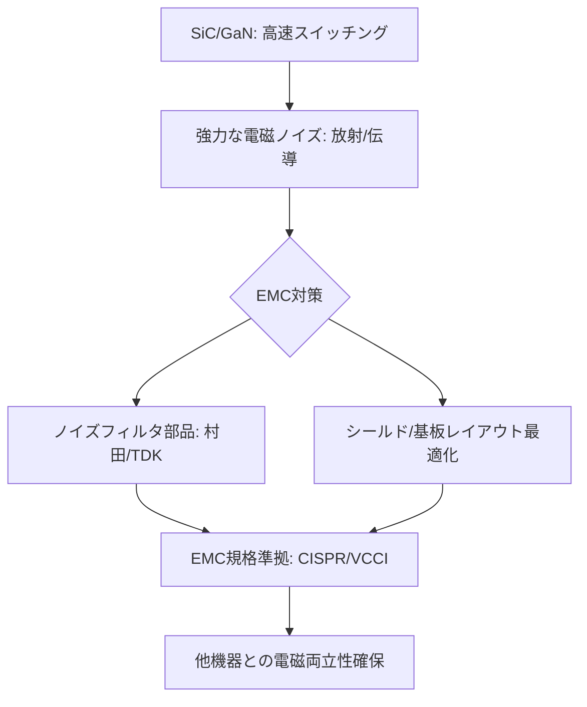

# T13-02-05 EMC(電磁両立性)設計・ノイズ対策技術

## Summary（5つの要点）

1. **SiC/GaNの課題**: **SiC**（T13-01-01）や**GaN**（T13-01-02）の**高速スイッチング**は、**高効率化**と引き換えに、**急峻な電圧・電流変化（高dv/dt, di/dt）**を引き起こし、**強力な電磁ノイズ（EMI）**の発生源となる。
2. **EMC（電磁両立性）**: デバイスが放出する**ノイズ（エミッション）**を抑制し、かつ外部からの**ノイズ（イミュニティ）**の影響を受けないようにする**設計・品質保証**技術の総称。
3. **ノイズ対策部品**: **村田製作所、TDK、太陽誘電**などが供給する**高周波ノイズフィルタ**（コモンモードチョーク、X/Yコンデンサ、フェライトビーズ）が不可欠 `(1)`。
4. **設計技術**: ノイズ源となる**寄生インダクタンス**を最小化する**基板レイアウト（PCB）**、**シールド構造**、**配線の最適化**が、部品以上に重要となる。
5. **品質保証と規格**: **品質保証**の観点から、**CISPR**（国際無線障害特別委員会）や**VCCI**（日本）などの**国際・国内EMC規格**に準拠していることの**試験・認証**が、製品出荷の**必須条件**となる。

#### 概念図

---

### 技術評価表（定量的な視点）
| 評価項目 | 評価 | 根拠 |
| :--- | :--- | :--- |
| 導入コスト | ⭐⭐⭐⭐☆ | ノイズ対策部品、試験・認証費用は**製品コストに必須**。対策難易度で上昇 |
| 技術成熟度 | ⭐⭐⭐⭐⭐ | ノイズ対策部品、試験規格は成熟。SiC/GaNの高周波化に追従中 |
| 日本の競争力 | ⭐⭐⭐⭐⭐ | **村田製作所、TDK**など、**電子部品メーカー**が**高周波EMC部品**で世界トップシェア `(1)` |
| 市場性 | ⭐⭐⭐⭐⭐ | 全ての電子機器、特にSiC/GaN搭載機器に**必須**。規制強化で需要増 |
| 品質保証の重要性 | ⭐⭐⭐⭐⭐ | **EMC規格不適合**は**製品出荷停止**、**リコール**に直結する**品質保証の根幹** |

---

## 日本の立ち位置・強み弱みのSummary

### 強み：日本企業や研究機関が持つ独自の技術、優位性などを箇条書きで記述。

* **高周波EMC部品の圧倒的シェア**: **村田製作所、TDK、太陽誘電**が、**積層セラミックコンデンサ（MLCC）**、**インダクタ**、**EMCフィルタ**といった**キー部品**で**世界トップシェア**と**高技術力**を誇る `(1) `。
* **ノイズシミュレーション技術**: **キーサイト・テクノロジー**（日本法人）や国内シミュレータベンダーが、**高周波ノイズ**の**発生メカニズム**を**3D電磁界シミュレーション**で高精度に予測する技術を提供。
* **実装技術のノウハウ**: **デンソー、パナソニック**など、**車載機器**や**民生機器**の**高密度実装**で培った**ノイズ対策レイアウト**のノウハウが豊富。

### 弱み：日本が抱える規制、標準化の遅れ、海外依存などを箇条書きで記述。

* **GaN/SiC特有のノイズ対策**: **MHz帯**で動作する**GaN**や、**超高電圧**の**SiC**から発生する**予期せぬノイズ**の**対策ノウハウ**の蓄積が、**欧米の先行メーカー（Infineon, TI）**に比べて不足している場合がある。
* **シミュレーションと実測のギャップ**: **シミュレーション精度**は向上しているが、**最終的なEMC試験**での**実測値**との**ギャップ**を埋める**デバッグ技術**と**専門エンジニア**が不足している。
* **アクティブフィルタの導入遅れ**: ノイズを**受動部品（フィルタ）**で抑えるだけでなく、**逆位相の信号**を生成して**能動的に打ち消す「アクティブEMCフィルタ」**技術の**低コスト化・実用化**が課題。

---

## 技術ロードマップ（短期/中期/長期）

### 短期目標（～2027年）

* **SiC/GaN**の**MHz帯スイッチング**に対応した、**超広帯域・高温対応**の**EMC対策部品**（コンデンサ、インダクタ）の量産化。
* **AI**を活用し、**基板レイアウト（PCB）**から**EMCノイズ発生**を**自動で予測・最適化**する**EMC設計支援ツール（EDA）**の精度向上。
* **CISPR規格**の**改訂（高周波化）**を主導し、**日本の部品技術**が有利になるよう国際標準化に貢献。

### 中期目標（2028年～2031年）

* **ノイズ発生源**となる**寄生インダクタンス**を**極限まで低減**する**3D実装技術**（T13-01-05）と**EMC設計**を完全に統合。
* **パワーデバイス**（SiC/GaN）と**ノイズ対策部品**を**1パッケージに集積**した**「EMC対策済みモジュール」**を標準化。
* **アクティブEMCフィルタ**技術を**低コスト化**し、**大型フィルタ部品**の**削減**を実現。

### 長期目標（2032年～2035年）

* **ノイズを発生させない**（ソフトスイッチングの最適化など）**革新的なパワーエレクトロニクス回路方式**と**デジタル制御**（T13-02-03）が実用化。
* **EMC設計**が**AIによって完全に自動化**され、**設計段階**で**規格準拠**が**100%保証**されるシステムが実現。

### 📚 参照リンク

1. [EMC対策部品 - 村田製作所](https://www.murata.com/ja-jp/products/emc)
2. [EMCコンポーネント - TDK](https://www.tdk.com/ja/products/emc/index.html)
3. [EMC対策部品 - 太陽誘電](https://www.yuden.co.jp/jp/products/category/emc/)
4. [VCCI協会 (情報処理装置等電波障害自主規制協議会)](https://www.vcci.jp/)