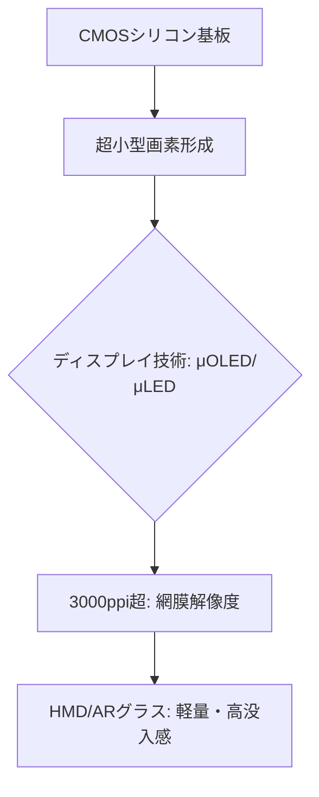

# T13-03-01 マイクロOLED・マイクロLEDディスプレイ

## Summary（5つの要点）

1. **超高精細・高密度**: **CMOSシリコン基板上**に直接画素を形成することで、**3000ppi（Pixel Per Inch）を超える**超高精細を実現。従来のスマートフォンのディスプレイ（約500ppi）の約6倍の密度を持つ。
2. **HMDの「網膜解像度」への鍵**: 非常に小さなディスプレイで広視野角（FOV）を実現するため、画素密度が没入感の鍵となる。この技術は、肉眼の解像度に近い**「網膜解像度」**の実現に不可欠。
3. **マイクロOLED（μOLED）**: 現在のHMDの主流。**ソニー**が技術をリードし、**Apple Vision Pro**に採用。高コントラスト、高速応答性、低消費電力に優れる。
4. **マイクロLED（μLED）**: 次世代技術。輝度が**10,000nits**を超え、屋外での**AR（拡張現実）**利用に不可欠な**太陽光耐性**を確保できる。量産化に向けた**トランジスタ・基板技術**が課題。
5. **日本企業の競争力**: **ソニー**が培ってきた**CMOS技術**と**OLED技術**の融合、**JDI**の**eLEAP技術**など、**超小型・高精細ディスプレイ**の**量産化技術**で世界をリードしている。

#### 概念図

---

### 技術評価表（定量的な視点）
| 評価項目 | 評価 | 根拠 |
| :--- | :--- | :--- |
| 導入コスト | ⭐⭐☆☆☆ | 高精度な半導体プロセスと高額なOLED/LED材料が必要 |
| 技術成熟度 | ⭐⭐⭐☆☆ | μOLEDは量産開始。μLEDは量産技術・歩留まりが課題 |
| 日本の競争力 | ⭐⭐⭐⭐⭐ | **ソニー、JDI、エプソン**が超高精細ディスプレイ技術で世界をリード `(1, 2)` |
| 市場性 | ⭐⭐⭐⭐⭐ | **HMD**の性能を決定づける中核部品。需要は爆発的に増加 |
| 品質保証の重要性 | ⭐⭐⭐⭐⭐ | **画素欠陥（デッドピクセル）**や**輝度・色均一性**がユーザー体験に直結 |

---

## 日本の立ち位置・強み弱みのSummary

### 強み：日本企業や研究機関が持つ独自の技術、優位性などを箇条書きで記述。

* **CMOS技術とOLEDの融合**: **ソニー**は**超小型CMOSセンサー**開発で培った**高密度集積技術**をμOLEDに転用し、高い優位性を持つ `(1)`。
* **eLEAP技術（JDI）**: **蒸着レス**でOLEDの発光効率と寿命を向上させる独自の技術は、μOLEDの量産コスト低減に貢献する。
* **エプソンのLTPS（低温ポリシリコン）技術**: 独自のLTPS技術を活用した高精細・高輝度なディスプレイ技術を持つ。

### 弱み：日本が抱える規制、標準化の遅れ、海外依存などを箇条書きで記述。

* **μLEDの量産化の遅れ**: 米国（Meta、Apple）、中国（BOE）がμLED開発に巨額投資。日本はμOLEDで先行するが、μLEDの**量産プロセス**の確立で競争に晒される。
* **装置産業の競争激化**: ディスプレイ製造装置・材料分野で、韓国・中国メーカーの追い上げが激しい。
* **HMD市場での存在感**: 部品では強いが、HMD完成品市場で**Meta、Apple**に主導権を握られており、部品の価格交渉力で不利になる懸念。

---

## 技術ロードマップ（短期/中期/長期）

### 短期目標（～2027年）

* **3000ppi級μOLED**の**量産体制を確立**し、次世代HMDへの安定供給を開始。
* **μLED**の**画素形成プロセス**（マス・トランスファー技術）の**歩留まりを30%以上向上**させる。
* **低消費電力化**技術（駆動回路最適化）により、HMDのバッテリー持続時間を2倍に延長。

### 中期目標（2028年～2031年）

* **μLEDディスプレイ**の**商用化**を開始し、**輝度10,000nits**超の**ARグラス**を実現。
* **マイクロディスプレイ**と**光学系**（T13-03-02）を**一体化したモジュール**の標準化。
* **色再現性（色域）**を大幅に向上させ、**プロフェッショナル用途**（医療、デザイン）への展開を加速。

### 長期目標（2032年～2035年）

* **網膜投影技術**と融合した**超小型・超高精細ディスプレイ**がHMDの主流となり、**HMDの存在を感じさせない**視覚体験を実現。
* **μLED**の**製造コスト**をLCD並みに低減し、コンシューマ向けARグラスへの普及を完了。

### 📚 参照リンク

1. [ソニー プレスリリース：空間再現ディスプレイ](https://www.sony.com/ja/new-products/headsets/spatial-reality-display/)
2. [JDI プレスリリース：世界初、蒸着レスで高精細を実現する次世代有機ELディスプレイ「eLEAP」](https://www.j-display.com/news/2022/220519.html)
3. [Apple Vision Proが採用したマイクロOLED技術とは？ - 日本経済新聞](https://www.nikkei.com/article/DGXZQOGN06C3E0W3A900C2000000/)