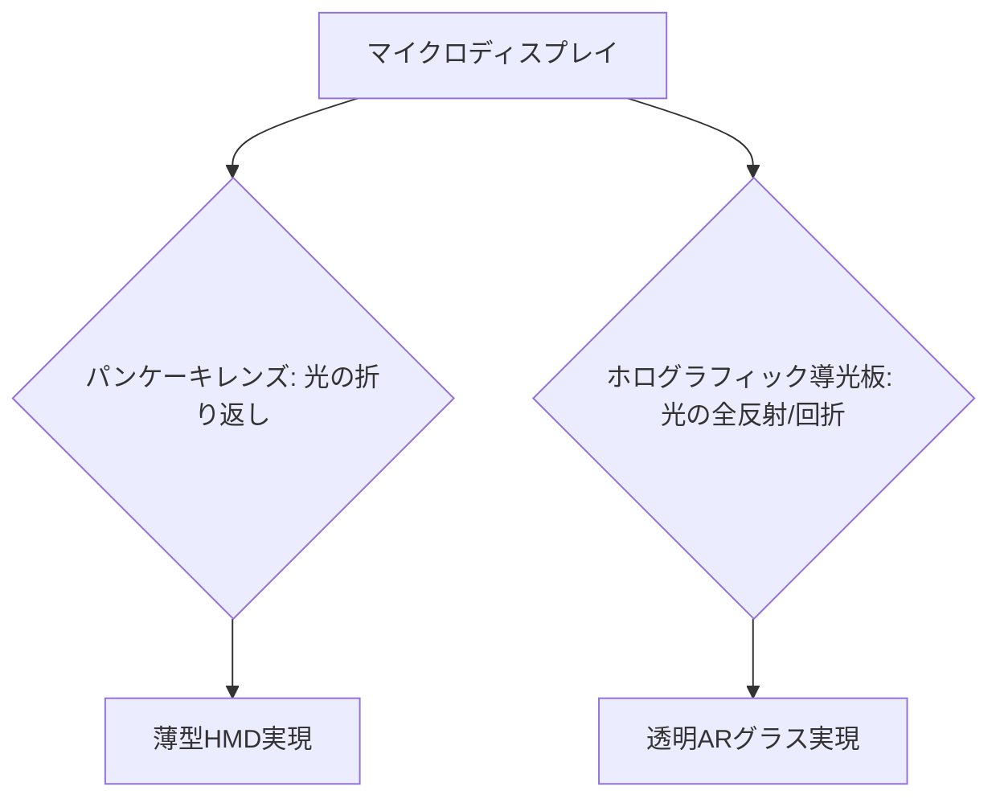

# T13-03-02 光学設計・導光技術(パンケーキレンズ、ホログラフィック導光板)

## Summary（5つの要点）

1. **薄型・軽量化の中核**: HMDの**装着感**を決定づける最重要技術。光学系の奥行き（レンズから目までの距離）を極限まで短縮し、**従来の半分以下の厚さ**と**軽量化**を実現する。
2. **パンケーキレンズ（VR向け）**: 光を**偏光フィルタ**と**凹面鏡**で**2～3回折り返し**て網膜に導く。レンズ枚数を削減し、VR HMDの**薄型化（Meta Quest 3等）**の主流技術。
3. **ホログラフィック導光板（AR向け）**: 薄い透明な**導光板（ウェーブガイド）**の内部で光を全反射させ、**ホログラム回折格子**で網膜に光を導く。ARグラスの**軽量化と透過視界**の両立に不可欠。
4. **広視野角（FOV）の確保**: 薄型化と同時に**FOV（Field of View、視野角）**を**100度以上**確保する。光学的な**収差（色ズレ、歪み）**をデジタル処理で補正する技術との融合が必須。
5. **材料技術の重要性**: レンズ、導光板の**高屈折率ガラス**、**高精度な非球面レンズ成形技術**（T15-05-01）が日本の**AGC**などの素材メーカーの強み `(1)`。

#### 概念図

---

### 技術評価表（定量的な視点）
| 評価項目 | 評価 | 根拠 |
| :--- | :--- | :--- |
| 導入コスト | ⭐⭐⭐☆☆ | 高精度な金型、光学部品製造・コーティングが必要 |
| 技術成熟度 | ⭐⭐⭐⭐☆ | パンケーキレンズは成熟。ホログラフィック導光板は発展途上 |
| 日本の競争力 | ⭐⭐⭐⭐☆ | **AGC、HOYA**など、**光学材料・精密成形技術**で世界トップ `(1)` |
| 市場性 | ⭐⭐⭐⭐⭐ | HMD/ARグラスの**コモディティ化**に向け、最重要の小型化要素 |
| 品質保証の重要性 | ⭐⭐⭐⭐⭐ | **色収差、歪曲収差、光損失**がユーザーの**酔い**や**体験品質**に直結 |

---

## 日本の立ち位置・強み弱みのSummary

### 強み：日本企業や研究機関が持つ独自の技術、優位性などを箇条書きで記述。

* **光学材料技術**: **AGC**（ガラス・成形技術）、**HOYA**（光学ガラス）が、高屈折率で低分散の**非球面レンズ**、**導光板の材料**で圧倒的な強みを持つ `(1)`。
* **精密金型・成形技術**: **キヤノン、ニコン**などのカメラメーカーが培った**高精度なプラスチックレンズ**の**射出成形・金型技術**が応用可能（T15-05-01）。
* **ホログラム・回折光学素子（DOE）**: **富士フイルム**など、写真・光学分野で培われた**回折格子**の製造・設計ノウハウ。

### 弱み：日本が抱える規制、標準化の遅れ、海外依存などを箇条書きで記述。

* **光学ベンチャーの不足**: **Lumus**（イスラエル）、**DigiLens**（米国）など、革新的な導光板技術を持つ**海外ベンチャー**が市場をリードし、日本企業は提携や部品供給に留まる傾向がある。
* **デジタル補正技術**: 光学的な欠陥をデジタルで補正する**GPUベースのリアルタイム画像処理**（T8-01-01）のアルゴリズム開発で、プラットフォーマーに後れを取る懸念。
* **VR/AR統合製品の欠如**: 部品技術は高いが、それを統合した**薄型・高性能な完成品HMD**のグローバル市場での存在感が薄い。

---

## 技術ロードマップ（短期/中期/長期）

### 短期目標（～2027年）

* **パンケーキレンズ**の**光学効率を50%超**に向上させ、ディスプレイの輝度要件を緩和。
* **ホログラフィック導光板**の**量産コストを半減**し、コンシューマARグラスへの採用を拡大。
* **デジタル補正技術**と光学設計の**シミュレーション**（T15-01-04）を完全に統合。

### 中期目標（2028年～2031年）

* **FOV 120度以上**、**厚さ5mm以下**の**超薄型光学モジュール**を標準化。
* **メタサーフェスレンズ（ML）**を実用化し、レンズを**単一の薄膜**に置き換え、**重量100g以下**のARグラスを実現。
* **アイトラッキング**（T13-03-03）と連携し、**注視点（フォーカス）**を物理的に制御する**バリアブル・フォーカス技術**を導入。

### 長期目標（2032年～2035年）

* **光学系全体**が**コンタクトレンズサイズ**まで小型化され、**度付きメガネ**のような**日常利用可能なARグラス**が主流となる。
* **レンズ素材**が**自己修復機能**や**環境適応機能**（調光など）を統合。

### 📚 参照リンク

1. [AGC ニュースリリース：XRデバイス向けガラス素材「アトモスガラス」](https://www.agc.com/news/detail/1202888/index.html)
2. [パンケーキレンズの基本原理とHMDへの応用 - Impress Watch](https://www.watch.impress.co.jp/docs/series/hmd/1458872.html)
3. [次世代ARグラスの鍵を握る導波路技術 - Lumiere Vison](https://www.lumiere.vision/post/waveguide-technology)