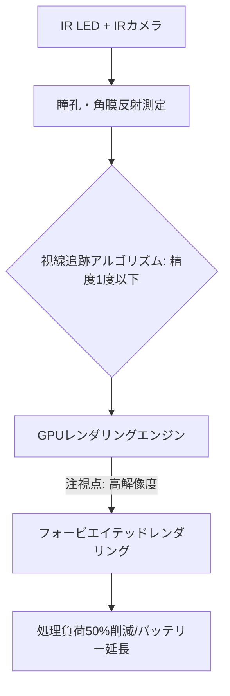

# T13-03-03 視線追跡・アイトラッキング技術

## Summary（5つの要点）

1. **基本原理**: **赤外線（IR）LED**と**IRカメラ**を用いて、眼球表面の反射光（プルキニエ像）と瞳孔の位置を測定し、**視線（注視点）**を**高精度（1度以下）**でリアルタイムに追跡する `(1)`。
2. **フォービエイテッドレンダリング（Foveated Rendering）**: 視線追跡データに基づき、人間が鮮明に見ている**注視点（中心窩）**のみを**高解像度**でレンダリングし、周辺視野の解像度を意図的に下げる処理技術。
3. **処理負荷の劇的削減**: HMDに必要な**GPUの処理負荷を最大50%**削減し、**バッテリー持続時間の延長**と**熱問題の緩和**に貢献。高解像度ディスプレイ（T13-03-01）の**実用化**に不可欠。
4. **直感的な操作・入力**: 視線自体を**UI（ユーザーインターフェース）のポインタ**として活用。HMDでの**クリック操作、メニュー選択**を**コントローラーレス**で実現する。
5. **生体・感情分析**: 視線データ（瞳孔径、瞬き、注視時間）からユーザーの**集中度、疲労度、感情**を推定する**アイトラッキング・インフォマティクス**への応用が進む `(2)`。

#### 概念図

---

### 技術評価表（定量的な視点）
| 評価項目 | 評価 | 根拠 |
| :--- | :--- | :--- |
| 導入コスト | ⭐⭐⭐☆☆ | IRカメラとLEDアレイの追加。アルゴリズムライセンス費用 |
| 技術成熟度 | ⭐⭐⭐⭐☆ | 主要なハイエンドHMD（Vision Pro, Quest Pro, PS VR2）に標準搭載 |
| 日本の競争力 | ⭐⭐⭐☆☆ | **Tobii**（スウェーデン）が市場を先行。日本は**NTT**や**カメラメーカー**が研究 `(3)` |
| 市場性 | ⭐⭐⭐⭐⭐ | HMDの**性能と電力効率**を両立させる**必須機能** |
| 品質保証の重要性 | ⭐⭐⭐⭐⭐ | 精度と遅延が**酔い**と**操作性**に直結。キャリブレーションの安定性が鍵 |

---

## 日本の立ち位置・強み弱みのSummary

### 強み：日本企業や研究機関が持つ独自の技術、優位性などを箇条書きで記述。

* **センサー・カメラ技術**: **ソニー**、**キヤノン**など、**高感度IRカメラ**、**CMOSセンサー**の開発力とサプライチェーンに強みを持つ。
* **基礎研究**: **NTT**の人間情報科学研究所、**理化学研究所**などが、**認知科学**に基づいた**視線データ解析**や**疲労度推定**の基礎研究で実績を持つ `(3)`。
* **車載応用**: 車載分野で先行する**ドライバーモニタリングシステム（DMS）**で培った**視線・集中度追跡のノウハウ**をHMDに応用可能。

### 弱み：日本が抱える規制、標準化の遅れ、海外依存などを箇条書きで記述。

* **アルゴリズム特許の海外依存**: **Tobii**、**SMI**などの海外専門企業が、アイトラッキングの**核心的なアルゴリズム**（視線推定、プルキニエ像解析）の特許を保有。
* **超低遅延処理チップの設計**: 視線追跡からレンダリング調整までを**10ms以下**で行うための**専用DSP/ASIC**の**設計ノウハウ**が、プラットフォーマー（Apple、Meta）に集中している。
* **プライバシー規制**: 視線データは**機密性の高い生体情報**であり、**個人情報保護法**との兼ね合いから、データ活用が欧米に比べて慎重になる傾向。

---

## 技術ロードマップ（短期/中期/長期）

### 短期目標（～2027年）

* **フォービエイテッドレンダリング**を**次世代HMDの標準機能**とし、**レンダリング負荷を40%削減**する効果を保証。
* **視線によるUI操作**の**標準プロトコル**を策定し、クロスプラットフォームでの互換性を確保。
* **視線追跡のキャリブレーション**を**10秒以内**で完了させる技術を実装。

### 中期目標（2028年～2031年）

* **視線生体認証**（虹彩認証など）を統合し、HMD内のコンテンツ・決済の**セキュリティ**を強化。
* **AI**を活用し、ユーザーの**集中度、感情、疲労度**を**リアルタイムで推定**し、コンテンツ提供や作業支援に活用。
* **光学系**（T13-03-02）と連携した**バリアブル・フォーカス**（焦点深度調整）を実用化し、**輻輳・調節の不一致**による酔いを解消。

### 長期目標（2032年～2035年）

* **HMD**が**視線データを活用した**脳科学・認知科学の**研究プラットフォーム**として機能。
* **視線**による**情報検索、意思決定支援**が**脳波**（T8-03-02）と統合され、**思考による直接操作**に進化。

### 📚 参照リンク

1. [アイトラッキング技術 - Tobii](https://www.tobii.com/ja/corporate/about-tobii/technology/eye-tracking/)
2. [感情・集中度推定のためのアイトラッキング技術 - J-STAGE](https://www.jstage.jst.go.jp/article/jime/35/6/35_466/_pdf/-char/ja)
3. [NTT R&D Webサイト：人間の認知・脳の活動を分析する技術](https://www.ntt.co.jp/rd/tech/human-information.html)