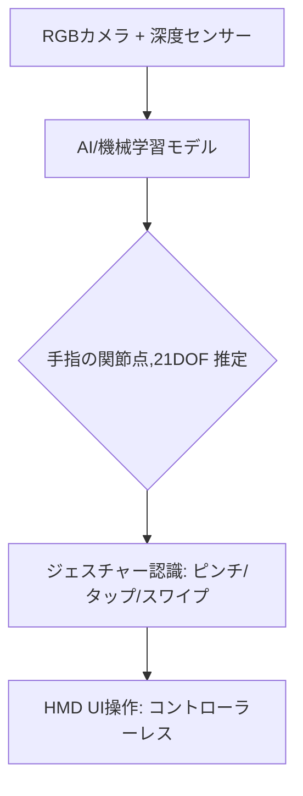

# T13-03-04 ハンドトラッキング・ジェスチャー認識

## Summary（5つの要点）

1. **コントローラーレス操作**: HMDに搭載された**RGBカメラ**と**深度センサー（ToF、LiDAR）**を用いて、コントローラーを必要とせず**手指の動き（ジェスチャー）**をリアルタイムで高精度に追跡する技術 `(1)`。
2. **アルゴリズムの中核**: **AI（機械学習）**が、カメラ画像から関節の位置（**21自由度**）を推定し、**ピンチ、スワイプ、タップ**といった**ジェスチャー**を認識する。
3. **直感性と自然な没入感**: 仮想空間のオブジェクトを**「直接掴む」「ボタンを押す」**といった**現実世界に近い直感的な操作**を可能にし、ユーザーの**認知負荷を軽減**し、没入感を向上させる。
4. **産業応用での普及**: **Hololens 2**（MRデバイス）や**Meta Quest 3**など、主要なHMDに標準搭載され、特に**医療トレーニング、製造業のリモート支援**（T15-04-03）で利用が拡大 `(2)`。
5. **主要技術企業**: 英国の**Ultraleap（旧Leap Motion）**が独自のトラッキングアルゴリズムで市場をリード。Meta、Appleも自社技術を内製化している。

#### 概念図

---

### 技術評価表（定量的な視点）
| 評価項目 | 評価 | 根拠 |
| :--- | :--- | :--- |
| 導入コスト | ⭐⭐⭐☆☆ | 深度センサー（ToF/LiDAR）と高性能な画像処理チップが必要 |
| 技術成熟度 | ⭐⭐⭐⭐☆ | 基本的なUI操作は成熟。複雑なジェスチャー、ハプティクス連携は発展途上 |
| 日本の競争力 | ⭐⭐⭐☆☆ | **ソニー**のToFセンサー、**キヤノン**の画像認識に強み。アルゴリズムは海外先行 `(3)` |
| 市場性 | ⭐⭐⭐⭐⭐ | AR/VRデバイスの**操作性を革新**し、普及を加速させる中核技術 |
| 品質保証の重要性 | ⭐⭐⭐⭐⭐ | **遮蔽（手と手が重なる）**や**高速動作**時の**認識精度**と**遅延**が体験品質を左右 |

---

## 日本の立ち位置・強み弱みのSummary

### 強み：日本企業や研究機関が持つ独自の技術、優位性などを箇条書きで記述。

* **ToFセンサー技術**: **ソニー**が、HMDやスマートフォンに不可欠な**高性能なToF（Time-of-Flight）深度センサー**の**世界トップシェア**を持つ。
* **ロボティクス・モーションキャプチャの蓄積**: **キヤノン、パナソニック**などが、産業用ロボットや映画・ゲーム制作で培った**高精度な動作解析**のノウハウ。
* **AR/MRアプリケーション**: **コンシューマ向けゲーム**や**企業向けトレーニング**での**応用力**が高い。

### 弱み：日本が抱える規制、標準化の遅れ、海外依存などを箇条書きで記述。

* **コアアルゴリズムの海外依存**: **Ultraleap**などの海外ベンダーの**特許・ライセンス**への依存度が高い。AIを活用した**手の形状・テクスチャ補完**技術で遅れ。
* **ハプティクス連携の遅れ**: ハンドトラッキングで掴んだ際の**触覚フィードバック（ハプティクス）**（T8-02-05）技術の**システム統合**で、欧米に後れ。
* **データセットの不足**: AIモデル学習に必要な**多様な人種・環境下での手指の動作データセット**の整備が遅れている。

---

## 技術ロードマップ（短期/中期/長期）

### 短期目標（～2027年）

* **ジェスチャー認識の精度**を向上させ、**タイプ入力**や**複雑なプロフェッショナル操作**に対応。
* **遮蔽（Occlusion）**や**様々な照明条件**下での**安定したトラッキング**を実現。
* **トラッキング遅延**を**10ms以下**に短縮し、リアルタイムでの操作感を改善。

### 中期目標（2028年～2031年）

* **ハプティクスフィードバックデバイス**（T8-02-05）と**ハンドトラッキング**を完全に統合し、**触れるVR/AR**を実現。
* **全身トラッキング技術**と連携し、**手の動き**だけでなく**体の動き全体**での自然なコミュニケーションを可能にする。
* **AI**がユーザーの**意図（ジェスチャーの予兆）**を**予測**し、操作の**応答速度を先行補償**。

### 長期目標（2032年～2035年）

* **非視覚センサー（筋電位、神経信号）**と融合し、**思考に近いレベル**での**直感的な操作**を実現（T8-03-02）。
* **HMDがコントローラーを完全に駆逐**し、全てのアバター操作が**現実の体の動き**と一致する。

### 📚 参照リンク

1. [Ultraleap社のハンドトラッキング技術](https://www.ultraleap.com/company/technology/)
2. [Microsoft HoloLens 2のハンドトラッキング](https://learn.microsoft.com/ja-jp/windows/mixed-reality/design/hand-tracking)
3. [ソニー、ToF（Time-of-Flight）センサー技術](https://www.sony-semicon.com/jp/products/is/tof.html)