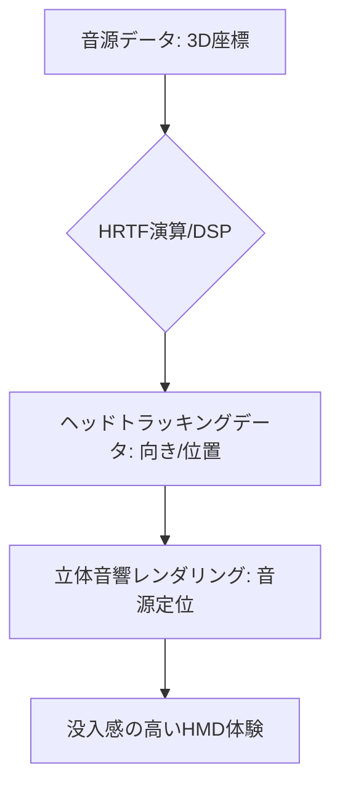

# T13-03-05 空間音響・立体音響レンダリング

## Summary（5つの要点）

1. **3次元の音場再現**: 音源の位置（上下、前後、左右）を正確に知覚させることで、**聴覚情報による没入感**を飛躍的に向上させる。視覚と聴覚の連動が、**VR酔いの軽減**にも寄与する。
2. **HRTF（頭部伝達関数）**: 人間の耳、頭、肩が音波に与える影響を数学的にモデル化し、**3次元空間の音源定位**を再現する核心技術。個人差が大きく、**パーソナライズ**が重要 `(1)`。
3. **ヘッドトラッキングとの統合**: HMDの**頭の動き**と**音場**を**リアルタイムで同期**させる。頭を動かしても音源が空間に固定されている（音源定位の安定）ことで、**臨場感**を決定づける。
4. **主要プラットフォーム**: **Dolby Atmos**、**DTS:X**といった映画・音楽規格、**SonyのTempest 3D AudioTech（PS5、PS VR2）**など、HMDやゲーム分野で技術が普及 `(3)`。
5. **日本の音響技術の強み**: **ヤマハ、Roland、JVCケンウッド**など、長年にわたり培ってきた**音響信号処理（DSP）**技術、**HRTF研究**の蓄積が豊富 `(1, 2)`。

#### 概念図

---

### 技術評価表（定量的な視点）
| 評価項目 | 評価 | 根拠 |
| :--- | :--- | :--- |
| 導入コスト | ⭐⭐☆☆☆ | 高度なDSPチップとアルゴリズム、高性能ヘッドホン/イヤホンが必要 |
| 技術成熟度 | ⭐⭐⭐⭐☆ | 映画、ゲーム分野では成熟。ARでの環境音との融合は発展途上 |
| 日本の競争力 | ⭐⭐⭐⭐⭐ | **ヤマハ、ソニー**など、音響機器とアルゴリズムの両面で世界をリード `(1, 3)` |
| 市場性 | ⭐⭐⭐⭐⭐ | 全てのAR/VR/メタバース体験に**必須の要素** |
| 品質保証の重要性 | ⭐⭐⭐⭐⭐ | **音源定位の精度**、**遅延**（リップシンク）、**個人差への対応**が重要 |

---

## 日本の立ち位置・強み弱みのSummary

### 強み：日本企業や研究機関が持つ独自の技術、優位性などを箇条書きで記述。

* **音響機器・DSPの知見**: **ヤマハ、Roland**などの楽器・音響機器メーカーが持つ、**低遅延・高精度な音響信号処理（DSP）**のコア技術。
* **プラットフォーム技術**: **ソニー**の**Tempest 3D AudioTech**が、PS5やPS VR2のエコシステムにおいて、空間音響を**低遅延で実現**するプラットフォームとして機能 `(3)`。
* **HRTFの基礎研究**: **ヤマハ**、**JVCケンウッド**、国内大学機関が、**HRTFの個人差**に関する詳細な研究と、**計測・推定アルゴリズム**の開発で世界をリード `(1)`。

### 弱み：日本が抱える規制、標準化の遅れ、海外依存などを箇条書きで記述。

* **コンテンツ制作の遅れ**: 立体音響に対応した**VR/ARコンテンツ**の制作ノウハウやクリエイターの数が、米国に比べて不足している。
* **国際標準化への影響力**: **Dolby、DTS**などの**欧米企業**が音響フォーマットの**国際標準化**を主導しており、日本発の技術がデファクトスタンダードになりにくい。
* **個人HRTF測定の普及**: **個人の耳の形**に合わせたHRTFの**迅速な測定・推定**技術が未だ高コスト・複雑であり、普及の妨げとなっている。

---

## 技術ロードマップ（短期/中期/長期）

### 短期目標（～2027年）

* **ヘッドトラッキング**との**連動遅延を5ms以下**に短縮し、**音源定位の安定性**を確保。
* **HRTFの推定アルゴリズム**を改善し、ユーザーの**耳の写真**などから**数分**で**個人に最適化**された音場を生成。
* **ARデバイス**において、**現実の環境音**と**仮想音**の**自然な融合**を実現（オーディオ・オクルージョンの改善）。

### 中期目標（2028年～2031年）

* **空間音響**が全ての**HMD、ARグラス**、**テレビ**の**標準機能**となる。
* **AI**を活用し、**ユーザーの聴覚特性や疲労度**に応じて、**音響パラメータを自動調整**する技術を導入。
* **聴覚AR**（音響によるナビゲーション、情報提示）のアプリケーションを実用化。

### 長期目標（2032年～2035年）

* **聴覚情報**が視覚情報と**完全に統合**され、**脳波**（T8-03-02）による**音源の選択、ミュート**などの**思考による操作**が実現。
* **超音波**や**指向性スピーカー**と組み合わせ、**ヘッドホンなし**での**プライベートな立体音響体験**を実現。

### 📚 参照リンク

1. [ヤマハ ニュースリリース：HRTFを応用した立体音響技術](https://www.yamaha.com/ja/about/research/sound/hrtf-technology/)
2. [JVCケンウッド：音響信号処理とHRTF研究](https://www.jvckenwood.com/jp/about/technical_journal/pdf/pdf/TJ2020/JP-TJ2020-008.pdf)
3. [Sony Tempest 3D AudioTech for PlayStation 5](https://www.playstation.com/ja-jp/ps5/3d-audio/)