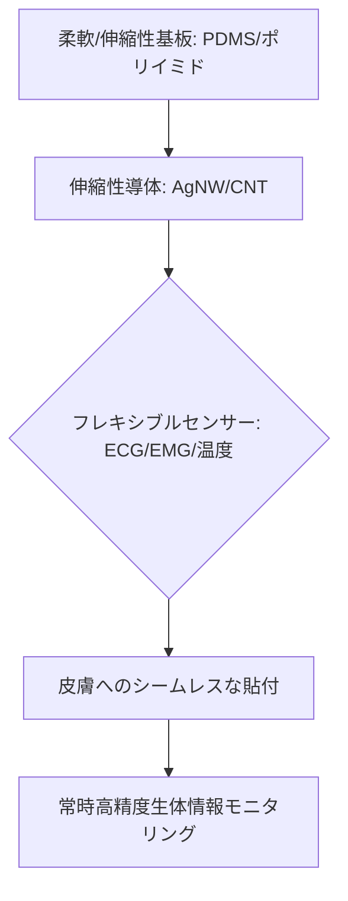

# T13-04-01 フレキシブル・伸縮性センサー

## Summary（5つの要点）

1. **皮膚密着型の実現**: 極薄（数マイクロメートル）かつ**伸縮性（数10%）**を持つ基板上に回路を形成し、皮膚の動きに追従することで、**違和感のない常時装着**と**高精度な生体信号計測**を可能にする `(1, 2)`。
2. **主要な計測対象**: **心電（ECG）**、**筋電（EMG）**、**体温**、**発汗**、**皮膚インピーダンス**など、皮膚表面で取得できる幅広い生体情報をシームレスに計測。
3. **材料技術**: **銀ナノワイヤー**や**CNT（カーボンナノチューブ）**、**有機トランジスタ**などの柔軟な素材を、**PDMS（ポリジメチルシロキサン）**や**ポリイミド**といった柔軟基板上に実装する技術が中核。
4. **日本の先駆的研究**: **東京大学の染谷隆夫教授**、**大阪大学の関谷毅教授**などが、**世界最薄・最軽量**の**「電子皮膚（e-skin）」**を実現し、この分野をリード `(1, 2)`。
5. **応用分野**: 病院でのECGケーブルレス化、スポーツ選手のパフォーマンス分析、高齢者の**転倒予知**、**認知機能低下の早期検出**など、ヘルスケア、スポーツテック、医療分野への応用が期待される。

#### 概念図

---

### 技術評価表（定量的な視点）
| 評価項目 | 評価 | 根拠 |
| :--- | :--- | :--- |
| 導入コスト | ⭐⭐☆☆☆ | 製造プロセスが複雑。高価なナノ材料（AgNW, CNT）やクリーンルームが必要 |
| 技術成熟度 | ⭐⭐⭐☆☆ | 研究開発段階から、医療/産業用途での実証、限定的な商用化へ移行中 `(1, 2)` |
| 日本の競争力 | ⭐⭐⭐⭐⭐ | 東大、阪大発の技術が国際的なベンチマーク。材料・印刷技術も優位 `(1, 2)` |
| 市場性 | ⭐⭐⭐⭐☆ | 従来のハードなウエアラブルデバイスを代替する**究極のインターフェース**として需要大 |
| 品質保証の重要性 | ⭐⭐⭐⭐⭐ | **繰り返しの曲げ・伸張**に対する**耐久性**、**生体適合性**、**洗濯耐性**が必須 |

---

## 日本の立ち位置・強み弱みのSummary

### 強み：日本企業や研究機関が持つ独自の技術、優位性などを箇条書きで記述。

* **電子皮膚の世界的パイオニア**: **東京大学の染谷研究室**は、伸縮性有機トランジスタを用いた**世界最薄・最軽量**の電子皮膚技術で世界を牽引。
* **印刷エレクトロニクス**: **大日本印刷、富士フイルム**など、長年培ってきた**印刷技術**を応用した**ロール・ツー・ロール**でのフレキシブル回路の**低コスト製造技術**。
* **ナノ材料技術**: **CNT（カーボンナノチューブ）**の**合成、分散、応用技術**において、日本企業・研究機関が世界トップクラスの知見を持つ。

### 弱み：日本が抱える規制、標準化の遅れ、海外依存などを箇条書きで記述。

* **最終製品化・ビジネス化の遅れ**: 基礎研究では強いが、**Apple、Fitbit**のような**コンシューマ向け最終製品**への**早期統合**や**グローバルな市場展開**で遅れ。
* **医療機器認証の壁**: 医療用途で実用化するには、**フレキシブルセンサー**の**長期的な信頼性**と**医療機器としての認証**プロセスが複雑で時間がかかる。
* **データ解析プラットフォームの弱さ**: センサーで取得した**膨大な生体データ**を解析し、**健康指標**として提示する**クラウド・AIプラットフォーム**の開発が、米国勢に後れを取る懸念。

---

## 技術ロードマップ（短期/中期/長期）

### 短期目標（～2027年）

* **フレキシブルセンサー**の**耐久性**を**10万回以上の曲げ・伸張**に耐えるレベルまで向上。
* **ECG/EMG**計測において、医療機器に匹敵する**ノイズ耐性**と**信号品質**を確保。
* **スポーツテック**や**リハビリテーション**分野での**実証実験**を完了し、商用製品を限定展開。

### 中期目標（2028年～2031年）

* **ペースタブル（貼付型）センサー**を**遠隔患者モニタリング（RPM）**の**標準ツール**として医療機関に導入。
* **フレキシブルバッテリー**や**無線給電**を統合し、**真のワイヤレス**な**電子皮膚パッチ**を実現。
* **汗**などの**体液**から**ストレスホルモン**や**薬物濃度**を**連続測定**する技術を実用化。

### 長期目標（2032年～2035年）

* **電子皮膚**が**衣服や下着**（T13-04-05）に**完全に統合**され、意識することなく**常時健康モニタリング**が実現。
* **AI**（T14-04-04）が**複数の生体情報**から**疾病の兆候**を**自動で予測**し、病院にデータ送信。

### 📚 参照リンク

1. [JST プレスリリース：世界最軽量の伸縮性有機トランジスタ集積回路](http://www.jst.go.jp/pr/announce/20180213/index.html)
2. [大阪大学 関谷研究室：貼付型フレキシブルワイヤレスセンサ](https://www.jst.go.jp/pr/jst-review/ja/pdf/202102_02.pdf)
3. [CNT（カーボンナノチューブ）の応用技術 - 産業技術総合研究所](https://www.aist.go.jp/aist_j/research_results/pr_2019/pr20191206/pr20191206.html)