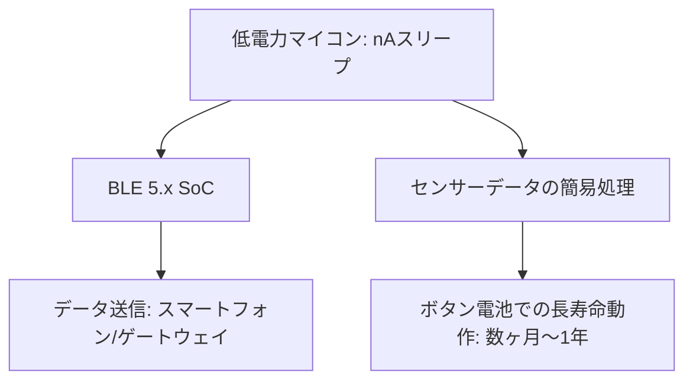

# T13-04-02 超低消費電力マイコン・Bluetooth LE通信

## Summary（5つの要点）

1. **ウエアラブルの生命線**: デバイスを**ボタン電池**や**コイン型電池**のみで**数ヶ月～数年**動作させるための、**電源管理**と**演算・通信**を担う中核技術。
2. **超低消費電力マイコン（MCU）**: 動作時だけでなく、**スリープモード（待機時）**の**漏れ電流（リーク電流）**を**ナノアンペア（nA）レベル**に抑え、**数秒間隔**の短時間動作でデータを処理するアーキテクチャ。
3. **Bluetooth Low Energy (BLE)**: **Bluetooth 5.x**規格により、**通信距離の拡大**（最大4倍）、**通信速度の向上**（最大2倍）、そして**省電力性**を両立させた**近距離無線通信規格** `(1)`。
4. **チップベンダーの寡占**: **Nordic Semiconductor**（ノルウェー）、**Dialog Semiconductor**（ルネサス傘下）、**Texas Instruments (TI)** が、この分野の専用SoC（System-on-Chip）市場で高いシェアを持つ。
5. **応用と統合**: センサー（T13-04-01）の計測、データの**エッジ側での簡易処理**、そしてスマートフォンやゲートウェイへの**省電力データ送信**までを**1チップ**で統合。**常時ヘルスケアモニタリング**（T13-04）の実現に不可欠。

#### 概念図

---

### 技術評価表（定量的な視点）
| 評価項目 | 評価 | 根拠 |
| :--- | :--- | :--- |
| 導入コスト | ⭐⭐⭐⭐☆ | 専用SoCの価格は比較的安定。大量生産により低コスト化が可能 |
| 技術成熟度 | ⭐⭐⭐⭐⭐ | BLE 5.xは成熟技術。超低消費電力技術は継続的に進化中 `(1)` |
| 日本の競争力 | ⭐⭐⭐☆☆ | **ルネサス**がDialogを買収したが、依然として**Nordic**が市場シェアで先行 `(2)` |
| 市場性 | ⭐⭐⭐⭐⭐ | IoTデバイス、ウエアラブル、ヘルスケア機器の**必須の要素** |
| 品質保証の重要性 | ⭐⭐⭐⭐⭐ | **バッテリー寿命の変動**、**通信の安定性**、**セキュリティ（Bluetoothの暗号化）**が製品品質を左右 |

---

## 日本の立ち位置・強み弱みのSummary

### 強み：日本企業や研究機関が持つ独自の技術、優位性などを箇条書きで記述。

* **ルネサス（Dialog）の技術取得**: **ルネサスエレクトロニクス**がDialog Semiconductorを買収し、**超低消費電力・ミックスドシグナル技術**（電源管理など）を獲得。
* **CMOS/EEPROM技術**: **東芝、ローム**などが持つ、**SRAMセル**や**電源IC**における**リーク電流を極小化**する半導体製造プロセスのノウハウ。
* **エナジーハーベスティング連携**: **太陽電池、振動、熱電素子**など、**エナジーハーベスティング**（T13-01-04）で得た**微小電力**で動作させるための**電源管理技術（PMIC）**に強み。

### 弱み：日本が抱える規制、標準化の遅れ、海外依存などを箇条書きで記述。

* **SoC市場での後れ**: **Nordic Semiconductor**、**TI**といった海外専業メーカーが、**BLEスタック（通信ソフトウェア）**や**開発エコシステム**で市場を先行。
* **アプリケーション層での統合の遅れ**: 低消費電力マイコンの上に載せる、**ヘルスケアアプリケーション**の**AI処理、クラウド連携**の**ソフトウェアフレームワーク**開発で、プラットフォーマーに後れ。
* **通信プロトコルの国際標準化**: **Bluetooth SIG**などの**国際標準化活動**における、日本企業の**発言力強化**が課題。

---

## 技術ロードマップ（短期/中期/長期）

### 短期目標（～2027年）

* **BLE 5.x**の**メッシュネットワーク機能**を活用し、**大規模なIoTセンサーネットワーク**を構築。
* **MCUのスリープ電流**を**10nA以下**に抑え、**バッテリー寿命を2倍**に延長。
* **エッジAI**（T14-04-03）を統合し、センサーデータを**マイコン側で高度に処理**してから送信し、**通信頻度を削減**。

### 中期目標（2028年～2031年）

* **ボタン電池不要**の**エナジーハーベスティング**（T13-01-04）のみで動作する**ウエアラブルデバイス**を実用化。
* **BLE**と**UWB（超広帯域無線）**を統合し、**測位精度10cm以下**の**高精度位置情報サービス**を実現。
* **サイバーセキュリティ機能**をハードウェアに組み込み、**通信の暗号化と認証**を低消費電力で実現。

### 長期目標（2032年～2035年）

* **μW（マイクロワット）レベル**の電力で**AI処理**と**広域通信（LPWA）**が可能な**完全自律型ウエアラブルデバイス**が社会に普及。
* **ペースタブルセンサー**が、医療・健康管理の**標準インターフェース**となる。

### 📚 参照リンク

1. [Nordic Semiconductor: Bluetooth Low Energy Technology](https://www.nordicsemi.com/products/low-power-bluetooth)
2. [ルネサスエレクトロニクス: Dialog Semiconductor買収に関する情報](https://www.renesas.com/jp/ja/about/press-room/news/viva-dialog-semiconductor-acquisition)
3. [Bluetooth SIG: Bluetooth Core Specification v5.4](https://www.bluetooth.com/specifications/le-core/)