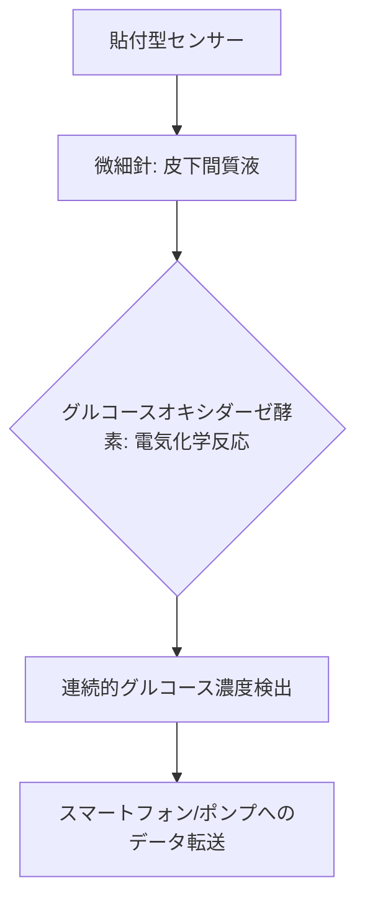

# T13-04-03 バイオセンサー・連続血糖測定(CGM)

## Summary（5つの要点）

1. **CGMの革新性**: 皮膚に貼付したセンサーから**微細な針（フィラメント）**を皮下の間質液に挿入し、**グルコース濃度**を**5分ごと**など**連続的**に測定する技術。従来の指先採血を不要にする `(1, 2)`。
2. **測定原理**: センサーの先端に固定された**酵素（グルコースオキシダーゼ）**がグルコースと反応する際に生じる**電流**を電気化学的に検出する。
3. **糖尿病管理の最適化**: 血糖値の**変動トレンド**をリアルタイムで把握できるため、患者自身が**インスリン注射量**や**食事、運動**のタイミングを最適化し、**合併症リスクを低減**できる。
4. **主要プレイヤー**: 米国の**Dexcom**、**Abbott（FreeStyle Libre）**、**Medtronic**が市場を寡占。特に**AbbottのFGM（フラッシュグルコースモニタリング）**は、較正不要で手軽に使えることで普及が進む。
5. **日本企業の参入**: **東レ**、**PHCホールディングス**などが**小型化、高精度化、低コスト化**に向けたセンサー技術、アレイ技術で開発を推進している。

#### 概念図

---

### 技術評価表（定量的な視点）
| 評価項目 | 評価 | 根拠 |
| :--- | :--- | :--- |
| 導入コスト | ⭐⭐☆☆☆ | センサーは消耗品であり（1〜2週間で交換）、継続的な費用が発生 |
| 技術成熟度 | ⭐⭐⭐⭐⭐ | 糖尿病治療では標準化。非糖尿病者向けの健康管理用途へ拡大中 `(1)` |
| 日本の競争力 | ⭐⭐⭐☆☆ | センサー技術に強みがあるが、**Dexcom/Abbott**の**市場シェア**と**データプラットフォーム**が先行 `(2)` |
| 市場性 | ⭐⭐⭐⭐⭐ | 糖尿病患者の増加、予防医療への関心の高まりにより、市場は急成長 |
| 品質保証の重要性 | ⭐⭐⭐⭐⭐ | **血糖値の精度（MARD）**、**皮下への挿入の安全性**、**電極の長期安定性**が医療機器として最重要 |

---

## 日本の立ち位置・強み弱みのSummary

### 強み：日本企業や研究機関が持つ独自の技術、優位性などを箇条書きで記述。

* **高精度な繊維・材料技術**: **東レ**が、CGMの**微細なフィラメント**や**センシング部**の**高分子材料、高精度コーティング**技術で優位性を持つ。
* **医療機器製造ノウハウ**: **PHCホールディングス（旧パナソニックヘルスケア）**など、血糖測定器で培った**医療機器製造、品質管理、販売チャネル**のノウハウ。
* **小型化・低侵襲化研究**: **東京医科歯科大学、理化学研究所**などが、**汗**や**涙**を用いた**非侵襲型**CGMや、**超小型アレイセンサー**の研究を推進。

### 弱み：日本が抱える規制、標準化の遅れ、海外依存などを箇条書きで記述。

* **データプラットフォームの遅れ**: 測定データを**AI**で解析し、**インスリンポンプ**（T13-04-05）や**医療機関**と連携する**ソフトウェアプラットフォーム**で、**Dexcom/Abbott**に後れ。
* **保険適用と規制**: CGMの**保険適用範囲**が限定的であったため、普及が欧米に比べて遅れた経緯がある。
* **半導体/MEMS技術の活用不足**: センサーチップの**超小型化、量産化**に向けた**MEMS（微小電気機械システム）**や**半導体技術**の応用で、海外に後れを取る懸念。

---

## 技術ロードマップ（短期/中期/長期）

### 短期目標（～2027年）

* **センサー寿命**を**2週間**から**1ヶ月**に延長し、**交換頻度**と**コスト**を低減。
* **CGM**を**インスリンポンプ**と連携させ、**AI**による**自動血糖制御システム（AID: Automated Insulin Delivery）**の普及を加速。
* **非糖尿病者**向けの**健康管理・スポーツ用途**への**CGMの市場展開**を開始。

### 中期目標（2028年～2031年）

* **完全非侵襲型**または**低侵襲型**（マイクロニードルなど）の**次世代血糖センサー**を実用化。
* **CGMセンサー**で**血糖値以外のバイオマーカー**（ケトン体、乳酸など）も**同時測定**する多機能化。
* **AI**（T14-04-04）が**食事の画像認識**と**CGMデータ**から**インスリン投与量を予測**し、患者の負担を最小化。

### 長期目標（2032年～2035年）

* **埋め込み型センサー**が**数年単位**で安定動作し、**採血や交換が完全に不要**な時代へ移行。
* **CGM**のデータが**電子カルテ**と連携し、**予防医療**や**公衆衛生**の**中核データ**となる。

### 📚 参照リンク

1. [Dexcom Japan: 連続血糖測定の仕組み](https://www.dexcom.com/en-jp/about-dexcom)
2. [アボットジャパン: FreeStyleリブレ（FGM）](https://www.freestylelibre.jp/)
3. [東レ ニュースリリース：CGM向けバイオセンサー技術](https://www.toray.co.jp/news/details/20210331.html)