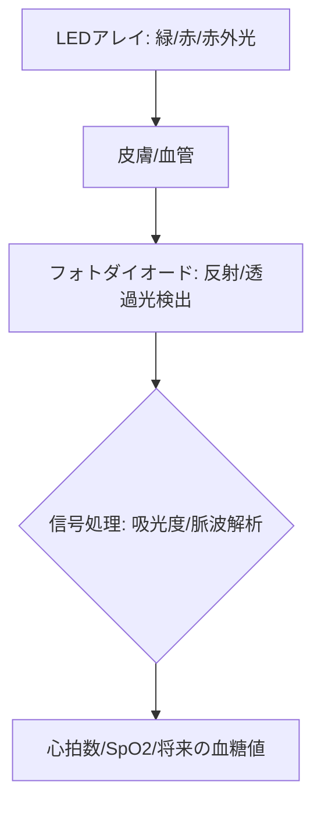

# T13-04-04 非侵襲型光学センサー(PPG・分光分析)

## Summary（5つの要点）

1. **非侵襲測定の基本**: **皮膚表面から光（LED）を照射**し、**血流中の成分**や**血流変化**によって**反射または透過した光**を**フォトダイオード**で検出する技術 `(1)`。
2. **PPG（光電容積脈波）**: **緑色LED**光を照射し、**脈動による血流変化**を捉えることで、**心拍数**や**心拍変動（HRV）**を計測。スマートウォッチの基本機能。
3. **SpO2（血中酸素飽和度）**: **赤色光**と**赤外光**など**複数の波長**の光を使い、**酸素化ヘモグロビン**と**還元ヘモグロビン**の**吸光度差**を分析して測定。
4. **次世代の目標**: **近赤外線分光分析**などを応用し、**血糖値、血中アルコール濃度、血圧、ストレスホルモン**など、より複雑な生体情報を**採血なし**で測定することを目指す `(2)`。
5. **日本の部品技術**: **浜松ホトニクス**、**ローム**、**京セラ**などが、**高感度フォトダイオード**、**小型LEDアレイ**、**光学フィルタ**といった**キー部品**の**世界的なサプライヤー**として優位性を持つ `(1)`。

#### 概念図

---

### 技術評価表（定量的な視点）
| 評価項目 | 評価 | 根拠 |
| :--- | :--- | :--- |
| 導入コスト | ⭐⭐⭐⭐⭐ | センサーモジュールは大量生産で低コスト化済み |
| 技術成熟度 | ⭐⭐⭐⭐☆ | 心拍、SpO2は成熟。血糖値、血圧は**高精度化**が大きな課題 `(2)` |
| 日本の競争力 | ⭐⭐⭐⭐⭐ | **光学素子・部品技術**で世界トップシェア。アルゴリズムは米国プラットフォーマーに強みがある `(1)` |
| 市場性 | ⭐⭐⭐⭐⭐ | スマートウォッチ、スマートリングなど、全てのウエアラブル機器の**標準機能** |
| 品質保証の重要性 | ⭐⭐⭐⭐⭐ | **皮膚の色、体毛、動き（モーションアーチファクト）**に対する**耐ノイズ性**と**精度**が鍵 |

---

## 日本の立ち位置・強み弱みのSummary

### 強み：日本企業や研究機関が持つ独自の技術、優位性などを箇条書きで記述。

* **超高感度光検出技術**: **浜松ホトニクス**が、**光電子増倍管**で培った**微弱な光**を**高感度**に検出する**フォトダイオード技術**を応用。
* **LED・レーザー技術**: **ローム、京セラ**などが、**複数の波長**を正確に発光・制御する**小型・高効率なLED/VCSEL（面発光レーザー）**アレイ技術。
* **分光分析の基礎研究**: 大学や研究機関が、**特定成分**（グルコース、アルコールなど）の**光吸収特性**を**皮膚透過光**から**高精度に分析**する**分光解析アルゴリズム**を研究。

### 弱み：日本が抱える規制、標準化の遅れ、海外依存などを箇条書きで記述。

* **アルゴリズム・プラットフォームの海外依存**: 測定された**生データ**を**健康指標**に変換する**信号処理アルゴリズム**と、**クラウド連携プラットフォーム**で**Apple、Google、Fitbit**に主導権を握られている。
* **血糖値測定の精度課題**: 非侵襲での血糖値測定は、**皮膚の厚さ、水分量、温度**などの**環境要因**に大きく影響され、**医療機器**として許容される**精度（MARD）**を達成する技術が未確立 `(2)`。
* **医療機器認証の壁**: 新しい非侵襲測定項目（血圧、血糖）について、**医療機器として承認**を得るための**臨床データの蓄積**と**規制対応**が課題。

---

## 技術ロードマップ（短期/中期/長期）

### 短期目標（～2027年）

* **血圧、心房細動**の**推定アルゴリズム**の精度を向上させ、**FDA、PMDA**など各国規制当局の認証を取得。
* **モーションアーチファクト**（運動中のノイズ）に対する**光学センサーの耐性**を大幅に向上。
* **多波長分光センサーモジュール**を**小型化・低コスト化**し、スマートリング、イヤホン型デバイスへの搭載を加速。

### 中期目標（2028年～2031年）

* **非侵襲型血糖値測定**の**精度（MARD）**を大幅に改善し、**補助的な健康管理ツール**として市場投入。
* **血中アルコール、乳酸**など、**運動・健康状態**に直結する**複数のバイオマーカー**の非侵襲測定を実現。
* **AI**（T14-04-04）が**光学データ**から**ストレスレベル**や**自律神経の状態**を**リアルタイムで推定**。

### 長期目標（2032年～2035年）

* **非侵襲型光学センサー**が**全ての健康診断**を代替し、**採血や病院での測定**が不要な**常時ヘルスケア社会**が実現。
* **皮膚下・血管内**に**ナノセンサー**を統合し、**光**で**体内情報**を**無線送信**。

### 📚 参照リンク

1. [浜松ホトニクス：PPGセンサーIC](https://www.hamamatsulogic.com/ja/product/ppg-sensor-ic)
2. [非侵襲血糖測定技術の課題と展望 - 日本臨床検査医学会雑誌](https://www.jstage.jst.go.jp/article/rinsho/69/3/69_3_477/_pdf/-char/ja)
3. [ローム：光学センサー技術](https://www.rohm.co.jp/solution/sensor/optical-sensor)