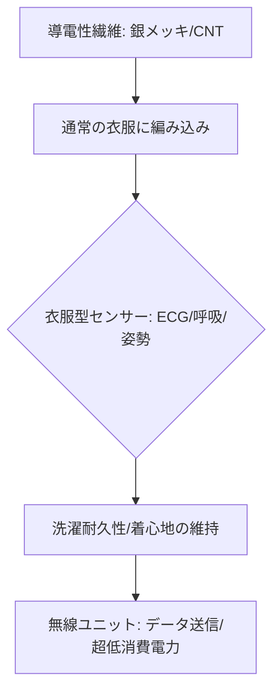

# T13-04-05 スマートテキスタイル・導電性繊維

## Summary（5つの要点）

1. **衣服のIoT化**: **導電性を持つ繊維**を**通常の衣服**に織り込むことで、**着心地を損なうことなく**、衣服自体が**センサー、電極、配線**として機能する技術 `(1)`。
2. **シームレスな常時計測**: **心拍、呼吸、姿勢、疲労度**などの生体情報を**無意識下**で計測。デバイスを装着する手間がなく、**日常的な健康管理**に最適。
3. **洗濯耐久性**: 導電性繊維を**樹脂**などで**コーティング**し、**数十回以上の洗濯**に耐える**耐久性**と**電気特性の安定性**を確保。実用化の最大の障壁。
4. **日本の繊維技術の強み**: **東レ（hitoe®）**、**帝人フロンティア（バイオフォニック®）**、**ミツフジ（hamon®）**など、**高機能繊維**で世界をリードする日本メーカーが技術開発を主導 `(1, 2)`。
5. **応用分野**: **スポーツ選手のコンディション管理**、**建設現場や工場**での**作業員の安全管理（熱中症、居眠り防止）**、**高齢者の見守り**など、B2B/B2G市場での普及が進む。

#### 概念図

---

### 技術評価表（定量的な視点）
| 評価項目 | 評価 | 根拠 |
| :--- | :--- | :--- |
| 導入コスト | ⭐⭐⭐☆☆ | 高機能繊維自体が高価だが、量産効果で低減可能 |
| 技術成熟度 | ⭐⭐⭐⭐☆ | B2B/B2G市場で商用化済み。コンシューマ市場は普及途上 `(1, 2)` |
| 日本の競争力 | ⭐⭐⭐⭐⭐ | **高機能繊維**、**テキスタイル技術**、**化学技術**で世界のトップ `(1, 2)` |
| 市場性 | ⭐⭐⭐⭐⭐ | **IoTヘルスケア**、**作業安全管理**の分野で、最も自然なインターフェースとして需要大 |
| 品質保証の重要性 | ⭐⭐⭐⭐⭐ | **洗濯による導電性の劣化**、**縫製時の断線リスク**、**着用時の皮膚との接触安定性**が鍵 |

---

## 日本の立ち位置・強み弱みのSummary

### 強み：日本企業や研究機関が持つ独自の技術、優位性などを箇条書きで記述。

* **世界最高水準の繊維技術**: **東レ、帝人**などの化学繊維メーカーが持つ、**導電性繊維**の**均一性、耐久性、量産性**に関する高度なノウハウ。
* **独自の製品化**: **ミツフジのhamon**、**東レのhitoe**（NTTとの共同開発）など、**導電性繊維から最終製品・サービス**までを一貫して提供するビジネスモデルが確立 `(2)`。
* **医療・作業環境への実績**: 既に**作業服、救急医療**の現場で**実証・採用**が進んでおり、**高い信頼性**の証明が進んでいる。

### 弱み：日本が抱える規制、標準化の遅れ、海外依存などを箇条書きで記述。

* **国際標準化の遅れ**: スマートテキスタイルに関する**生体情報取得方法**や**データフォーマット**の**国際標準化（ISO/TC 38など）**で、欧米企業が先行。
* **コンシューマ製品化の課題**: **デザイン、ファッション性、価格**の面で、既存のスポーツウェアブランドとの**協業**や**マーケティング**が課題。
* **無線給電の統合の遅れ**: 衣服に搭載されるセンサー・通信ユニットへの**無線給電**（T13-02-04）の**統合技術**の確立が途上。

---

## 技術ロードマップ（短期/中期/長期）

### 短期目標（～2027年）

* **導電性繊維**の**洗濯耐久性**を**100回以上**に向上。
* **スポーツ**、**作業安全**分野での**市場シェアを拡大**し、製品の**価格を半減**。
* **複数種類のセンサー**（心拍、呼吸、温度、姿勢）を**1枚の衣服**に**シームレスに統合**。

### 中期目標（2028年～2031年）

* **無線給電技術**を衣服に統合し、**バッテリー交換・充電が不要**な**完全ワイヤレス化**を実現。
* **AI**（T14-04-04）が**スマートテキスタイル**のデータから**疾病の兆候、メンタルヘルス**を**リアルタイムで予測**。
* **一般向け**の**日常着**（下着、パジャマ）への**スマートテキスタイルの普及**を本格化。

### 長期目標（2032年～2035年）

* **衣服**が**「第二の皮膚」**として**完全に機能**し、**病院での検査**の一部を**日常生活**の中で**代替**。
* **自己修復機能**を持つ**導電性繊維**が開発され、**製品寿命**と**信頼性**が**飛躍的に向上**。

### 📚 参照リンク

1. [東レ: 機能性繊維 hitoe® の技術紹介](https://www.toray.co.jp/innovation/research/smart_textiles.html)
2. [ミツフジ: 導電性繊維 hamon® の技術と応用](https://mitsufuji.co.jp/)
3. [帝人フロンティア: 高機能繊維 バイオフォニック®](https://www.teijin-frontier.com/)
