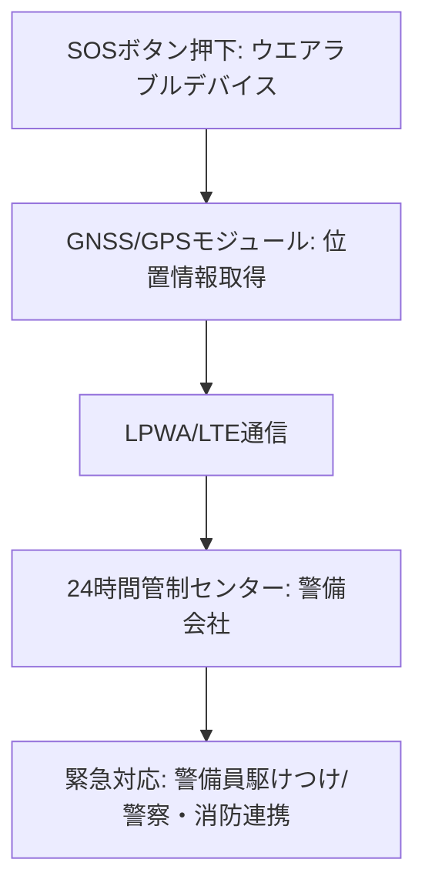

# T13-05-01 携帯型緊急通報デバイス(SOSボタン・GPS追跡)

## Summary（5つの要点）

1. **ワンタッチ緊急通報**: 小型で目立たないデバイス（ペンダント、腕時計型など）に搭載された**SOSボタン**を操作することで、契約した**警備会社や緊急連絡先**に**即座**に通報する `(1)`。
2. **高精度GPS追跡**: 通報と同時に、デバイスに内蔵された**GNSSモジュール（GPS, QZSSなど）**が**現在地を高精度に特定**し、警備員や家族に送信。迅速な**駆けつけサービス**を可能にする。
3. **双方向音声通信**: 通報後、警備管制センターと**ハンズフリー**で通話できる機能を搭載。ユーザーの状況を確認し、適切な**警察、消防への連携**をサポート。
4. **主な利用者層**: **高齢者**（急病、転倒時）、**子供**（登下校時の見守り）、**単身で働く女性**など、**個人の安全確保**と**位置情報把握**が重要なターゲット。
5. **日本の強み**: **セコム（ココセコム）**、**ALSOK**といった**警備業界のトップ企業**が、**全国ネットワーク**を活用した**24時間365日の有人管制**と**迅速な駆けつけ体制**を構築 `(1)`。

#### 概念図

---

### 技術評価表（定量的な視点）
| 評価項目 | 評価 | 根拠 |
| :--- | :--- | :--- |
| 導入コスト | ⭐⭐⭐☆☆ | デバイス本体は安価だが、月額の**警備・通信サービス費用**が発生 |
| 技術成熟度 | ⭐⭐⭐⭐⭐ | GPS、モバイル通信、警備システムは成熟。バッテリー寿命が鍵 `(1)` |
| 日本の競争力 | ⭐⭐⭐⭐⭐ | **警備サービスと連携した国内モデル**が確立。**QZSS**活用で高精度測位 |
| 市場性 | ⭐⭐⭐⭐⭐ | **高齢化社会、共働き世帯の増加**により、見守り・安全市場は拡大必至 |
| 品質保証の重要性 | ⭐⭐⭐⭐⭐ | **バッテリー切れ**、**誤通報**、**通信途絶**が人命に関わるため、**信頼性**が最重要 |

---

## 日本の立ち位置・強み弱みのSummary

### 強み：日本企業や研究機関が持つ独自の技術、優位性などを箇条書きで記述。

* **有人管制と駆けつけサービス**: **セコム、ALSOK**が持つ**24時間365日**の**警備管制ノウハウ**と**全国の警備員ネットワーク**。
* **準天頂衛星（QZSS）活用**: 日本独自の**QZSS（みちびき）**を利用することで、**山間部や都市のビル街**などでも**高精度で安定した位置情報**の取得が可能。
* **デバイスの小型・軽量化**: **ボタン電池**で長時間駆動し、ファッション性を損なわない**小型・薄型**のウエアラブルデバイス設計技術。

### 弱み：日本が抱える規制、標準化の遅れ、海外依存などを箇条書きで記述。

* **海外展開の難しさ**: 警備体制は各国で異なるため、国内で成功したサービスモデルを**海外で横展開**するには、**規制対応**と**現地警備会社との連携**が必要。
* **通信技術の多様性**: **LPWA（LoRaWAN, Sigfox）**など、**超低消費電力通信**技術の採用が海外に比べ遅れ、**バッテリー寿命**の面で改善余地がある。
* **プライバシー保護**: 位置情報の**利用目的**と**保存期間**について、**個人情報保護法**に基づいた**厳格な運用**が求められる。

---

## 技術ロードマップ（短期/中期/長期）

### 短期目標（～2027年）

* **QZSS**の**サブメーター級測位補強サービス**を統合し、**測位精度を1メートル以下**に向上。
* **超低消費電力通信**（T13-04-02）を採用し、**バッテリー寿命を1年以上**に延長。
* **転倒・急病検知**（T13-05-02）や**AI危険予測**（T13-05-04）などの**自動通報機能**を標準搭載。

### 中期目標（2028年～2031年）

* **生体認証**（T13-05-05）を統合し、**本人確認**と**誤通報防止**を徹底。デバイスの**不正利用を防止**。
* **ドローン**や**自律走行ロボット**と連携した**緊急時監視・巡回**を主要都市で導入。
* **国際的な緊急通報ネットワーク**と連携し、**海外旅行中**でも**現地の支援**を受けられるシステムを構築。

### 長期目標（2032年～2035年）

* **デバイス**が**衣服や下着**（T13-04-05）に**完全に統合**され、**SOSボタン**すら意識しない**生体情報**による**自動通報**が主流となる。
* **AI**が**ユーザーの行動パターン**を学習し、**危険度が高い状況を予知**して、**事前**に**警告・支援**を開始。

### 📚 参照リンク

1. [ALSOK ココセコム サービス紹介](https://www.alsok.co.jp/personal/coco_secom/)
2. [セコム プレスリリース：ココセコムの活用事例](https://www.secom.co.jp/corporate/release/2021/nr_20210401.html)
3. [内閣府 宇宙開発戦略推進事務局：QZSS（みちびき）の概要](https://www.cao.go.jp/pmd/space/qzss/index.html)