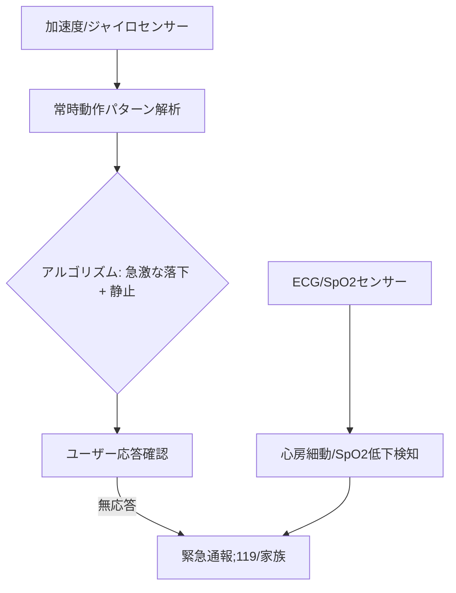

# T13-05-02 転倒・急病検知アルゴリズム(加速度センサー・ジャイロ)

## Summary（5つの要点）

1. **多軸センサーによる動作分析**: スマートウォッチなどに内蔵された**加速度センサー**と**ジャイロセンサー（角速度）**のデータを**常時監視**し、**ユーザーの動きのパターン**を解析 `(1)`。
2. **転倒検知の仕組み**: **「急激な落下」**（加速度の急激な変化）の後に**「静止状態」**（動きがない状態）が一定時間続いた場合を**「転倒」**と判断。ユーザーに**応答確認**を求め、**無応答の場合**に**自動で救急通報**を行う `(1)`。
3. **急病検知の多角化**: **ECG（心電図）機能**による**心房細動（AFib）**、**PPGセンサー**（T13-04-04）による**SpO2（血中酸素飽和度）**の**急激な低下**を検知し、**心疾患・呼吸器疾患**の**早期対応**を支援。
4. **誤検知の防止**: **機械学習（AI）**を活用し、**日常の動作**（椅子からの立ち上がり、激しい運動）と**実際の転倒・急病**を**高精度で識別**し、**誤通報率を最小化**する。
5. **主要な実装**: **Apple Watch**がこの機能の**普及を牽引**。Samsung **Galaxy Watch**、Fitbitなど主要なウエアラブルデバイスに標準機能として搭載されている。

#### 概念図

---

### 技術評価表（定量的な視点）
| 評価項目 | 評価 | 根拠 |
| :--- | :--- | :--- |
| 導入コスト | ⭐⭐⭐⭐☆ | センサーは普及品。高性能MCU、AIアルゴリズム開発コスト |
| 技術成熟度 | ⭐⭐⭐⭐☆ | 基本的な転倒検知は成熟。心疾患・呼吸器疾患の検知精度は向上中 `(1)` |
| 日本の競争力 | ⭐⭐⭐☆☆ | デバイス・プラットフォームは海外勢が先行。**アルゴリズム開発**に注力すべき |
| 市場性 | ⭐⭐⭐⭐⭐ | **高齢者の増加、単身世帯の増加**により、必須のヘルスケア機能に |
| 品質保証の重要性 | ⭐⭐⭐⭐⭐ | **誤検知（誤通報）**と**見逃し（未検知）**が**人命と社会コスト**に直結 |

---

## 日本の立ち位置・強み弱みのSummary

### 強み：日本企業や研究機関が持つ独自の技術、優位性などを箇条書きで記述。

* **センサー部品技術**: **TDK、村田製作所**など、**小型・高精度**な**MEMS加速度センサー、ジャイロセンサー**の**世界的なサプライヤー**（T13-04-04）。
* **医療連携**: 救急隊や病院との**データ連携**のプロトコル開発（**DMAT、地域医療情報連携**）のノウハウ。
* **高齢者ヘルスケア研究**: 大学・研究機関による**高齢者の動作データ**の収集と、**転倒リスク分析**の基礎研究。

### 弱み：日本が抱える規制、標準化の遅れ、海外依存などを箇条書きで記述。

* **プラットフォーム依存**: 検知アルゴリズムが**Apple、Google**といった**OS/プラットフォーム企業**に**内製化**されており、独自のアルゴリズムの搭載・連携に制約がある。
* **医療機器認証**: 心房細動検知などの**医療行為**に該当する機能については、**医療機器としてのPMDA認証**が必要で、**導入スピード**が海外より遅れる懸念。
* **データ収集の課題**: AI学習に必要な**「実際の転倒」**という**稀なイベント**の**大量データ収集**が倫理的・技術的に困難。

---

## 技術ロードマップ（短期/中期/長期）

### 短期目標（～2027年）

* **加速度センサー**と**バイオセンサー**（ECG/SpO2/温度）の**複合データ**から、**心肺停止**や**重度の呼吸困難**を**95%以上**の精度で検知。
* **転倒検知**の**誤検知率**を**1%未満**に低減。
* **救急隊**へ送る**通報内容**に、**検知された症状**と**ユーザーの持病情報**を**自動で付与**するシステムを構築。

### 中期目標（2028年～2031年）

* **脳波**（T8-03-02）や**発汗**（T13-04-01）などの**複合的な生体信号**から、**脳卒中、心筋梗塞**などの**予兆を予測**し、未然に警告。
* **AI**が**ユーザーの行動パターン**（T13-05-04）を学習し、**転倒リスクの高い場所や時間帯**を**パーソナライズ**して通知。
* **スマートホーム**の**環境センサー**（カメラ、マイク）と連携し、**転倒時の状況**を**多角的に把握**。

### 長期目標（2032年～2035年）

* **救命ドローン**が**自動通報**と同時に発進し、**応急処置キット（AED、止血剤）**を**迅速に搬送**するシステムが社会インフラ化。
* **検知アルゴリズム**が**医療機器クラス**の信頼性を持ち、**全ての医療機関**で**遠隔患者モニタリング**の標準となる。

### 📚 参照リンク

1. [Apple Watch 転倒検出機能の技術詳細](https://www.apple.com/jp/newsroom/2022/09/apple-watch-fall-detection-feature-expands-to-cycling-and-workout/)
2. [スマートデバイスによる心房細動検出の現状と課題 - 日本循環器学会](https://www.j-circ.or.jp/cms/wp-content/uploads/2020/09/jo_2020_062.pdf)
3. [Samsung Galaxy Watchの健康検知機能](https://www.samsung.com/jp/support/mobile-devices/galaxy-watch-fall-detection/)