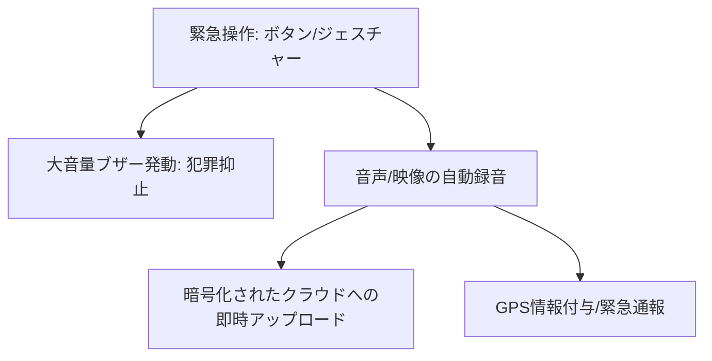

# T13-05-03 防犯ブザー・音声録音機能付きデバイス

## Summary（5つの要点）

1. **犯罪抑止と証拠保全の両立**: **大音量ブザー**（100dB以上）による**周囲への異常通知**と**犯罪抑止効果**、そして同時に**現場の音声・映像を自動で録音・記録**する**証拠保全機能**を統合。
2. **自動クラウドアップロード**: 録音・録画データは、**デバイスが破壊されるリスク**に備え、即座に**クラウドサーバー**に**暗号化**してアップロード。被害者が後で安全にアクセスできる体制。
3. **ステルス録音機能**: 危険を感じた際に、**表面上は気づかれにくい操作**（特定のジェスチャー、サイレントボタンなど）で**録音を密かに開始**する機能。事前の危険回避をサポート。
4. **モバイルアプリ連携**: **スマートフォンの防犯アプリ**（警視庁の**Digi Police**など）と連携し、GPS情報（T13-05-01）とともに**緊急連絡先や警察に通報**する機能 `(1)`。
5. **日本での普及**: 子供向けだけでなく、**痴漢・暴行被害対策**として**女性や学生**の間で**スマホ連動型**や**小型専用デバイス**の需要が高まっている。**パナソニック**、**ELPA**などが専用デバイスを販売。

#### 概念図

---

### 技術評価表（定量的な視点）
| 評価項目 | 評価 | 根拠 |
| :--- | :--- | :--- |
| 導入コスト | ⭐⭐⭐⭐⭐ | 専用デバイスは安価。スマホアプリは無料で利用可能 |
| 技術成熟度 | ⭐⭐⭐⭐☆ | ブザー、録音機能は成熟。**クラウド連携、暗号化**が進化中 `(1)` |
| 日本の競争力 | ⭐⭐⭐⭐☆ | **警視庁アプリ**など**公的機関との連携**モデルに強み。デバイスは部品技術に強み |
| 市場性 | ⭐⭐⭐⭐⭐ | 女性、子供の**自己防衛意識**の高まりにより、需要は安定的 |
| 品質保証の重要性 | ⭐⭐⭐⭐⭐ | **音声のクリアさ**、**録音開始の遅延**、**データの真正性（証拠能力）**が最重要 |

---

## 日本の立ち位置・強み弱みのSummary

### 強み：日本企業や研究機関が持つ独自の技術、優位性などを箇条書きで記述。

* **行政との連携**: **警視庁**が主導する**Digi Police**アプリのように、**公的機関**と**パーソナルセーフティデバイス**が連携するモデルが確立。
* **小型・高音質技術**: **パナソニック**などの電機メーカーが持つ、**小型マイク**による**高音質録音**と、**大音量スピーカー**の**小型化**技術。
* **プライバシー保護設計**: 録音・録画データの**厳格な暗号化**と、**アクセスログの管理**に関する**法規制順守**のノウハウ。

### 弱み：日本が抱える規制、標準化の遅れ、海外依存などを箇条書きで記述。

* **国際標準化の遅れ**: 防犯デバイスと**緊急通報システム（eCallなど）**の**国際的なデータ連携規格**において、日本発の標準化が遅れ。
* **AIによる状況判断の不足**: **音声認識AI**（T8-03-01）を活用し、**「助けて」**などの**トリガーワード**や**悲鳴**を**自動で認識**し、録音・通報を行う機能の**実装速度**が海外に比べ遅れ。
* **データ保管の課題**: 証拠保全のための**クラウドデータの永続的な保管**と、その**コスト、法的な責任**に関する課題。

---

## 技術ロードマップ（短期/中期/長期）

### 短期目標（～2027年）

* **AI音声認識**（T8-03-01）を統合し、**悲鳴、叫び声**を**90%以上**の精度で検知し、**自動で録音・通報**を開始。
* **録音データ**の**クラウドアップロード速度**を**5秒以内**に短縮し、**証拠のリアルタイム性**を向上。
* **ウェアラブル端末**（T13-04）に**防犯機能**を**標準機能**として組み込む。

### 中期目標（2028年～2031年）

* **AI危険予測**（T13-05-04）と連携し、**危険エリア進入時**に**デバイスが自動で録音待機状態**に移行。
* **顔認識AI**を統合し、**加害者の顔**を**瞬時に記録・分析**し、**警察データベース**と連携。
* **国際規格**に準拠した**緊急通報プロトコル**を実装し、海外での利用を可能にする。

### 長期目標（2032年～2035年）

* **スマートテキスタイル**（T13-04-05）に**極小マイク・カメラ**が組み込まれ、**衣服**が**完全に機能**する**自己防衛システム**となる。
* **生体認証**（T13-05-05）により、**デバイスの持ち主本人**以外による**操作のロック**と**緊急時解除**の柔軟な両立。

### 📚 参照リンク

1. [警視庁 防犯アプリ「Digi Police」](https://www.keishicho.metro.tokyo.lg.jp/kurashi/higai/yobo/digipolice.html)
2. [パナソニック プレスリリース：防犯ブザー一体型デバイス](https://news.panasonic.com/jp/topics/2022/10/26/20221026-1.html)
3. [ELPA 防犯ブザー製品情報](https://www.elpa.co.jp/product/category/25.html)