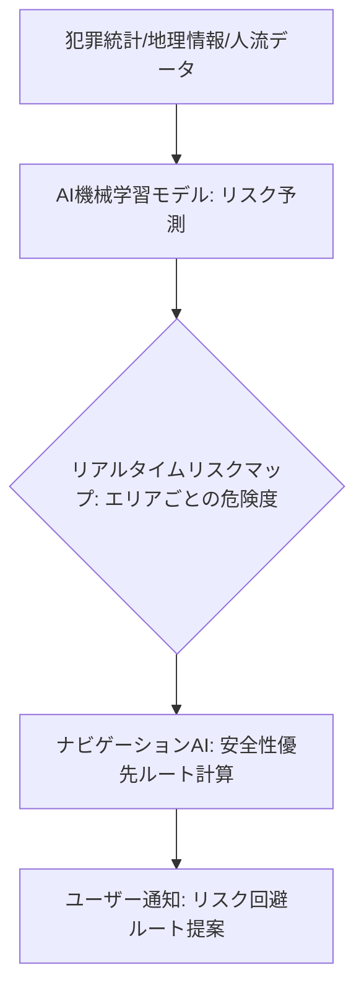

# T13-05-04 AI危険予測・リスク回避ナビゲーション

## Summary（5つの要点）

1. **多要素データの統合分析**: **過去の犯罪発生統計、人流データ（時間帯・曜日）**、**地理情報（街灯の有無、建物の種類、死角）**、**天候**などの**膨大なデータ**を**AI（機械学習モデル）**で**リアルタイムに分析**し、**特定のエリアのリスクレベル**を予測 `(1)`。
2. **リスク回避ルートの提案**: ユーザーの**現在地と目的地**に基づき、**所要時間**と**リスクレベル**を比較。**最も安全性の高いルート**を**ナビゲーション**として提案する。
3. **パーソナライズ化**: ユーザーの**性別、年齢、行動パターン**、**過去の被害経験**などを加味し、**個人のリスク許容度**に合わせた**パーソナライズされたルート**を提示。
4. **実証実験の推進**: **NTTドコモ**は**人流データ**と**防犯カメラ情報**の匿名化データを活用した**リスク予測**の実証実験を推進。**トヨタ**も**車両データ**を活用した**安全支援サービス**への応用を研究 `(1, 2)`。
5. **犯罪予知と抑止効果**: 予測された**高リスクエリア**に対して、**警察や警備会社**が**パトロールを強化**するなどの**犯罪予知・抑止**への応用も期待される。

#### 概念図

---

### 技術評価表（定量的な視点）
| 評価項目 | 評価 | 根拠 |
| :--- | :--- | :--- |
| 導入コスト | ⭐⭐⭐☆☆ | 大規模なデータ収集、AIモデルの学習・運用コストが高い |
| 技術成熟度 | ⭐⭐⭐☆☆ | 犯罪統計に基づく予測は成熟。**リアルタイムの予知**は発展途上 `(1)` |
| 日本の競争力 | ⭐⭐⭐⭐☆ | **NTTドコモ**の**人流データ**、**トヨタ**の**プローブデータ**など**独自データの活用**に強み `(1, 2)` |
| 市場性 | ⭐⭐⭐⭐☆ | **夜間・単身移動の増加**に伴い、**安全な移動**への需要が拡大 |
| 品質保証の重要性 | ⭐⭐⭐⭐⭐ | **予測の精度**、**誤った安全ルート**による**リスク増大**の回避が最重要 |

---

## 日本の立ち位置・強み弱みのSummary

### 強み：日本企業や研究機関が持つ独自の技術、優位性などを箇条書きで記述。

* **匿名化された大規模データ**: **NTTドコモ**が持つ**携帯電話基地局データ**を基にした**匿名化された人流データ**や、**トヨタ**の**コネクテッドカー**からの**プローブデータ**。
* **地理情報システム（GIS）の精度**: **国土地理院**や**ゼンリン**などが持つ、**高精度な地図情報**と**街灯、防犯カメラ**などの**インフラ情報**のデータベース。
* **警備会社との連携**: **セコム、ALSOK**など、**警備員の出動データ**と**AI予測**を連携させる**実動的な安全サービス**の構築。

### 弱み：日本が抱える規制、標準化の遅れ、海外依存などを箇条書きで記述。

* **プライバシー規制**: **匿名化人流データ**の**利用範囲**が**個人情報保護法**により厳しく制限されており、**AI学習**に必要な**粒度の細かいデータ**の活用が困難。
* **犯罪統計の粒度**: 犯罪統計データが**エリア単位**で大まかであり、**特定の時間帯・場所**を**AIが予測**するための**詳細なデータセット**が不足。
* **グローバル展開の課題**: 各国の**犯罪統計**や**地理インフラ**の**データフォーマット**が異なり、国内で開発したモデルの**海外への横展開**が容易でない。

---

## 技術ロードマップ（短期/中期/長期）

### 短期目標（～2027年）

* **犯罪統計**と**人流データ**に基づき、**予測精度を70%以上**とする**リスク予測AIモデル**を実用化。
* **夜間**における**人通りが少ないルート**や**街灯がないルート**を**自動で回避**するナビゲーションを商用化。
* **AI予測データ**を**警備会社**へ提供し、**パトロールの最適化**を開始。

### 中期目標（2028年～2031年）

* **ウエアラブルデバイス**（T13-05-01）の**緊急通報**と**AI予測**を連携させ、**危険度の高い場所**で**自動的に通報待機状態**に移行。
* **ライブ映像**（**監視カメラ、ドライブレコーダー**）を**AI**が**解析**し、**リアルタイムで不審者を検知**してユーザーに警告。
* **事故リスク**や**災害リスク**も**統合**した**複合的リスク回避ナビゲーション**に進化。

### 長期目標（2032年～2035年）

* **個人専用のAIアシスタント**が、**ユーザーの行動**と**外部リスク**を**常時監視**し、**意識することなく****安全な行動**へと**誘導**。
* **都市インフラ全体**が**AIリスク予測**に基づき、**街灯の自動点灯**や**防犯カメラの監視エリア変更**を**リアルタイムで実行**。

### 📚 参照リンク

1. [NTTドコモ ニュースリリース：AIを活用した危険予測技術の実証実験](https://www.nttdocomo.co.jp/english/info/media_center/pr/2021/0315.html)
2. [トヨタ プレスリリース：安全運転支援技術に関する取り組み](https://global.toyota/jp/newsroom/corporate/37576579.html)
3. [警察庁：犯罪統計データ](https://www.npa.go.jp/toukei/)