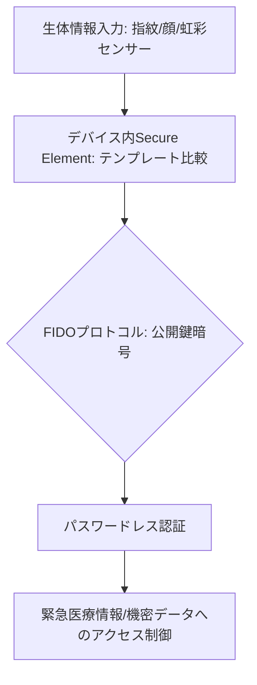

# T13-05-05 生体認証・本人確認技術(指紋・顔・虹彩認証)

## Summary（5つの要点）

1. **パスワードレス認証の実現**: **指紋、顔、虹彩、声紋**などの**身体的・行動的特徴**を用いて**個人を特定**し、**パスワードやPIN**といった**知識認証**を不要にする `(1)`。
2. **セキュリティと利便性の両立**: **高い認証精度（誤受入率FAR: False Acceptance Rateが低い）**を保ちながら、**デバイスへのアクセス**や**決済**を**数秒で完了**させる**高い利便性**を提供。
3. **FIDO（Fast IDentity Online）標準**: 生体認証データを**デバイス内**に**安全に保存**し、ネットワークには**公開鍵暗号**で生成された認証情報のみを送信する**セキュリティプロトコルの国際標準**。パスワードレスのデファクトスタンダード `(2)`。
4. **パーソナルセーフティへの貢献**: **紛失・盗難時**の**不正アクセス**を防ぎ、**緊急連絡先**や**医療情報**などの**機密性の高い個人データ**を保護。緊急時に**本人確認**を迅速に行う機能も統合。
5. **日本企業の強み**: **NEC**が**指紋・顔・虹彩**などの**マルチモーダル生体認証**で**世界トップクラスの精度**を誇り、公共分野・金融機関での採用実績が豊富 `(1)`。

#### 概念図

---

### 技術評価表（定量的な視点）
| 評価項目 | 評価 | 根拠 |
| :--- | :--- | :--- |
| 導入コスト | ⭐⭐⭐☆☆ | センサー部品、Secure Element（セキュリティチップ）のコストが発生 |
| 技術成熟度 | ⭐⭐⭐⭐⭐ | スマートフォン、PC、金融機関では成熟。虹彩、静脈認証は高セキュリティ用途で進化 `(1, 2)` |
| 日本の競争力 | ⭐⭐⭐⭐⭐ | **NEC**の**認証精度**は世界トップクラス。指紋センサー部品でも強み `(1)` |
| 市場性 | ⭐⭐⭐⭐⭐ | **IDaaS（Identity as a Service）**の普及、**パスワードレス社会**の実現に必須 |
| 品質保証の重要性 | ⭐⭐⭐⭐⭐ | **誤受入率（FAR）**、**誤拒否率（FRR）**、**なりすまし耐性（スプーフィング）**がセキュリティの鍵 |

---

## 日本の立ち位置・強み弱みのSummary

### 強み：日本企業や研究機関が持つ独自の技術、優位性などを箇条書きで記述。

* **マルチモーダル認証の精度**: **NEC**が持つ**顔、指紋、虹彩**の**複数の生体情報を組み合わせた認証**の**高精度なアルゴリズム**。
* **指紋センサー技術**: **FPC**（富士通系）、**アルプスアルパイン**などが、**静電容量式、光学式**の**高感度指紋センサー**の開発で実績。
* **金融・公共機関での実績**: **銀行ATM**、**出入国管理**など、**高信頼性**が求められる分野での**長期的な運用ノウハウ**。

### 弱み：日本が抱える規制、標準化の遅れ、海外依存などを箇条書きで記述。

* **プラットフォームの主導権**: **Apple（Face ID）、Google（Android Biometrics）**がOSレベルの**生体認証API**を主導しており、日本の独自技術が**グローバルなデファクトスタンダード**になりにくい。
* **法規制と利用範囲**: **生体情報**は**機密性の高い個人情報**であり、**個人情報保護法**や**医療情報規制**との兼ね合いから、**データ活用の柔軟性**が欧米に比べて限定的。
* **FIDO規格への早期対応**: FIDO標準化団体への**技術貢献**と、**最新規格**への**デバイス・サービス**の**早期対応**が課題。

---

## 技術ロードマップ（短期/中期/長期）

### 短期目標（～2027年）

* **FIDO認証**を**国内の主要なオンラインサービス**の**標準認証方式**とする。
* **ウェアラブルデバイス**（T13-04）に**生体認証**を統合し、**デバイスのロック解除、決済**を**シームレス**に実現。
* **AI**を活用し、**年齢変化、マスク、暗闇**などの**環境変化**に対する**顔認証の堅牢性**を向上。

### 中期目標（2028年～2031年）

* **行動生体認証**（**歩き方、タイピングの癖**など）を統合し、**常時監視**による**連続的な本人確認**を実現。
* **デジタルID（マイナンバーカード等）**と**生体認証**を連携させ、**オンライン・オフライン**での**完全な本人確認**を可能にする。
* **緊急時**に**救急隊**が**生体認証**で**ユーザーの医療情報**へ**限定的にアクセス**できる**セキュリティプロトコル**を確立。

### 長期目標（2032年～2035年）

* **生体認証**が**全ての物理的な鍵、IDカード、パスワード**を代替し、**「ユーザー自身」**が**社会サービスのアクセス権**となる。
* **神経信号**（T8-03-02）や**脳波**を用いた**思考認証**など、**次世代の生体認証技術**が実用化。

### 📚 参照リンク

1. [NEC Bio-IDiom：生体認証技術](https://jpn.nec.com/biometrics/index.html)
2. [FIDO Alliance 公式サイト](https://fidoalliance.org/)
3. [Apple Face ID の技術解説](https://www.apple.com/jp/privacy/features/)