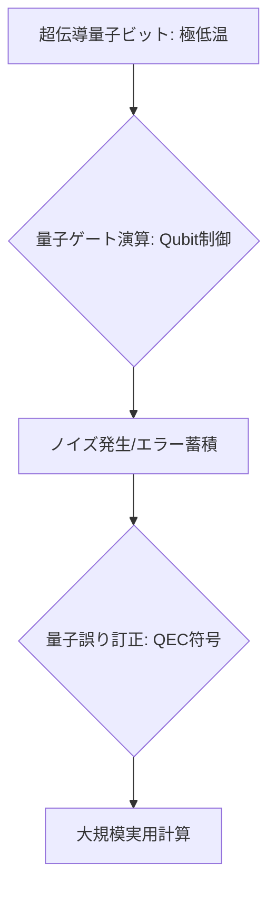

# T14-01-01 超伝導量子ビット（ゲート型量子コンピューター）

## Summary（5つの要点）

1. **基本原理**: **超伝導回路**（ジョセフソン接合）を利用し、電気信号の量子状態を**量子ビット**として使用する方式。絶対零度（極低温）近傍で動作させ、**量子ゲート演算**により計算を実行する `(1)`。
2. **先行開発**: **IBM**（Qiskit）と**Google**（Sycamoreチップで量子超越性を実証）が開発を主導。現行機はノイズのある中間スケール量子コンピューター（**NISQ**）時代に位置づけられる。
3. **最大の課題（ノイズ）**: 量子ビットが外部のノイズ（熱、電磁波）に極めて敏感なため、**コヒーレンス時間**（量子状態を保てる時間）が短い。大規模化には**量子誤り訂正**技術の確立が不可欠 `(2)`。
4. **大規模化への道**: 量子ビット数の増加（スケーリング）は比較的容易だが、**量子誤り訂正**（QEC）に必要な**物理量子ビットの数**が膨大（数百～数千個 $	o$ 1論理量子ビット）になる点がボトルネック。
5. **日本の立ち位置**: **理化学研究所、東京大学、NTT**などが研究開発を進めており、特に**量子誤り訂正符号**や、極低温での**制御エレクトロニクス**に注力している。

#### 概念図

---

### 技術評価表（定量的な視点）
| 評価項目 | 評価 | 根拠 |
| :--- | :--- | :--- |
| 導入コスト | ⭐⭐☆☆☆ | 希釈冷凍機、制御装置、設置スペースに極めて高額なコスト |
| 技術成熟度 | ⭐⭐⭐⭐☆ | 量子超越性を実証。NISQデバイスはクラウド経由で利用可能 |
| 日本の競争力 | ⭐⭐⭐☆☆ | 基礎研究は高いが、デバイスの量子ビット数、産業応用では米欧に後れ `(2)` |
| 市場性 | ⭐⭐⭐⭐⭐ | 創薬、材料開発、金融、AIなど、幅広い分野でブレークスルーが期待される |
| 品質保証の重要性 | ⭐⭐⭐⭐⭐ | **量子誤り訂正**と**コヒーレンス時間**の確保が計算信頼性の絶対条件 |

---

## 日本の立ち位置・強み弱みのSummary

### 強み：日本企業や研究機関が持つ独自の技術、優位性などを箇条書きで記述。

* **基礎研究と人材**: **理化学研究所、東京大学**を中心とした**量子情報科学の基礎研究**は世界トップレベルであり、優秀な研究者を有している。
* **NTTの半導体技術**: **NTT**は、超伝導回路の形成に必要な**微細加工技術**と、量子ビットを制御するための**エレクトロニクス技術**に強みを持つ。
* **量子誤り訂正符号**: **日本発のQEC符号**や、ノイズ耐性の高い量子ゲート操作技術に関する研究が盛ん。

### 弱み：日本が抱える規制、標準化の遅れ、海外依存などを箇条書きで記述。

* **量子ビット数と投資規模**: IBM、Google、Rigetti Computingなどの米国勢に比べ、**量子ビット数**や**研究開発への投資規模**で大きく後れを取っている。
* **サプライチェーンの海外依存**: 量子コンピューターに必須の**希釈冷凍機**、**高周波制御機器**などを海外メーカーに依存している。
* **産業界の活用経験不足**: **量子アルゴリズム**（T14-01-05）や**量子ソフトウェア開発**に関する産業界での実践経験が乏しい。

---

## 技術ロードマップ（短期/中期/長期）

### 短期目標（～2027年）

* **NISQデバイス**（50～100量子ビット）を化学シミュレーション、金融最適化などの**特定用途で実証**し、産業応用のユースケースを拡大。
* **量子誤り訂正**の基本単位となる**論理量子ビット**（数十～数百物理量子ビットで構成）の動作実証。
* 量子コンピューターの**クラウドサービス**利用を拡大し、**量子ソフトウェア開発者**を育成。

### 中期目標（2028年～2031年）

* **実用レベルの量子誤り訂正**が可能な**フォールトトレラント量子コンピューター**（FTQC）のプロトタイプを開発。
* FTQCを用いて、**従来スパコンで解けなかった特定の化学・材料問題**を実際に解決し、**量子優位性**を確立。
* 量子ビット数を**数千～数万**にスケールアップする技術を確立。

### 長期目標（2032年～2035年）

* **大規模なFTQC**を実現し、創薬、新材料開発、AI、暗号解読など**広範囲な問題**を革新的なスピードで解決。
* 量子コンピューティングを**クラウドインフラ**として提供し、産業界に不可欠な**計算資源**として定着。

### 📚 参照リンク

1. [量子コンピューティングの現状と展望 - IBM Quantum](https://www.ibm.com/quantum)
2. [日本の量子技術イノベーション戦略 - 内閣府](https://www8.cao.go.jp/cstp/gaiyo/yusendo/pdf/r03-24.pdf)
3. [超伝導量子コンピューター研究 - 理化学研究所](https://www.riken.jp/)
4. [Googleの量子超越性実証論文 - Nature](https://www.nature.com/articles/s41586-019-1663-9)