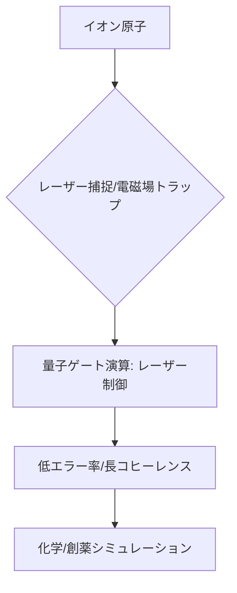

# T14-01-02 イオントラップ型量子コンピューター

## Summary（5つの要点）

1. **基本原理**: **レーザー**と**電磁場**を用いて、真空中で**イオン（帯電原子）**を捕捉し、その**電子のエネルギー準位**を量子ビットとして利用する方式 `(1)`。
2. **特徴（低エラー率）**: 外部ノイズの影響を受けにくいため、**量子ビットの寿命（コヒーレンス時間）が長く**、**量子ゲート操作のエラー率が最も低い**という利点を持つ `(2)`。
3. **先行開発**: **IonQ**（米国）、**Honeywell Quantum Solutions**（現Quantinuum）が商業化をリード。中規模（数十～数百量子ビット）のデバイスがクラウド経由で利用可能。
4. **最大の課題（スケーラビリティ）**: 大量のイオンを**精密に捕捉・移動・制御**する必要があり、量子ビット数の**大規模化（スケーラビリティ）**が技術的なボトルネック。複数のトラップチップを連携させる技術が開発中。
5. **応用分野**: 特に**化学シミュレーション**（分子の基底状態エネルギー計算）、**創薬**、**最適化問題**など、中規模で高い精度が要求される分野での実用化が期待されている。

#### 概念図

---

### 技術評価表（定量的な視点）
| 評価項目 | 評価 | 根拠 |
| :--- | :--- | :--- |
| 導入コスト | ⭐⭐☆☆☆ | 高精度レーザー、超高真空システム、複雑な制御エレクトロニクスが必要 |
| 技術成熟度 | ⭐⭐⭐⭐☆ | ゲート忠実度、コヒーレンス時間で最も高い性能を示す。商業化済み |
| 日本の競争力 | ⭐⭐⭐☆☆ | 大阪大学、NICTなどで基礎研究が進むが、デバイス開発では米欧に後れ `(2)` |
| 市場性 | ⭐⭐⭐⭐⭐ | 高精度計算が求められる分野（化学、材料）での需要が高い |
| 品質保証の重要性 | ⭐⭐⭐⭐⭐ | ゲート操作の**高忠実度**と**長期安定性**の維持が必須 |

---

## 日本の立ち位置・強み弱みのSummary

### 強み：日本企業や研究機関が持つ独自の技術、優位性などを箇条書きで記述。

* **レーザー制御技術**: **高精度なレーザー**（周波数、強度）の制御技術や、**微細な光学部品**の製造技術に強みを持つ。
* **基礎研究**: **大阪大学、情報通信研究機構（NICT）**などで、イオントラップの基礎理論、量子ネットワーク応用などの研究が進んでいる。
* **創薬・化学分野との連携**: 創薬・化学企業との連携により、**高精度なシミュレーション**のニーズを研究開発に直接フィードバックできる。

### 弱み：日本が抱える規制、標準化の遅れ、海外依存などを箇条書きで記述。

* **システムインテグレーション**: イオントラップ、レーザー、真空、制御システムを**統合**し、安定的に運用する**システムインテグレーション技術**で米国のスタートアップに後れを取っている。
* **大規模化技術**: 量子ビットを**数百以上**に拡張するための**マイクロファブリケーションされたイオントラップチップ**の開発規模と速度が遅れている。
* **量子ソフトウェア開発の遅れ**: イオントラップの**特性を活かしたアルゴリズム**（T14-01-05）の開発や、量子プログラマーの育成が課題。

---

## 技術ロードマップ（短期/中期/長期）

### 短期目標（～2027年）

* **100量子ビット級**のデバイスで、**量子化学計算**や**最適化問題**のベンチマークを実行し、その優位性を実証。
* **マイクロファブリケーション**された**モジュール型トラップチップ**の開発を進め、量子ビットの**移動と連携**技術を確立。
* **量子誤り訂正**の基本操作（QEC）の**高忠実度**での実証。

### 中期目標（2028年～2031年）

* 複数のトラップチップを接続し、**フォールトトレラント量子コンピューター**（FTQC）のアーキテクチャを確立。
* **500～1000量子ビット**規模のデバイスを商用提供し、**創薬**や**新材料開発**のプロセスに組み込む。
* **エラー率**を現状の1/10に低減し、実用レベルの**論理量子ビット**を実現。

### 長期目標（2032年～2035年）

* **数万～数十万量子ビット**にスケールアップし、**超伝導方式と並ぶ**大規模汎用FTQCとして定着。
* イオントラップの高い**量子ビット品質**を活かし、**量子ネットワーク**のノードとしての機能も実現。

### 📚 参照リンク

1. [イオントラップ型量子コンピューター技術 - IonQ](https://www.ionq.com/technology)
2. [イオントラップによる量子コンピュータ研究 - 大阪大学](https://www.osaka-u.ac.jp/ja/news/2021/04/1501)
3. [Quantinuumによるイオントラップ技術 - Quantinuum](https://www.quantinuum.com/)
4. [NICTの量子ICT研究戦略 - NICT](https://www.nict.go.jp/)