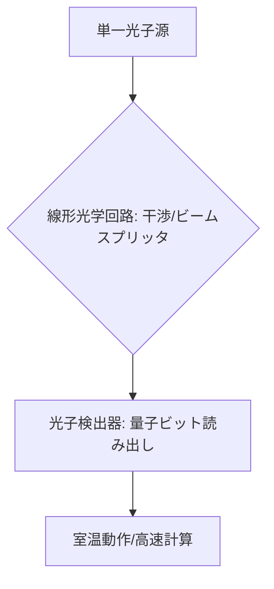

# T14-01-03 光量子コンピューター（フォトニック量子）

## Summary（5つの要点）

1. **基本原理**: **光子（フォトン）**の量子状態（偏光、時間、位相など）を量子ビットとして利用する方式。光の干渉を利用して**線形光学回路**で計算を実行する `(1)`。
2. **特徴（室温動作）**: 光は熱ノイズの影響を受けにくく、**極低温冷却が不要**で**室温動作が可能**。また、光ファイバー通信との親和性が極めて高い。
3. **先行開発**: **Xanadu**（カナダ）、**PsiQuantum**（米国）が大規模な集積回路による開発を推進。NTT、東京大学も継続的な研究実績を持つ。
4. **課題（光子生成・検出）**: 高品質な**単一光子源**の生成と、光子を**高効率で検出**する技術が最大のボトルネック。また、量子誤り訂正に必要な非線形光学素子の実現も難しい `(2)`。
5. **応用分野**: 特定の計算（例: **ガウシアン・ボソン・サンプリング**）での**量子優位性**が実証され、**量子シミュレーション、量子機械学習**などの専用機としての実用化が先行している。

#### 概念図

---

### 技術評価表（定量的な視点）
| 評価項目 | 評価 | 根拠 |
| :--- | :--- | :--- |
| 導入コスト | ⭐⭐⭐☆☆ | 冷却は不要だが、高精度なレーザー、光回路、検出器が必要 |
| 技術成熟度 | ⭐⭐⭐☆☆ | 特定問題での優位性を実証。汎用計算機としては途上 |
| 日本の競争力 | ⭐⭐⭐⭐⭐ | **NTT**の**光集積回路技術**、**東京大学**の**量子光学研究**は世界トップレベル `(2)` |
| 市場性 | ⭐⭐⭐⭐⭐ | 量子ネットワーク、高速AI計算など、通信・データ処理分野での応用期待大 |
| 品質保証の重要性 | ⭐⭐⭐⭐⭐ | 光子の**損失**、**干渉の精度**が計算結果の信頼性に直結する |

---

## 日本の立ち位置・強み弱みのSummary

### 強み：日本企業や研究機関が持つ独自の技術、優位性などを箇条書きで記述。

* **NTTの光技術**: **NTT**が持つ**光通信、光集積回路（シリコンフォトニクス）**に関する技術力は世界的に極めて高く、光量子コンピューターの**スケーラビリティ**に直結する。
* **量子光学研究**: **東京大学、京都大学**などで、**スクイーズド光**などの量子光源生成や、光子の非線形相互作用に関する**基礎研究**が充実している。
* **量子ネットワークへの応用**: 光通信網との親和性が高いため、将来的な**量子ネットワーク**構築において中核的な役割を果たすことが期待される。

### 弱み：日本が抱える規制、標準化の遅れ、海外依存などを箇条書きで記述。

* **スタートアップの規模**: Xanadu、PsiQuantumといった海外の**巨額な資金調達**を行うスタートアップに比べ、国内での**商業化のスピード**と**投資規模**で後れを取っている。
* **汎用性の課題**: 特定問題に特化した専用機としての応用が中心であり、**汎用ゲート型コンピューター**として超伝導・イオントラップ方式と競合するための技術開発が課題。
* **システム統合の経験不足**: 大規模な光回路、制御系、検出系を**単一システム**として統合するエンジニアリング経験が不足している。

---

## 技術ロードマップ（短期/中期/長期）

### 短期目標（～2027年）

* **特定問題**（量子シミュレーション、機械学習）に特化した**中規模デバイス**を商用提供し、ユースケースを拡大。
* **集積回路化**による**光子損失の低減**と、**量子光源の高品質化**技術を確立。
* **室温で動作**する**量子メモリ**の研究開発を推進。

### 中期目標（2028年～2031年）

* **量子誤り訂正**が可能な**フォールトトレラント光量子コンピューター**のプロトタイプを開発。
* 光通信網との連携を強化し、**量子ネットワーク**の基盤技術として確立。
* 量子ビット数を**数千～数万**にスケールアップし、**創薬**や**材料開発**への応用を開始。

### 長期目標（2032年～2035年）

* 大規模なFTQCを実現し、**超高速のAI・データ処理**を可能にする**量子クラウドインフラ**として定着。
* 光量子コンピューターの**分散処理**による**ネットワーク型量子計算**を実用化。

### 📚 参照リンク

1. [フォトニック量子コンピューティング技術 - Xanadu](https://www.xanadu.ai/technology/photonic-quantum-computing)
2. [NTTの光量子コンピューター研究 - NTT](https://www.ntt.co.jp/)
3. [PsiQuantumと光量子コンピューター - Nature Photonics](https://www.nature.com/articles/s41566-021-00877-6)
4. [東京大学の量子光学研究 - 東京大学](https://www.u-tokyo.ac.jp/)