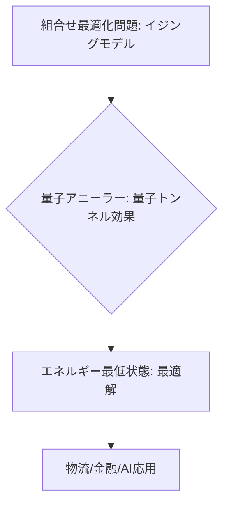

# T14-01-04 量子アニーリング（最適化問題特化型）

## Summary（5つの要点）

1. **基本原理**: 組合せ最適化問題の解を、量子ビットの**基底状態**（最もエネルギーの低い状態）として見つけることに特化した計算方式 `(1)`。
2. **用途特化**: **物流配送ルート最適化、金融ポートフォリオ最適化、創薬の分子設計、AIの学習高速化**など、産業応用が明確な**特定の問題**（イジングモデル）に特化している。
3. **先行開発**: **D-Wave Systems**（カナダ）が世界で初めて商用機を提供。超伝導量子ビットを用いており、極低温での動作が必要。
4. **ハイブリッド計算**: 量子アニーラーの計算能力を最大限に引き出すため、**量子アニーラー**と**古典的なスーパーコンピューター**を組み合わせた**ハイブリッド計算**が主流 `(2)`。
5. **日本の立ち位置**: **富士通（デジタルアニーラー）、日立、NEC、デンソー**などが、D-Waveや自社の**CMOSアニーリング**（T14-04-03）などの技術を用い、実証実験と産業応用を積極的に進めている。

#### 概念図

---

### 技術評価表（定量的な視点）
| 評価項目 | 評価 | 根拠 |
| :--- | :--- | :--- |
| 導入コスト | ⭐⭐⭐☆☆ | ゲート型よりは低いが、専用ハードウェアと冷却システムが必要 |
| 技術成熟度 | ⭐⭐⭐⭐⭐ | 世界初の商用化済み量子コンピューター。産業応用が最も進展 |
| 日本の競争力 | ⭐⭐⭐⭐⭐ | 富士通、日立、NECなどが古典・量子アニーリングで世界的に優位 `(2)` |
| 市場性 | ⭐⭐⭐⭐⭐ | 最適化問題は産業界の多くの課題であり、即効性が期待される |
| 品質保証の重要性 | ⭐⭐⭐⭐☆ | 常に最適な解（グローバルミニマム）に到達できる**保証**が必要 |

---

## 日本の立ち位置・強み弱みのSummary

### 強み：日本企業や研究機関が持つ独自の技術、優位性などを箇条書きで記述。

* **古典アニーリング技術**: **富士通（デジタルアニーラー）、日立、NEC**などが、**CMOS技術**を活用した**超高速な古典アニーリングマシン**（デジタルアニーラーなど）を開発し、量子アニーリングと競合・補完している。
* **産業応用ノウハウ**: **デンソー、トヨタ**などの製造業が、**生産計画、ロボットの経路最適化**など、実世界の複雑な問題への応用ノウハウを蓄積している。
* **ハイブリッド計算**: **古典スパコン**との連携による**ハイブリッド計算**のアルゴリズム開発で、効率的な問題解決手法を確立している。

### 弱み：日本が抱える規制、標準化の遅れ、海外依存などを箇条書きで記述。

* **量子アニーリングハードウェアの海外依存**: 装置自体はD-Waveなどの海外メーカーが先行しており、**超伝導量子アニーラー**の自社開発は途上。
* **問題のイジングモデルへの変換**: 実世界の複雑な問題を**量子アニーラー**が解ける**イジングモデル**へ**効率的かつ正確に変換**するノウハウを持つ人材が不足している。
* **量子ゲート型との連携**: 汎用計算が可能な**量子ゲート型コンピューター**（T14-01-01）との**連携戦略**がまだ明確ではない。

---

## 技術ロードマップ（短期/中期/長期）

### 短期目標（～2027年）

* **古典/量子ハイブリッドアニーリング**の利用を拡大し、**物流、金融、製造**など特定分野での**実ビジネス効果**を実証。
* **D-Wave**などの商用機において、**量子ビット数を5000以上**に増加させ、より大規模な問題への適用を開始。
* **イジングモデルへの自動変換ツール**を開発し、量子アニーラーの利用の敷居を下げる。

### 中期目標（2028年～2031年）

* **量子効果の明確な優位性**（古典ハイブリッドより高速/高精度な解）を示す**量子アニーリング専用のユースケース**を確立。
* **室温動作**が可能な**フォトニックアニーリング**（光量子アニーリング）や**CMOSアニーリング**の性能を向上させ、低コスト化・普及を促進。
* 量子アニーラーを**大規模データ解析、AIの学習**などのバックエンド処理に組み込む。

### 長期目標（2032年～2035年）

* **汎用量子コンピューター**（FTQC）と連携し、**超最適化計算**を実現する**量子計算プラットフォーム**を確立。
* 量子アニーリングが**すべての組合せ最適化問題**を、**古典スパコンを凌駕**するスピードと精度で解く**標準ツール**として定着。

### 📚 参照リンク

1. [量子アニーリングの基本と応用 - D-Wave Systems](https://www.dwavesys.com/quantum-annealing-basics)
2. [デジタルアニーラ技術 - 富士通](https://www.fujitsu.com/jp/about/research/cooperation/digital-annealer/)
3. [量子アニーリング技術の産業応用 - 日立製作所](https://www.hitachi.co.jp/)
4. [量子アニーリングによる物流最適化事例 - デンソー](https://www.denso.com/jp/ja/news/news-releases/2021/20211116-01/)