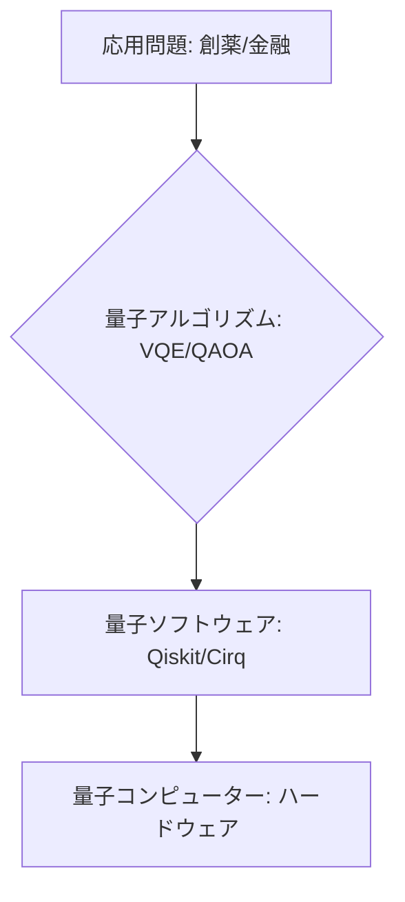

# T14-01-05 量子アルゴリズム・量子ソフトウェア開発基盤

## Summary（5つの要点）

1. **定義**: 量子コンピューターの計算能力を最大限に引き出すための**計算手順（アルゴリズム）**と、それらを効率的に実装・実行するための**プログラミングフレームワーク**と**開発環境** `(1)`。
2. **主要アルゴリズム**: **Shor's algorithm**（素因数分解）、**Grover's algorithm**（探索）、そして**NISQ時代**に重要な**VQE**（変分量子固有値ソルバー）、**QAOA**（量子近似最適化アルゴリズム）などがある。
3. **開発基盤**: **IBM Qiskit、Google Cirq、Microsoft Q#、Amazon Braket**が代表的。これらは量子コンピューター（T14-01-01～03）のハードウェアとユーザーを繋ぐ**インターフェース**として機能する `(2)`。
4. **量子機械学習（QML）**: AI分野への応用として、データのパターン認識や分類を量子的な手法で行う**量子機械学習**の研究が進展。**量子ニューラルネットワーク**など、古典AIを凌駕する計算効率を目指す。
5. **人材育成の課題**: 量子アルゴリズムの開発・実装には、**量子力学、情報科学、コンピューターサイエンス**に精通した**複合的な専門知識**が必要であり、専門人材の育成が急務。

#### 概念図

---

### 技術評価表（定量的な視点）
| 評価項目 | 評価 | 根拠 |
| :--- | :--- | :--- |
| 導入コスト | ⭐⭐⭐⭐⭐ | ソフトウェアライブラリは無料で利用可能。学習コストは高い |
| 技術成熟度 | ⭐⭐⭐⭐☆ | Qiskitなどのフレームワークは成熟。アルゴリズム開発は途上 |
| 日本の競争力 | ⭐⭐⭐⭐☆ | 基礎研究、特にNISQアルゴリズムの分野で国際的な成果あり `(1)` |
| 市場性 | ⭐⭐⭐⭐⭐ | 量子コンピューターの能力を引き出す唯一の手段であり、必須 |
| 品質保証の重要性 | ⭐⭐⭐⭐⭐ | アルゴリズムの**計算効率（加速）**と**精度（エラー耐性）**の保証が不可欠 |

---

## 日本の立ち位置・強み弱みのSummary

### 強み：日本企業や研究機関が持つ独自の技術、優位性などを箇条書きで記述。

* **NISQアルゴリズムの研究**: **VQE、QAOA**など、現在の**NISQデバイス**で実用化が期待されるアルゴリズムに関する研究成果が国際的に高い評価を得ている。
* **産総研・JSTの支援**: **産業技術総合研究所（産総研）**や**JST CREST**などの研究支援プログラムが、アルゴリズムとソフトウェア開発を積極的に後押ししている。
* **量子化学・材料科学との連携**: **マテリアルズインフォマティクス**（T15-01）分野での応用ニーズが高く、量子アルゴリズムと**実問題**との連携が密接に進んでいる。

### 弱み：日本が抱える規制、標準化の遅れ、海外依存などを箇条書きで記述。

* **プラットフォームの海外依存**: 主要な開発基盤（**Qiskit、Cirq、Q#**）は海外企業が主導しており、国内発の**標準的かつ大規模な**量子ソフトウェア開発エコシステムの構築が遅れている。
* **人材不足**: 量子コンピューティングを理解し、実際にコードを書ける**量子プログラマー**の絶対数が不足しており、育成が急務。
* **ハードウェアとの協調設計不足**: アルゴリズムと**量子ハードウェア**（T14-01-01～03）の特性を最大限に活かす**協調的なソフトウェア設計**のノウハウが蓄積途上。

---

## 技術ロードマップ（短期/中期/長期）

### 短期目標（～2027年）

* **NISQアルゴリズム**（VQE、QAOA）を用いて、**量子超越性**を示す**実用的なユースケース**の発見と実証。
* **クラウドベース**の量子ソフトウェア開発環境（Qiskitなど）を活用した**量子プログラマーの育成**と産業界への展開。
* **量子機械学習（QML）**の基礎となる**量子データエンコーディング技術**を確立。

### 中期目標（2028年～2031年）

* **フォールトトレラント量子コンピューター**（FTQC）に対応した**汎用性の高い量子プログラミング言語**と**コンパイラ**を開発。
* **量子化学計算**や**大規模最適化**において、**古典計算を凌駕する**計算精度と効率を持つアルゴリズムを標準化。
* **量子暗号**（耐量子暗号）の国際標準化に対応した**アルゴリズム（PQC）**の開発と実装。

### 長期目標（2032年～2035年）

* 量子アルゴリズムとFTQCが、**創薬、新材料、AI**の分野で**不可欠なイノベーションツール**として定着。
* AIが**計算要求**に基づき、**最適な量子アルゴリズム**を自動で選択・生成・実行する**自律型量子ソフトウェア**を実現。

### 📚 参照リンク

1. [量子ソフトウェア開発の現状 - 産業技術総合研究所](https://www.aist.go.jp/)
2. [量子コンピューティングフレームワーク Qiskit - IBM](https://qiskit.org/)
3. [量子アルゴリズム研究の最前線 - JST CREST](https://www.jst.go.jp/)
4. [量子機械学習の動向 - Google AI Quantum](https://ai.google/research/teams/quantum-ai/)