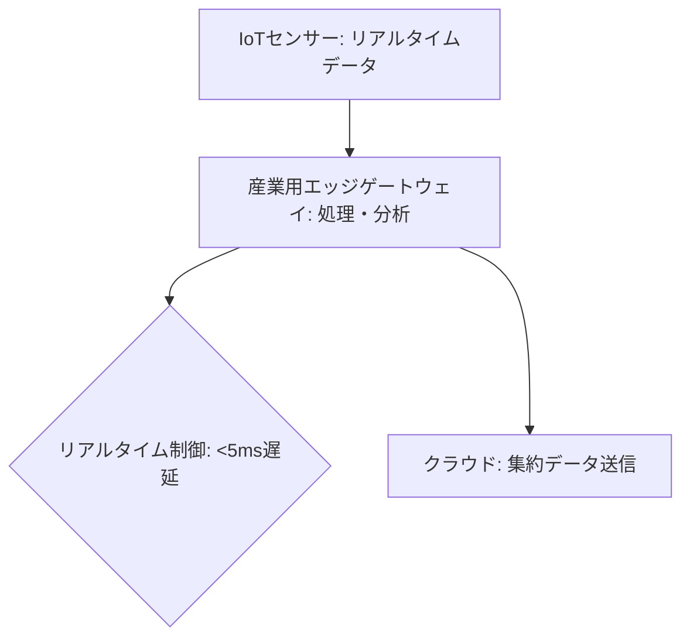

# T14-02-01 産業用エッジゲートウェイ・リアルタイムデータ処理

## Summary（5つの要点）

1. **エッジでの即時処理**: センサーやデバイスから収集した大量のIoTデータを、工場、プラント、建設現場などの**発生源（エッジ）**で即座に処理するコンピューティング装置 `(1)`。
2. **リアルタイム制御**: **ネットワーク遅延**（レイテンシ）を**数ミリ秒（ms）以下**に抑え、クラウドへの通信を待たずに、製造ラインやロボットの**自律制御**を可能にする。
3. **データフィルタリングと集約**: 全データをクラウドに送信せず、エッジで**異常検知、フィルタリング、データ集約**を行い、**通信帯域の削減**と**クラウドコストの最適化**を図る。
4. **環境耐性**: 産業環境での利用を前提とし、**防塵、防水、耐熱・耐振性**を備えた**ファンレス設計**のゲートウェイが主流。FA（ファクトリーオートメーション）ネットワークとの高い互換性を持つ。
5. **産業用5Gとの統合**: **産業用5G**（T14-02-03）や**ローカル5G**と組み合わせることで、**無線化された自律制御システム**の**中核**として機能する。

#### 概念図

---

### 技術評価表（定量的な視点）
| 評価項目 | 評価 | 根拠 |
| :--- | :--- | :--- |
| 導入コスト | ⭐⭐⭐⭐☆ | 産業用PC/ゲートウェイの価格は下落傾向。システム構築費用は必要 |
| 技術成熟度 | ⭐⭐⭐⭐⭐ | Cisco, Dell, 富士通など主要ITベンダーが製品化。FA分野で実導入済み |
| 日本の競争力 | ⭐⭐⭐⭐☆ | 富士通、NEC、横河電機など、FA・OT分野で強いプレイヤーが存在 `(2)` |
| 市場性 | ⭐⭐⭐⭐⭐ | スマートファクトリー、インフラ監視、自動運転など、全産業で必須となる |
| 品質保証の重要性 | ⭐⭐⭐⭐⭐ | 制御ロジックの実行遅延、環境耐性が**プラントの安全性**に直結 |

---

## 日本の立ち位置・強み弱みのSummary

### 強み：日本企業や研究機関が持つ独自の技術、優位性などを箇条書きで記述。

* **OT（制御技術）の知見**: **三菱電機、横河電機**などのFA（ファクトリーオートメーション）/DCS（分散制御システム）ベンダーが、長年の**リアルタイム制御**に関する深い知見を持つ。
* **堅牢なハードウェア**: **富士通、NEC**などが、**高温多湿、振動**といった劣悪な産業環境に耐えうる**高信頼性の産業用PC・ゲートウェイ**を提供している。
* **エッジAIチップとの連携**: **ソシオネクスト**（T14-02-02）などの国産チップ開発と連携し、**エッジでのAI推論**を最適化できる。

### 弱み：日本が抱える規制、標準化の遅れ、海外依存などを箇条書きで記述。

* **標準化の遅れ**: 異なるベンダー間の**エッジOS、データフォーマット**の標準化が遅れており、システム構築の**相互運用性**に課題がある。
* **ソフトウェアプラットフォーム依存**: エッジで動作する**リアルタイムOS**や**コンテナ管理システム**（Docker, Kubernetes）の分野で、海外技術への依存度が高い。
* **セキュリティ対策の遅れ**: OTネットワークとITネットワークが融合する中で、**エッジデバイスのセキュリティ**（T14-02-05）に関する規格・ガイドライン整備と実践が遅れている `(2)`。

---

## 技術ロードマップ（短期/中期/長期）

### 短期目標（～2027年）

* 製造業、電力、鉄道などでの**エッジゲートウェイの本格導入**と、**予知保全**（T15-04-05）や**異常検知**（T15-04-03）用途での実証を完了。
* **産業用5G/ローカル5G**（T14-02-03）とエッジゲートウェイの**シームレスな統合**を実現。
* **コンテナ技術**を用いたエッジアプリケーションの**リモートデプロイ**と**集中管理**システムの確立。

### 中期目標（2028年～2031年）

* エッジコンピューティングが**デジタルツイン**（T14-02-04）の**リアルタイムシミュレーション基盤**として機能する。
* エッジデバイスが**自律的に学習・判断**し、製造ラインの**プロセスパラメータを自己最適化**するシステムの導入。
* **ゼロトラスト**（T14-02-05）を前提とした、**エッジノード間**のセキュアな通信基盤を確立。

### 長期目標（2032年～2035年）

* **クラウドとエッジの境界**が意識されない**分散型自律システム**（DAI: Distributed Autonomous Infrastructure）を社会インフラ（電力、交通）に導入。
* **エッジAIチップ**（T14-02-02）の搭載により、ゲートウェイが**超低消費電力**で**超高速AI処理**を可能にする。

### 📚 参照リンク

1. [産業用IoTとエッジコンピューティング - Cisco](https://www.cisco.com/c/ja_jp/solutions/internet-of-things/industrial-iot.html)
2. [産業サイバーセキュリティの動向と課題 - 経済産業省](https://www.meti.go.jp/policy/netsecurity/)
3. [エッジAIソリューション - 富士通](https://www.fujitsu.com/jp/about/research/tech/ai/edge-ai/)
4. [インダストリアルIoTプラットフォーム - 横河電機](https://www.yokogawa.co.jp/)