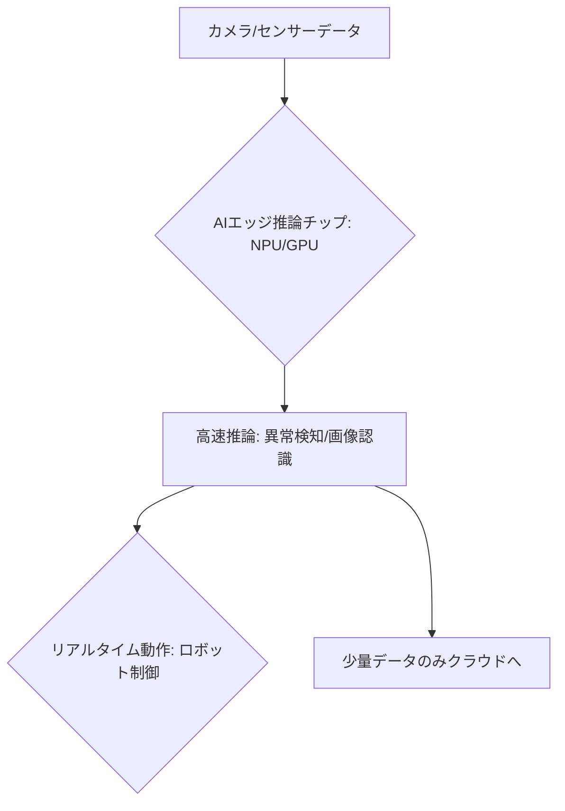

# T14-02-02 AIエッジ推論チップ（産業用GPU/NPU）

## Summary（5つの要点）

1. **エッジでのAI処理**: クラウドではなく、**カメラ、ロボット、ゲートウェイ**などの**エッジデバイス**に組み込まれ、AIモデル（画像認識、音声処理など）の**推論**を高速に実行する専用プロセッサ `(1)`。
2. **専用アクセラレータ**: **GPU**（NVIDIA Jetsonなど）、**NPU**（Neural Processing Unit、Intel Movidius、Google Edge TPUなど）と呼ばれる専用の**並列演算アクセラレータ**を搭載し、AI処理を最適化。
3. **低消費電力・高性能**: 消費電力を**1W～10W**程度の低水準に抑えつつ、推論性能（**TOPS: Tera Operations Per Second**）は**1～100TOPS**を達成。バッテリー駆動のデバイスや、熱設計に制約のある産業機器に不可欠。
4. **応用分野**: **自動運転車**（T18-05-03）、**産業ロボット**のビジョンシステム、**ドローン**（T19-10）の自律飛行、**製造ラインの異常検知**など、リアルタイム性が要求される分野。
5. **日本の立ち位置**: **ソシオネクスト**などの国内企業が、**特定用途向け（ASIC/ASSP）**の高性能・低消費電力チップ開発で強みを持つ `(2)`。

#### 概念図

---

### 技術評価表（定量的な視点）
| 評価項目 | 評価 | 根拠 |
| :--- | :--- | :--- |
| 導入コスト | ⭐⭐⭐⭐☆ | チップ単価は比較的安価。高性能版は高価だが、クラウド費用を削減 |
| 技術成熟度 | ⭐⭐⭐⭐⭐ | NVIDIA Jetsonなど、主要なプラットフォームは成熟。応用が拡大中 |
| 日本の競争力 | ⭐⭐⭐⭐☆ | ASIC/ASSP分野でソシオネクストなどが強み。汎用GPUは海外依存 `(2)` |
| 市場性 | ⭐⭐⭐⭐⭐ | 自動運転、ロボティクス、産業IoTなど、成長産業の中核技術 |
| 品質保証の重要性 | ⭐⭐⭐⭐⭐ | 推論エラーが**ロボットの誤動作**や**安全機能の停止**に直結 |

---

## 日本の立ち位置・強み弱みのSummary

### 強み：日本企業や研究機関が持つ独自の技術、優位性などを箇条書きで記述。

* **特定用途向けLSI（ASIC/ASSP）設計**: **ソシオネクスト、ルネサスエレクトロニクス**などが、顧客の要求に合わせた**高性能かつ超低消費電力**のカスタムAI推論チップ開発に強み。
* **自動車・ロボティクス分野での実績**: **デンソー、トヨタ**などが、自動運転や産業ロボット向けに**車載・産業グレード**の高い信頼性を持つエッジAIチップを実運用している。
* **低消費電力技術**: **微細加工技術**と**回路設計技術**により、エッジデバイスのバッテリー寿命延長に貢献する**超低消費電力チップ**の開発が進んでいる。

### 弱み：日本が抱える規制、標準化の遅れ、海外依存などを箇条書きで記述。

* **汎用GPU/NPUの海外依存**: **NVIDIA**や**Intel**といった海外勢が提供する**汎用的なハイエンドGPU/NPU**への依存度が高く、国内でこれに対抗するチップは不在。
* **ソフトウェアエコシステムの不足**: **CUDA**（NVIDIA）や**TensorFlow Lite**（Google）といった海外の**AIソフトウェアフレームワーク**のエコシステムへの依存が高い。
* **人材不足**: エッジAIチップの**ハードウェア設計**と、その上で動作する**AIアルゴリズム**の最適化を同時に行える**複合的な専門人材**が不足している。

---

## 技術ロードマップ（短期/中期/長期）

### 短期目標（～2027年）

* **低消費電力チップ**の性能を向上させ、**消費電力1Wあたり50TOPS以上**の効率を達成。
* **センサーフュージョン**（カメラ、LiDAR、レーダーデータ統合）をエッジAIチップ上でリアルタイムに実行する技術を確立。
* **エッジAIチップ**を搭載した**自律型ロボット、ドローン**（T19-10）の商業化を加速。

### 中期目標（2028年～2031年）

* **超高精度**（例: 3D深度推定、高精度な予知保全）が求められるAI処理を、**数ナノ秒レベル**の低遅延で実行可能なチップを開発。
* **量子コンピューティング**（T14-01）の技術を応用した**量子ニューラルネットワーク推論**を可能にするチップアーキテクチャの研究。
* **セキュリティ**（T14-02-05）機能をチップレベルで実装し、**ハードウェアベースのゼロトラスト**を実現。

### 長期目標（2032年～2035年）

* **AIエッジ推論チップ**が、自動運転車、産業ロボットの**事実上の標準プロセッサ**として定着。
* **AIが自己学習・自己進化**する機能をエッジチップに搭載し、**クラウド接続なし**で環境変化に対応できるシステムを実現。

### 📚 参照リンク

1. [NVIDIA JetsonによるエッジAIプラットフォーム - NVIDIA](https://www.nvidia.com/ja-jp/autonomous-machines/embedded-systems/jetson-platform/)
2. [ASIC開発とAIチップ戦略 - ソシオネクスト](https://www.socionext.com/)
3. [Intel MovidiusとエッジAI - Intel](https://www.intel.co.jp/content/www/jp/ja/products/details/get-started/ai-kits/movidius.html)
4. [Google Edge TPUによる高速推論 - Google Cloud](https://cloud.google.com/edge-tpu/)