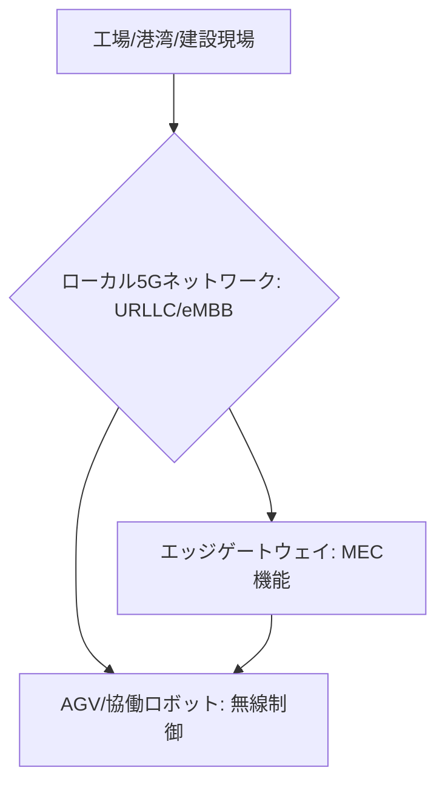

# T14-02-03 産業用5G・ローカル5Gネットワーク

## Summary（5つの要点）

1. **産業向け無線通信**: 工場、プラント、倉庫、港湾などの**特定のエリア**に構築される**専用の5Gネットワーク**。これにより、外部ネットワークの影響を受けない**安定した通信**を実現 `(1)`。
2. **ローカル5G**: 日本独自の制度で、**企業や自治体が自ら免許を取得**し、地域のニーズに合わせてネットワークを構築・運用できる。これにより、柔軟なインフラ整備が可能。
3. **低遅延・大容量（URLLC/eMBB）**: 5Gの特徴である**超低遅延（URLLC: Ultra-Reliable Low-Latency Communication）**と**大容量通信（eMBB: enhanced Mobile Broadband）**を最大限に活用。
4. **自律制御の実現**: URLLCにより、**AGV（無人搬送車）の集中制御、協働ロボット、遠隔操作機械**など、**リアルタイム性**が求められる自律制御システムを**無線**で実現する `(2)`。
5. **エッジコンピューティングとの連携**: 5Gの**MEC（Multi-access Edge Computing）機能**と**エッジゲートウェイ**（T14-02-01）を連携させることで、**無線アクセスからデータ処理まで**の遅延を最小化する。

#### 概念図

---

### 技術評価表（定量的な視点）
| 評価項目 | 評価 | 根拠 |
| :--- | :--- | :--- |
| 導入コスト | ⭐⭐⭐☆☆ | 基地局、コアネットワーク、端末投資が必要だが、通信ケーブル敷設費を削減 |
| 技術成熟度 | ⭐⭐⭐⭐☆ | 技術仕様は確立。ローカル5Gの実証・導入事例が急速に増加中 |
| 日本の競争力 | ⭐⭐⭐⭐⭐ | **ローカル5G**制度、**NTTドコモ、KDDI**などのインフラ技術、**NEC、富士通**の機器開発で世界的に優位 `(1)` |
| 市場性 | ⭐⭐⭐⭐⭐ | 製造業のDX、スマートシティ、インフラ監視など、広い分野で無線化ニーズが高い |
| 品質保証の重要性 | ⭐⭐⭐⭐⭐ | 制御通信の**切断**や**遅延**が、産業機械の**停止や事故**に直結 |
---

## 日本の立ち位置・強み弱みのSummary

### 強み：日本企業や研究機関が持つ独自の技術、優位性などを箇条書きで記述。

* **ローカル5G制度の先行**: 世界に先駆けて**ローカル5G制度**を導入し、企業や自治体による**自営網構築**を可能にした。これにより、多種多様なユースケースの開発が進んでいる。
* **通信キャリアとベンダーの連携**: **NTTドコモ、KDDI、ソフトバンク**などのキャリアと、**NEC、富士通**といった通信機器ベンダーが連携し、**ローカル5Gのワンストップソリューション**を提供できる。
* **産業機器との親和性**: **AGV、産業ロボット、建設機械**など、日本の強みである産業機械への**5G通信モジュール**の組み込みが進んでいる。

### 弱み：日本が抱える規制、標準化の遅れ、海外依存などを箇条書きで記述。

* **周波数帯の制約**: ローカル5Gに割り当てられている**周波数帯（28GHz帯、4.8GHz帯）**が、海外のメインストリーム（Cバンドなど）と異なり、**端末価格**や**国際的な機器調達**の面で課題がある。
* **人材不足**: 5Gネットワークの**設計、構築、運用**、および**MECアプリケーション開発**に関する専門知識を持つ人材が不足している。
* **グローバル標準化への貢献不足**: 5Gのコア技術自体は海外ベンダー（Ericsson, Huawei, Nokia）が主導しており、**標準化活動**における日本の存在感が薄い。

---

## 技術ロードマップ（短期/中期/長期）

### 短期目標（～2027年）

* **ローカル5G**の導入を**製造業、建設業、物流業**で加速させ、**AGV、遠隔監視、無線カメラ**の本格運用を開始。
* **MEC（Multi-access Edge Computing）**機能を標準化し、**エッジゲートウェイ**（T14-02-01）との**自動連携**を実現。
* **超低遅延（URLLC）**機能の安定性を向上させ、**遠隔手術、高精度ロボット制御**への適用を拡大。

### 中期目標（2028年～2031年）

* 産業用5Gが**光ファイバー**に代わる**有線レベルの信頼性**を持つ通信インフラとして、工場内の**標準ネットワーク**として定着。
* **5G Advanced**（5Gの次世代規格）の機能を活用し、**AIエッジ推論**（T14-02-02）や**デジタルツイン**（T14-02-04）の連携をさらに高度化。
* 基地局、コア機能の**仮想化（vRAN/vCore）**と**オープン化（Open RAN）**を推進し、コスト低減とベンダー多様化を図る。

### 長期目標（2032年～2035年）

* **6G技術**の早期導入に向けた研究開発を加速し、**テラヘルツ波**などの利用により**超大容量・超低遅延**の無線通信を実現。
* 産業用無線ネットワークが**自己修復機能**を持ち、**障害を自律的に回避**する**超高信頼性**を実現。

### 📚 参照リンク

1. [ローカル5Gの現状と展望 - NTTドコモ](https://www.nttdocomo.co.jp/biz/service/local5g/)
2. [産業用5Gの応用事例 - 経済産業省](https://www.meti.go.jp/policy/netsecurity/)
3. [Open RANと5Gの進化 - NEC](https://jpn.nec.com/)
4. [5Gによるスマートファクトリーの実現 - 富士通](https://www.fujitsu.com/jp/)