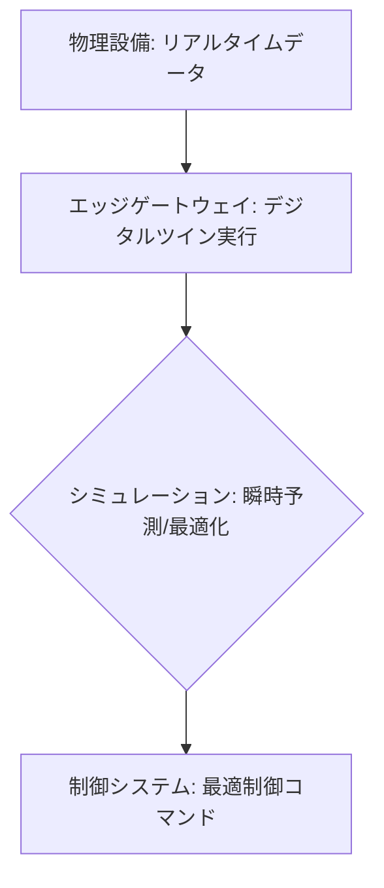

# T14-02-04 デジタルツイン・エッジシミュレーション

## Summary（5つの要点）

1. **エッジでのツイン動作**: 物理的な機器やシステムの**デジタルコピー（デジタルツイン）**を、**エッジゲートウェイ**（T14-02-01）上で動作させ、**リアルタイム**にシミュレーションを行う技術 `(1)`。
2. **超低遅延な意思決定**: クラウドを経由する際の**通信遅延を完全に回避**し、数ミリ秒単位の**瞬時のシミュレーション**と、それに基づく**制御コマンドの実行**を可能にする。
3. **予測と最適化**: 物理設備の現状データをエッジで取り込み、**将来の状態を予測**（例: 故障確率、生産量）し、**最適な制御パラメータ**を瞬時に導出する `(2)`。
4. **デジタルツインの機能強化**: 従来、設計フェーズやクラウド側で実行されていたシミュレーションをエッジに移行することで、**製造ラインの動的な変更、設備の微細な異常**など、より繊細な制御に対応できるようになる。
5. **応用分野**: **製造ラインのボトルネック予測、産業ロボットの衝突回避、エネルギー管理（EMS）の最適化、プラントの予知保全**など、リアルタイムの予測・制御が不可欠な領域。

#### 概念図

---

### 技術評価表（定量的な視点）
| 評価項目 | 評価 | 根拠 |
| :--- | :--- | :--- |
| 導入コスト | ⭐⭐⭐☆☆ | ソフトウェア、エッジハードウェア、モデリング費用が必要 |
| 技術成熟度 | ⭐⭐⭐⭐☆ | シミュレーションモデルは確立。エッジでのリアルタイム運用が拡大中 |
| 日本の競争力 | ⭐⭐⭐⭐☆ | FAベンダー（三菱電機、横河電機）のOTとITの統合に強み `(2)` |
| 市場性 | ⭐⭐⭐⭐⭐ | スマートファクトリー、スマートシティなど、全産業のDX推進の核となる |
| 品質保証の重要性 | ⭐⭐⭐⭐⭐ | シミュレーション結果の**正確性**が、**制御の安全性**に直結 |
---

## 日本の立ち位置・強み弱みのSummary

### 強み：日本企業や研究機関が持つ独自の技術、優位性などを箇条書きで記述。

* **OT（制御技術）とITの融合**: **三菱電機、横河電機**など、長年にわたりFA/DCSを手掛けてきたベンダーが、OT側の知見を活かして**リアルタイム制御**に特化したデジタルツインを開発している。
* **製造業のモデリング技術**: 自動車、電機メーカーなどの**シミュレーション技術（CAE）**の蓄積があり、物理設備を高精度でモデリングするノウハウが豊富。
* **エッジAIチップとの連携**: **エッジAIチップ**（T14-02-02）を活用し、シミュレーション結果に基づいた**AI制御**をリアルタイムに実行する能力が高い。

### 弱み：日本が抱える規制、標準化の遅れ、海外依存などを箇条書きで記述。

* **プラットフォームの海外依存**: **Siemens MindSphere、GE Predix**など、デジタルツインの**基盤となるプラットフォーム**は海外ベンダーが先行している。
* **データ連携の標準化の遅れ**: 異なるベンダーの機器やシステム間で、**デジタルツインのモデルやデータの相互運用性**を確保するための標準化が進んでいない。
* **人材不足**: 物理モデリング、エッジコンピューティング、リアルタイム制御の**複合的な知識**を持つ**デジタルツインエンジニア**が不足している。

---

## 技術ロードマップ（短期/中期/長期）

### 短期目標（～2027年）

* **製造ラインの微調整、予知保全**など、**限定的な領域**でのエッジシミュレーションによる**リアルタイム最適化**を実証。
* **デジタルツイン**のデータを、**エッジゲートウェイ**（T14-02-01）を通じてクラウドと連携し、**設計データ（CAD）**と**実稼働データ**の統合を実現。
* **産業用5G/ローカル5G**（T14-02-03）の低遅延通信を活かした**遠隔地の設備**のエッジシミュレーション制御を確立。

### 中期目標（2028年～2031年）

* **プラント全体、都市インフラ全体**を対象とした**大規模なデジタルツイン**を、エッジとクラウドの**分散協調**で動作させるアーキテクチャを確立。
* **AIエッジ推論**（T14-02-02）を統合し、シミュレーション結果に基づいた**制御パラメータの自律的なチューニング**を実現。
* デジタルツインを用いた**サイバーセキュリティ**（T14-02-05）の**シミュレーションと攻撃予測**をリアルタイムに実行。

### 長期目標（2032年～2035年）

* **現実世界と仮想世界が完全に同期**し、**制御遅延がゼロ**に近い、**自律的な産業・社会インフラ**の運用を実現。
* デジタルツインが**設計、製造、運用、保守、リサイクル**のライフサイクル全体を統合的に最適化する**知的なプラットフォーム**として機能。

### 📚 参照リンク

1. [デジタルツイン技術の概要 - Siemens](https://www.siemens.com/jp/ja/products/digital-enterprise/digital-twin.html)
2. [FAコンピューティングとエッジAI - 三菱電機](https://www.mitsubishielectric.co.jp/fa/)
3. [GE Predixと産業用IoT - GE Digital](https://www.ge.com/digital/)
4. [横河電機のデジタルツインソリューション - 横河電機](https://www.yokogawa.co.jp/)