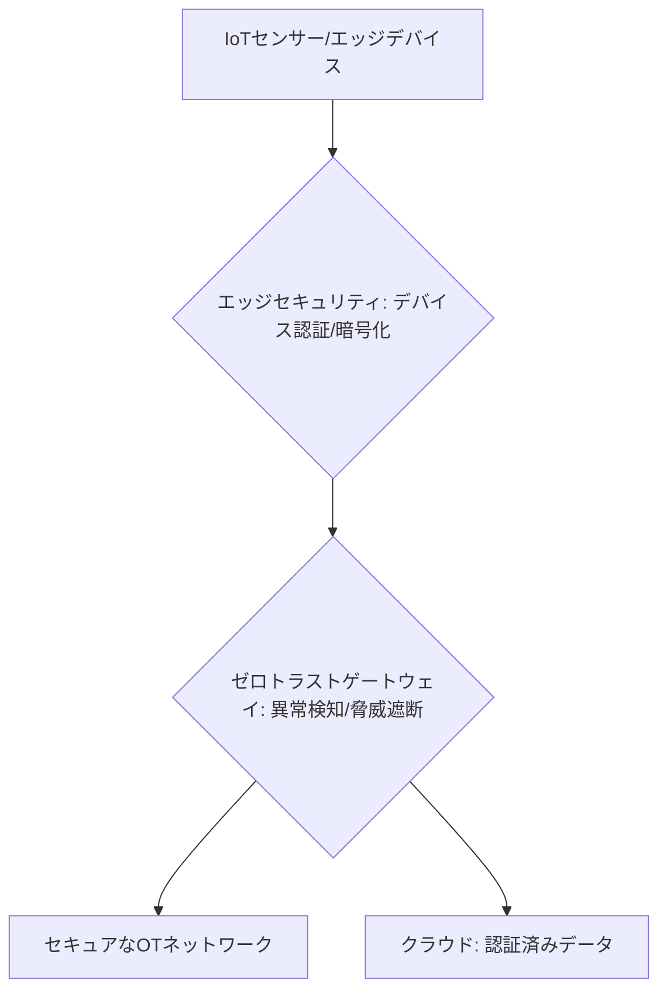

# T14-02-05 エッジセキュリティ・ゼロトラストアーキテクチャ

## Summary（5つの要点）

1. **エッジでの防御**: IoTセンサーやゲートウェイなどの**エッジデバイス自体**をサイバー攻撃から守るセキュリティ技術。OT（制御技術）ネットワークとITネットワークの融合（OT/ITコンバージェンス）により、攻撃対象領域が拡大したことへの対策 `(1)`。
2. **ゼロトラストアーキテクチャ**: 「**何も信頼しない**」を前提とし、エッジデバイス、ユーザー、アプリケーションの**すべて**をネットワークアクセス時に**厳密に検証・認証**するセキュリティモデル `(2)`。
3. **デバイス認証・暗号化**: すべてのエッジデバイスに**固有のデジタルID**を付与し、通信の都度**相互認証**を行う。データは**TLS/VPN**などで暗号化され、傍受や改ざんを防ぐ。
4. **異常検知と脅威遮断**: エッジデバイスの**動作パターンをAIで常時監視**し、不正な通信、設定変更、制御コマンドなどの**異常を即座に検知・遮断**。クラウドに接続する前に脅威を食い止める。
5. **OTネットワークの保護**: **産業用IoT（IIoT）**の普及に不可欠な技術であり、**工場、電力インフラ、交通システム**など、**物理的な被害**に直結するOTシステムの安全性を担保する。

#### 概念図

---

### 技術評価表（定量的な視点）
| 評価項目 | 評価 | 根拠 |
| :--- | :--- | :--- |
| 導入コスト | ⭐⭐⭐☆☆ | ソフトウェアライセンス、管理システム、コンサルティング費用が必要 |
| 技術成熟度 | ⭐⭐⭐⭐☆ | ゼロトラスト概念は成熟。OT環境への適用・規格化が急速に進展中 |
| 日本の競争力 | ⭐⭐⭐☆☆ | 対策製品（Palo Alto, Fortinet）は海外依存。OT分野での実践ノウハウに強み `(1)` |
| 市場性 | ⭐⭐⭐⭐⭐ | サイバー攻撃の高度化に伴い、全産業で必須の投資対象となる |
| 品質保証の重要性 | ⭐⭐⭐⭐⭐ | セキュリティ侵害が、**インフラの停止**や**人命に関わる事故**に直結 |
---

## 日本の立ち位置・強み弱みのSummary

### 強み：日本企業や研究機関が持つ独自の技術、優位性などを箇条書きで記述。

* **OTセキュリティのノウハウ**: **三菱電機、日立、東芝**など、長年にわたり**社会インフラや工場制御システム（OT）**を構築してきた企業が、OT特有のセキュリティ要件と運用の知見を持つ。
* **産業用プロトコルの知見**: OTネットワークで利用される**特殊な産業用プロトコル**（OPC UA、Modbusなど）の解析・監視技術に強みを持つ。
* **セキュリティチップ開発**: **ルネサスエレクトロニクス**などが、エッジデバイス向けの**耐タンパー性**の高い**セキュリティチップ**（セキュアエレメント）の開発を進めている。

### 弱み：日本が抱える規制、標準化の遅れ、海外依存などを箇条書きで記述。

* **ゼロトラストソリューションの海外依存**: ゼロトラストネットワークアクセス（ZTNA）などの主要なソリューションは、**Palo Alto Networks、Fortinet**といった海外ベンダーへの依存度が高い。
* **人材不足**: OTとITの両方に精通し、**OTセキュリティをゼロトラストの観点から設計・運用**できる**複合的なセキュリティ専門家**が不足している。
* **法制度の複雑さ**: 電力、ガス、水道などの**重要インフラ**におけるセキュリティ要件が複雑で、新しいエッジセキュリティ技術の**迅速な導入**を妨げる要因となっている `(1)`。

---

## 技術ロードマップ（短期/中期/長期）

### 短期目標（～2027年）

* **重要インフラ、大規模工場**のエッジデバイスへの**デジタル証明書**の導入を完了し、**厳格なデバイス認証**を開始。
* **エッジゲートウェイ**（T14-02-01）に**異常検知AI**を組み込み、**不正な制御コマンド**や**データ流出**をクラウド接続前に検知・遮断。
* **産業用5G/ローカル5G**（T14-02-03）のセキュリティガイドラインを策定し、安全な無線OTネットワークの構築を推進。

### 中期目標（2028年～2031年）

* **全エッジデバイス**に対して**ゼロトラストアーキテクチャ**を全面的に適用し、ネットワーク内での**横展開攻撃**を完全に阻止。
* **エッジAIチップ**（T14-02-02）に**セキュリティ機能**（セキュアブート、メモリ保護）を実装し、**ハードウェアレベルでのセキュリティ**を実現。
* **デジタルツイン**（T14-02-04）を活用し、**サイバー攻撃のシミュレーション**と**防御策の自動最適化**をリアルタイムで実行。

### 長期目標（2032年～2035年）

* **AI**が**脅威を予測・学習・防御**し、人間の介入なしにセキュリティを維持する**自律型セキュリティシステム**を確立。
* **量子コンピューター**（T14-01）による**暗号解読**に耐えうる**耐量子暗号**（PQC）をエッジデバイスに標準実装。

### 📚 参照リンク

1. [OT/ICSセキュリティ対策の動向 - 経済産業省](https://www.meti.go.jp/policy/netsecurity/)
2. [ゼロトラスト・アーキテクチャの基本 - Palo Alto Networks](https://www.paloaltonetworks.jp/blog/2021/08/what-is-zero-trust-network-access-ztna-and-why-do-you-need-it/)
3. [産業制御システム向けセキュリティ - トレンドマイクロ](https://www.trendmicro.com/ja_jp/)
4. [OTセキュリティソリューション - 日立製作所](https://www.hitachi.co.jp/)