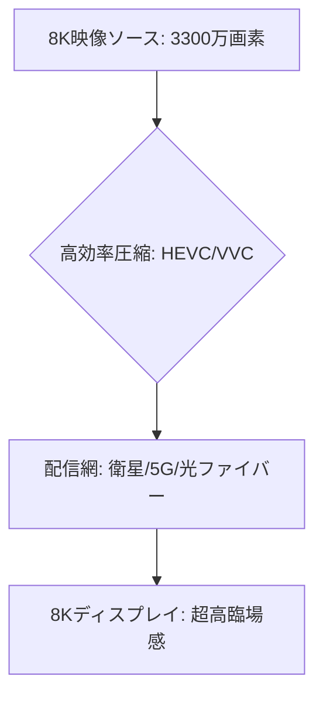

# T14-03-01 8K・高精細映像配信技術

## Summary（5つの要点）

1. **超高精細度**: 7680×4320ピクセル（約3300万画素）の映像を扱える技術。4Kの4倍、フルHDの16倍の情報量により、**肉眼では判別できないレベル**のリアリティと臨場感を提供する `(1)`。
2. **日本の先行**: **NHK**が世界に先駆けて研究開発を行い、2018年に**世界初の8K本放送**を開始。国際標準化（ITU-R BT.2020）にも貢献した。
3. **圧縮効率の向上**: 膨大なデータ量の8K映像を伝送するため、現在の**HEVC（H.265）**に加え、次世代の**VVC（H.266：Versatile Video Coding）**といった**高効率な映像圧縮技術**が不可欠 `(2)`。
4. **応用分野**: スポーツ中継、コンサートなどのエンターテイメントに加え、**医療画像診断、文化財のアーカイブ、教育**など、高精細度が要求される**非放送分野**への活用が拡大。
5. **配信インフラ**: 衛星放送に加え、**5Gモバイルネットワーク**（T14-02-03）や**光ファイバー網**といった**大容量かつ高速な通信インフラ**との連携が配信の鍵となる。

#### 概念図

---

### 技術評価表（定量的な視点）
| 評価項目 | 評価 | 根拠 |
| :--- | :--- | :--- |
| 導入コスト | ⭐⭐⭐☆☆ | 8Kカメラ、編集機器、伝送装置、ディスプレイの価格が依然として高い |
| 技術成熟度 | ⭐⭐⭐⭐☆ | 放送と配信の両面で技術は確立。普及はディスプレイ価格に依存 |
| 日本の競争力 | ⭐⭐⭐⭐⭐ | **NHK**の研究開発、**ソニー、パナソニック**などのカメラ・ディスプレイ技術で世界をリード `(1)` |
| 市場性 | ⭐⭐⭐⭐☆ | 家庭への普及は緩やかだが、B2B（医療、教育、産業）での需要は堅調 |
| 品質保証の重要性 | ⭐⭐⭐⭐⭐ | 高速移動体の8K伝送における**映像劣化、パケットロス**の低減が必須 |
---

## 日本の立ち位置・強み弱みのSummary

### 強み：日本企業や研究機関が持つ独自の技術、優位性などを箇条書きで記述。

* **放送技術の先行**: **NHK**が主導した8Kの**撮影、制作、圧縮、伝送、表示**に関する総合的な技術は、世界的に優位性を確立している。
* **映像機器の技術**: **ソニー、キヤノン**による**8K対応カメラ・レンズ**、**シャープ、パナソニック**による**8Kディスプレイ**など、関連機器の技術力が高い。
* **超高効率圧縮技術**: **HEVC、VVC**など、映像圧縮技術の**国際標準化**に日本企業・研究者が貢献しており、技術基盤を持つ。

### 弱み：日本が抱える規制、標準化の遅れ、海外依存などを箇条書きで記述。

* **コンテンツ不足と普及の遅れ**: ハードウェア技術は高いが、8K制作の**コストと手間**から**キラーコンテンツ**が不足しており、一般家庭への普及速度が緩やか。
* **配信プラットフォームの分断**: 放送事業者と通信事業者の間で、8Kコンテンツの**配信規格や収益モデル**の統合が遅れている（T14-03-02、T14-03-05の課題）。
* **映像圧縮技術のライセンス問題**: VVCなどの高度な圧縮技術は**特許ライセンス**が複雑であり、これが機器メーカーの負担となり普及を遅らせる可能性がある。

---

## 技術ロードマップ（短期/中期/長期）

### 短期目標（～2027年）

* **VVC（H.266）**のエンコーダ/デコーダの商用チップを開発し、8K配信の**伝送帯域を20%以上削減**。
* **スポーツ、ライブエンターテイメント**における**8K制作・配信**の運用コストを大幅に低減し、コンテンツ数を増加。
* 8K技術を**医療、文化財、産業検査**などのB2B分野に本格展開。

### 中期目標（2028年～2031年）

* 8Kディスプレイ価格を**4K製品と同等レベル**にまで引き下げ、一般家庭への**普及率を50%以上**に拡大。
* **IP放送**（T14-03-02）や**5G**を主要な8K配信経路とし、安定した超高画質オンデマンドサービスを提供。
* 8K映像と**立体音響**（T14-03-03）、**自由視点映像**（T14-03-04）を統合した**「没入型メディア」**の標準規格を確立。

### 長期目標（2032年～2035年）

* **8Kが標準的な画質**となり、放送、通信、医療、産業分野での**データの「眼」**として不可欠なインフラとなる。
* **AI**を活用し、低解像度映像をリアルタイムで8K相当に**アップスケーリング**する技術が実用化。

### 📚 参照リンク

1. [NHK 8Kスーパーハイビジョンの開発 - NHK技研](https://www.nhk.or.jp/strl/)
2. [VVC（Versatile Video Coding）標準化動向 - 映像情報メディア学会](http://www.ite.or.jp/)
3. [8Kカメラ技術 - ソニー](https://www.sony.jp/)
4. [8Kディスプレイの開発 - シャープ](https://jp.sharp/)